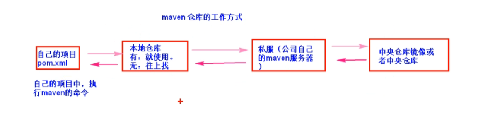

# 1、依赖：dependencies和dependency

# 2、jav：groupId（组织ID）、artifactId（项目名称【jar、war、ear、pom项目类型等等】）、version（项目版本号）

```xml
<dependencies>
    <dependency>
        <groupId>org.springframework</groupId>
        <artifactId>spring-webmvc</artifactId>
        <version>5.3.10</version>
    </dependency>
</dependencies>
```


# 3、打包类型：packaging   项目的打包类型有jar、war、ear、pom、等等，默认是jar

```xml
<packaging>jar</packaging>
```


# 4、仓库工作方式




# 5、maven的生命周期，插件和命令


## 5.1、maven的生命周期：项目构建的各个阶段（项目从无到有）。包括 清理、编译、测试、报告、打包、安装、部署


## 5.2、maven的插件：要完成构建项目的各个阶段，要使用maven命令，执行命令的功能是通过插件完成的。插件就是jar包、一些类。


## 5.3、maven的命令：执行maven功能是由命令发出的。比如mvn compile【编译阶段命令】，通过调用相应插件进行工作

### 5.3.1、clean：清理命令，作用是删除以前生成的数据，删除target目录

> 插件是 :
>
> maven-clean-plugin


### 5.3.2、compile：编译命令，执行的代码编译.

### 把src/main/java目录中的代码编译为class文件。同时把class文件拷贝到target/classes目录。target/classes目录是存放类文件的根目录（也叫做类路径，classpath）

> 插件是:
>
> maven-compiler-plugin		编译代码的插件
>
> maven-resources-plugin		资源插件，处理文件的。作用是把src/main/resources目录中的文件拷贝到target/classes目录中


### 5.3.3、test-compile：编译命令

### 把src/test/java目录中的代码编译为class文件，同时把class文件拷贝到target/test-classes目录。	把src/test/resources目录中的文件拷贝到target/test-classes目录

> 插件是：
>
> maven-compiler-plugin		编译代码的插件
>
> maven-resources-plugin		资源插件，处理文件的。


### 5.3.4、test：测试命令，作用执行target/test-classes目录的程序，测试src/main/java目录中的主程序代码是否符合要求

> 插件是：
>
> maven-surefire-plugin

### 5.3.5、package：打包，作用是把项目中的资源class文件和配置文件都放到压缩文件中，默认压缩文件是jar类型，web应用是war类型。

> 插件是：
>
> maven-jar-plugin		执行打包处理。生成一个jar扩展的文件，放在target目录下，打包的文件包含的是src/main目录中的所有的生成的class和配置文件，和test无关。
>
> 例如：target目录下生成的是ch01-maven-1.0SNAPSHOT.jar
>
> 当前项目的pom.xml文件中项目坐标是
>
> ```xml
> <groupId>com.eddic</groupId>
> 	<artifactId>ch01-maven</artifactId>
> 	<version>1.0-SNAPSHOT</version>
> 	<packaging>jar</packaging>
> ```


### 5.3.6、install：把生成的打包的文件，安装到maven仓库。


# 6、配置插件，在pom.xml中

```xml
<!--设置构建项目相关的内容-->
<build>
    <plugins>
        <!--设置插件-->
        <plugin>
            <groupId>org.apache.maven.plugins</groupId>
            <artifactId>maven-compiler-plugin</artifactId>
            <version>3.8.1</version>
            <configuration>
                <source>1.8</source> <!--指定编译代码的jdk版本-->
                <target>1.8</target> <!--运行java程序使用的jdk版本-->
            </configuration>
        </plugin>
    </plugins>
</build>
```


# 7、junit单元测试

> 单元：在java中指的是方法。一个方法就是一个单元，方法是测试的最小单位。
>
> 作用：简化了使用main方法测试时的混乱，不清晰，程序员容易乱的弊端


## 注意点：

> 1、测试类它的包名和要测试的类包名（路径名）一致
>
> - com.eddic.Serviceimpl
>
> - com.eddic.Test
>
> 2、测试时方法的定义：
>
> - public方法
> - 没有返回值
> - 方法名称自定义
> - 方法没有参数
>
> 3、在测试类中的方法可以单独执行，测试类也可以单独执行


# 8、pom.xml

## pom：项目对象模型，maven把项目当作模型处理，操作这个模型就是操作项目。maven通过pom.xml文件实现项目的构建和依赖的管理。


# 9、依赖管理

在pom.xml中

```xml
<scope> </scope>
```

表示依赖的范围，这个依赖在项目构建的哪个阶段起作用，其中的值为：

> compile：默认，参与构建项目的所有阶段
>
> test：测试，在测试阶段使用，比如执行mvn test
>
> provided：提供者，项目在部署到服务器时，不需要提供这个依赖的jar，而是由服务器来提供这个依赖的jar包		例如servlet和jsp依赖

## 例如，当把web文件在idea中打包之后，会在target目录下生成一个war类型的文件，可以使用tomcat直接访问此war压缩文件，tomcat解压缩这个war文件并运行，tomcat的lib目录下就许多自带依赖，其中就有servlet和jsp的依赖项，所以打包时不必向war文件中加入servlet和jsp


# 10、常用设置：properties

```xml
<properties>
    <project.build.sourceEncoding>UTF-8</project.build.sourceEncoding>	项目构建使用的编码，避免中文乱码
    <maven.compiler.source>1.8</maven.compiler.source>			源码编译的jdk版本		
    <maven.compiler.target>1.8</maven.compiler.target>			运行代码的jdk版本
</properties>
```


# 11、Maven处理文件的默认规则

- ## maven会把src/main/resources目录中的文件，拷贝到target/classes目录下

- ## maven只处理src/main/java目录中的.java文件，把这些java文件编译为class，拷贝到target/classes目录中。不处理其他文件

> 如果要使maven将src/main/java目录中的其他文件拷贝到target/classes目录中，需要在pom.xml中配置资源拷贝插件，关闭过滤器

```xml
<build>
   <resources>
       <resource>
           <directory>src/main/java</directory>
           <includes>
               <include>**/*.properties</include>
               <include>**/*.xml</include>
           </includes>
           <filtering>false</filtering>
       </resource>
       <resource>
           <directory>src/main/resources</directory>
           <includes>
               <include>**/*.properties</include>
               <include>**/*.xml</include>
           </includes>
           <filtering>false</filtering>
       </resource>
   </resources>
</build>
```


