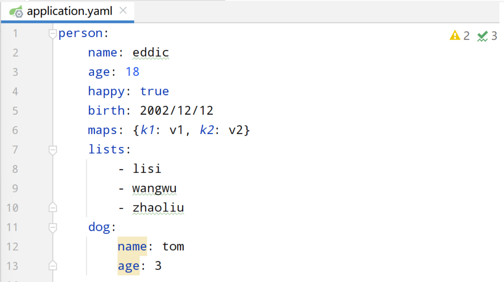

# 1、基础


# 2、SpringBoot认识
## 2.1、SpringBoot简介
- 简单来说springboot其实并不是一个新的框架，它默认配置了很多框架额使用方式，就像maven整合了所有的jar包，springboot整合了所有的框架

### 程序=数据结构+算法（集合框架）————程序猿
### 程序=面向对象+框架————码农

# 什么是微服务架构
- 微服务是一种架构风格，他要求我们在开发一个应用的时候，这个应用必须构建成一系列小服务的组合，可以通过http的方式进行互通
- 每个服务运行在自己的进程中，服务之间相互协调，互相配合，为用户提供最终价值
- 每个服务都围绕着具体业务进行构建，并且能够被独立的部署到生产环境、类生产环境等
- 
- 


# 3、第一个SpringBoot程序、原理探讨【springboot_01】
## 3.1、官方提供了一个快速生成的网站，idea集成了这个网站
- https://start.spring.io/
- 直接使用idea创建一个springboot项目（一般开发直接在idea中创建）


## 3.2、pom.xml


```xml
    <?xml version="1.0" encoding="UTF-8"?>
    <project xmlns="http://maven.apache.org/POM/4.0.0" xmlns:xsi="http://www.w3.org/2001/XMLSchema-instance"
             xsi:schemaLocation="http://maven.apache.org/POM/4.0.0 https://maven.apache.org/xsd/maven-4.0.0.xsd">
        <modelVersion>4.0.0</modelVersion>
    
        <!--    有一个父项目:spring-boot-starter-parent,地址是远程的在线的-->
        <parent>
            <groupId>org.springframework.boot</groupId>
            <artifactId>spring-boot-starter-parent</artifactId>
            <version>2.7.4</version>
            <relativePath/> <!-- lookup parent from repository -->
        </parent>
    
        <!--坐标-->
        <groupId>com.eddic</groupId>
        <artifactId>springboot_01</artifactId>
        <version>0.0.1-SNAPSHOT</version>
    
    
        <name>springboot_01</name>
        <description>springboot_01</description>
        <properties>
            <java.version>1.8</java.version>
        </properties>
        <dependencies>
    
            <!--        该依赖包含了SpringMVC-->
            <dependency>
                <groupId>org.springframework.boot</groupId>
                <artifactId>spring-boot-starter-web</artifactId>
            </dependency>
    
            <!--        类似于junit的单元测试-->
            <dependency>
                <groupId>org.springframework.boot</groupId>
                <artifactId>spring-boot-starter-test</artifactId>
                <scope>test</scope>
            </dependency>
        </dependencies>
    
        <build>
            <!--        打jar包插件-->
            <plugins>
                <plugin>
                    <groupId>org.springframework.boot</groupId>
                    <artifactId>spring-boot-maven-plugin</artifactId>
                </plugin>
            </plugins>
        </build>
    
    </project>
```


## 3.3、SpringBoot的原理就是 自动装配

- pom.xml的spring-boot-starter-web这个依赖自动帮助我们装配了web依赖，包括tomcat、dispatcherServlet、xml
    ```xml
            <dependency>
                <groupId>org.springframework.boot</groupId>
                <artifactId>spring-boot-starter-web</artifactId>
            </dependency>
    ```
    
- 所有的springboot的依赖都是以 spring-boot-starter开头的
    ```xml
    <dependencies>
        <!--  pom.xml自动装配web依赖的依赖-->
        <dependency>
            <groupId>org.springframework.boot</groupId>
            <artifactId>spring-boot-starter-web</artifactId>
        </dependency>
    
        <!--类似于junit的单元测试依赖-->
        <dependency>
            <groupId>org.springframework.boot</groupId>
            <artifactId>spring-boot-starter-test</artifactId>
            <scope>test</scope>
        </dependency>
    </dependencies>
    ```


## 3.4、jar包
- 在Maven的生命周期里package可以进行打包
- 打包完成后会得到一个jar包（我们编写的SpringBoot，例如springboot_01）
- 此时该jar包就是一个结构程序，正好对应了微服务里的一个一个的服务
- 我们可以使用java -jar springboot_01.jar来运行该jar包
- **此时编写的java程序我们不必去考虑视图层了，只需要考虑业务逻辑即可，真正的前后端分离已经体现了出来，vue是一个纯前端框架，数据从后端各个jar包接口获取，后端各个jar包只需要提供接口即可，不需要考虑视图层**
- jar包是一个容器，不需要任何的外部环境便可以独自运行


## 3.5、springboot的配置在application.properties里面进行配置
- application.properties是一个配置文件，里面可以配置很多东西，例如端口号、数据库连接等等
- 该配置文件的名字是固定的，不可以改变
- 该配置文件的位置也是固定的，不可以改变
- 该配置文件的内容也是固定的，不可以改变
- 该配置文件的内容是key=value的形式
- 该配置文件的内容是可以被springboot读取和自动装配的


## 3.6、springboot的自动装配的原理
- 在pom.xml中有一个父项目————spring-boot-starter-parent，spring-boot-starter-parent还有一个父项目————spring-boot-dependencies，spring-boot-dependencies里面有很多的依赖以及jar包的版本，例如spring-boot-starter-web依赖，spring-boot-starter-test依赖等等
- spring-boot-starter-parent里面有自动配置好的资源过滤
- spring-boot-starter-parent里面有自动配置好的插件
- spring-boot-starter-parent里面有很多启动器
  - 启动器：SpringBoot的启动场景
  - 比如spring-boot-starter-web，他就会帮我们自动导入web环境的所有依赖
  - springboot会将所有的功能场景都变成一个个的启动器
  - 你需要什么功能就导入什么启动器就可以了`starter`


 ## 3.7、注解
结论：springboot所有的自动配置都是在启动的时候扫描并加载类路径/META-INF/下的`spring.factories`文件，所有的自动配置类都在这里面，然后根据自动配置类里面的注解进行自动装配，但是不一定生效，要判断条件是否成立，只要导入了对应的start，就有对应的启动器了，有了启动器，我们自动装配就会生效，然后就配置成功


## 3.8、了解主启动类怎么运行————SpringApplication.run(主配置类.class, args); 包括两部分
- SpringApplication类
- run方法


# 4、yaml语法讲解【springboot_02_config】
## 4.1、Springboot使用一个全局的配置文件，配置文件的名称是固定的
**要么是application.properties、要么是application.yml**

- application.properties
  - 语法结构：key=value
- application.yml
  - 语法结构：key:【空格】value

**配置文件的作用：修改SpringBoot自动配置的默认值，因为SpringBoot在底层都给我们自动配置好了**


## 4.2、yaml和properties的对比


## 4.3、yaml给对象进行赋值


**@ConfigurationProperties(prefix = "person")作用：**

- 告诉SpringBoot将本类中的所有属性和配置文件中相关的配置进行绑定；
- 参数`prefix = "person"`：配置文件中哪个下面的所有属性进行一一映射
- 自行搜索yaml对比properties优点


## 4.4、JSR303校验


## 4.5、自动配置的原理https://www.bilibili.com/video/BV1PE411i7CV/?p=12&spm_id_from=pageDriver&vd_source=081e71bb38c6a50a535ff8a4fac6207f

每一个自动配置类最后都使用了@ConfigurationProperties注解载入yaml的配置文件中的值，我们可以修改这些值，从而达到修改自动配置的目的


# 5、web开发【springboot_03_web】

## 5.1、一个简单的web项目
在com.eddic.controller里面写一个方法（HelloController），返回一个字符串，运行然后在浏览器里面输入localhost:8080/hello，就可以看到返回的字符串了
```@RestController
public class HelloController {

    @GetMapping("/hello")
    public String hello() {
        return "Hello World";
    }
}
```


## 5.2、静态资源导入
### 1、在springboot中，我们可以使用以下方式处理静态资源，直接使用；localhost:8080/xxx.html就可以访问到了

- 在resources目录下创建static目录，然后将静态资源放入static目录下
- 在resources目录下创建public目录，然后将静态资源放入public目录下
- 在resources目录下创建resources目录，然后将静态资源放入resources目录下
- webjars：将静态资源放入webjars中【使用localhost:8080/webjars/xxx.html就可以访问到了】
- 有很多人用了 Thymeleaf 之后，会将静态资源也放在 resources/templates 目录下，注意，templates 目录并不是静态资源目录，它是一个放页面模板的位置（你看到的 Thymeleaf 模板虽然后缀为 .html，其实并不是静态资源）,**templates目录下的所有页面，只能通过controller来跳转**
- 

### 2、优先级
- resources > static（默认） > public


### 3、自定义静态资源映射:
在application.yaml中配置`spring:mvc:static-path-pattern: /hello/**`，然后使用localhost:8080/hello/xxx.html就可以访问到了


# 6、首页【springboot_04_IndexAndIcon】
index.html可以放在static/public/resources目录下，也可以放在templates目录下，但是放在templates目录下的话，就不能直接访问了，需要通过controller来访问

# 7、thyemleaf【springboot_05_thymeleaf】
## 7.1、概念
- 以前开发，前端交给我们的页面是html页面，后端交给我们的是jsp页面，然后我们需要在jsp页面中嵌入html页面，这**样就会导致代码的耦合度很高，而且不利于维护**
- **模板引擎**：可以通过html模板（Template）中的ER表达式接收后端的数据（Data），经过模板引擎（TemplateEngine）将数据填充到html模板（Template）页面中，最后返回给前端，**这样就可以实现前后端的分离，前端只需要关注页面的展示，后端只需要关注数据的处理**


## 7.2、使用
### 1、pom.xml中引入thymeleaf依赖
```xml
<dependency>
    <groupId>org.springframework.boot</groupId>
    <artifactId>spring-boot-starter-thymeleaf</artifactId>
</dependency>
```

### 2、在templates目录下创建test.html

> ### 注意：在模板中所有的html元素都可以被thymeleaf替换接管：  th：元素名

```html
<!DOCTYPE html>
<html lang="en" xmlns:th="http://www.thymeleaf.org">
<head>
    <meta charset="UTF-8">
    <title>Title</title>
</head>
<body>
<!--所有的html元素都可以被thymeleaf替换接管： th：元素名-->
<div th:text="${msg}"></div>
</body>
</html>
```

### 3、在controller中返回test.html
```java
@Controller
public class TestController {
    @RequestMapping("/test")
    public String test(Model model) {
        model.addAttribute("msg", "Hello, Thymeleaf!");
        return "test";
    }
}
```


## 7.3、语法 https://www.thymeleaf.org/doc/tutorials/3.0/usingthymeleaf.html#unescaped-text


# 8、MVC配置扩展【springboot_06_WebMvcConfigurer】
> ## 在config包下创建MyMvcConfig.java类进行配置的扩展


## 8.1、自定义视图解析器
```java
@Configuration
public class MyMvcConfig implements WebMvcConfigurer {
//    ViewResolver 实现了视图解析器接口的类，我们就可以把他看做视图解析器
    @Bean
    public ViewResolver myViewResolver() {
        return new MyViewResolver();
    }

//    自定义了一个自己的试图解析器MyViewResolver
    private static class MyViewResolver implements ViewResolver {
        @Override
        public View resolveViewName(String viewName, Locale locale) throws Exception {
            return null;
        }
    }
}
```

## 8.2、自定义视图跳转
```java
@Configuration
public class MyMvcConfig implements WebMvcConfigurer {
    @Override
    public void addViewControllers(ViewControllerRegistry registry) {
        registry.addViewController("/hello").setViewName("test");
        
    }
}
```


# 9、员工管理系统


## 9.1、准备工作

> - ### 所有的页面的静态资源都需要使用thymeleaf接管
>
> ```
> th:href="@{/css/bootstrap.min.css}"
> ```
>
> - ### 使用	th:fragment	th:insert	th:replace	进行代码复用，比如重复使用的侧边栏
>
> ```html
> <nav class="col-md-2 d-none d-md-block bg-light sidebar" th:fragment="sidebar">
> 
> 调用：
> <div th:insert="~{dashboard:: sidebar}"></div>
> 或者
> <div th:replace="~{commons/commons::sidebar}"></div>
> ```


## 9.2、展示员工列表

```html
<thead>
    <tr>
        <th>id</th>
        <th>lastName</th>
        <th>email</th>
        <th>gender</th>
        <th>department</th>
        <th>birth</th>
        <th>操作</th>
    </tr>
</thead>

<tbody>
    <!--通过th:each遍历出EmployeeController.java中emps中的信息-->
    <tr th:each="emp:${emps}">
        <td th:text="${emp.getId()}"></td>
        <td th:text="${emp.getLastName()}"></td>
        <td th:text="${emp.getEmail()}"></td>
        <td th:text="${emp.getGender()==0?'女':'男'}"></td>
        <td th:text="${emp.department.getDepartmentName()}"></td>
        <td th:text="${#dates.format(emp.getBirth(),'yyyy-MM-dd HH:mm:ss')}"></td>
        <td>
            <button class="btn btn-sm btn-primary">编辑</button>
            <button class="btn btn-sm btn-danger">删除</button>
        </td>
    </tr>
</tbody>
```


## 9.3、增加员工（修改、删除同理）

> - ### 按钮提交
> - ### 跳转到添加页面
> - ### 添加员工成功
> - ### 返回首页


## 9.4、404页面

> ### 在templates下建立error文件夹，里面放置404.html，当页面找不到时，springboot会自动跳转到error下的404.html


# 10、前端的知识

## 10.1、如何写出一个好看的页面

- 模板：别人写好的，直接拿来改成自己需要的【模板之家】、【x-admin】
- 框架：组件、自己手动组合拼接！ 【bootstrap】、【layui】、【semantic-ui】
  - 栅格系统
  - 导航栏
  - 侧边栏
  - 表单

## 10.2、创造一个网站

- 1、前端先搞定，页面长什么样子、数据怎么展示
- 2、设计数据库（数据库设计难点！）
- 3、前端让他自动运行，独立化工程
- 4、数据接口怎么对接：json
- 5、前后端联调测试


# 11、接下来几天

- **JDBC**
- **Mybatis**
- **Druid：数据库连接池**
- **Shiro：搞安全的**
- **Spring Security：搞安全的**
- 异步任务【两个注解就搞定了】
- Swagger：接口文档
- Dubbo：分布式服务框架
- Zookeeper：分布式协调服务
- Redis：分布式缓存


> # idea打开SpingBootWeb项目带数据库，看源码


