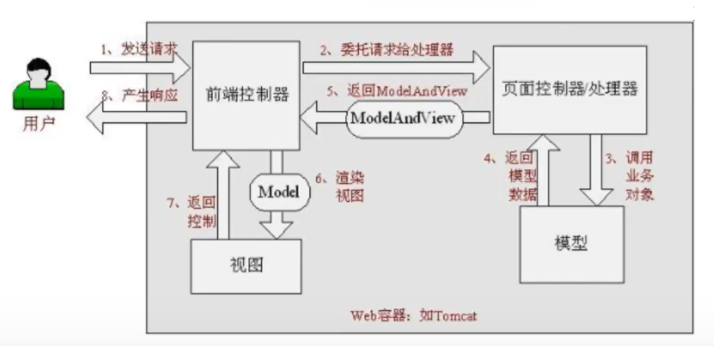
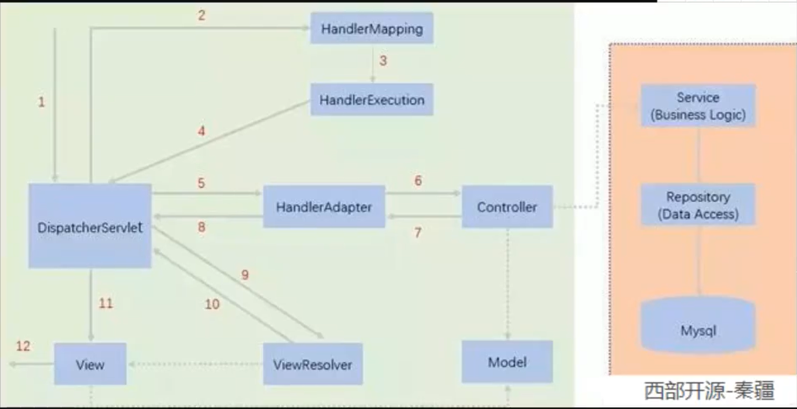

# 1、回顾Servlet
## 1.1、导入依赖(pom.xml)
```xml
<?xml version="1.0" encoding="UTF-8"?>
<project xmlns="http://maven.apache.org/POM/4.0.0"
         xmlns:xsi="http://www.w3.org/2001/XMLSchema-instance"
         xsi:schemaLocation="http://maven.apache.org/POM/4.0.0 http://maven.apache.org/xsd/maven-4.0.0.xsd">
    <modelVersion>4.0.0</modelVersion>

    <groupId>org.example</groupId>
    <artifactId>SpringMVC</artifactId>
    <packaging>pom</packaging>
    <version>1.0-SNAPSHOT</version>
    <modules>
        <module>springmvc_01_servlet</module>
    </modules>

    <properties>
        <maven.compiler.source>8</maven.compiler.source>
        <maven.compiler.target>8</maven.compiler.target>
    </properties>

    <!--导入依赖-->
    <dependencies>
        <dependency>
            <groupId>junit</groupId>
            <artifactId>junit</artifactId>
            <version>4.12</version>
        </dependency>
        <dependency>
            <groupId>org.springframework</groupId>
            <artifactId>spring-webmvc</artifactId>
            <version>5.2.0.RELEASE</version>
        </dependency>
        <dependency>
            <groupId>javax.servlet</groupId>
            <artifactId>servlet-api</artifactId>
            <version>2.5</version>
        </dependency>
        <dependency>
            <groupId>javax.servlet.jsp</groupId>
            <artifactId>jsp-api</artifactId>
            <version>2.2</version>
        </dependency>
        <dependency>
            <groupId>javax.servlet</groupId>
            <artifactId>jstl</artifactId>
            <version>1.2</version>
        </dependency>
    </dependencies>
</project>
```

## 1.2、编写一个Servlet类(HelloServlet.class)，用来处理用户的请求和返回响应
```java
package com.kuang.servlet;

import javax.servlet.ServletException;
import javax.servlet.http.HttpServlet;
import javax.servlet.http.HttpServletRequest;
import javax.servlet.http.HttpServletResponse;
import java.io.IOException;

public class HelloServlet extends HttpServlet {
    @Override
    protected void doGet(HttpServletRequest req, HttpServletResponse resp) throws ServletException, IOException {
        //1.获取前端参数
        String method = req.getParameter("method");
        if(method.equals("add")){
            req.getSession().setAttribute("msg","执行了add方法");
        }
        if(method.equals("delete")){
            req.getSession().setAttribute("msg","执行了delete方法");
        }
        //2.调用业务层
        //3.视图转发或者重定向    getRequestDispatcher：转发
        req.getRequestDispatcher("/WEB-INF/jsp/test.jsp").forward(req,resp);

    }

    @Override
    protected void doPost(HttpServletRequest req, HttpServletResponse resp) throws ServletException, IOException {
        doGet(req,resp);
    }
}

```

## 1.3、编写一个视图页面显示Servlet响应（test.jsp）
```html
<html>
<head>
    <title>Title</title>
</head>
<body>

<!--在这里将msg取出来并展示-->
${msg}

</body>
</html>
```
## 1.4、在web.xml中将Servlet类(HelloServlet.class)注册
```xml
<?xml version="1.0" encoding="UTF-8"?>
<web-app xmlns="http://xmlns.jcp.org/xml/ns/javaee"
         xmlns:xsi="http://www.w3.org/2001/XMLSchema-instance"
         xsi:schemaLocation="http://xmlns.jcp.org/xml/ns/javaee http://xmlns.jcp.org/xml/ns/javaee/web-app_4_0.xsd"
         version="4.0">

    <servlet>
        <servlet-name>hello_1</servlet-name>
        <servlet-class>com.kuang.servlet.HelloServlet</servlet-class>
    </servlet>

    <servlet-mapping>
        <servlet-name>hello_1</servlet-name>
        <url-pattern>hello</url-pattern>
    </servlet-mapping>

    <!--配置超时时间15分钟-->
    <session-config>
        <session-timeout>15</session-timeout>
    </session-config>
    
    <!--配置欢迎页-->
    <welcome-file-list>
        <welcome-file>index.jsp</welcome-file>
    </welcome-file-list>
</web-app>
```

## 1.5、写一个视图去请求Servlet（from.jsp）
```html
<%@ page contentType="text/html;charset=UTF-8" language="java" %>
<html>
<head>
    <title>Title</title>
</head>
<body>

<%--提交表单--%>
<form action="/hello" method="post">
    <input type="text" name="method">
    <input type="submit">
</form>


</body>
</html>
```

# 2、SpringMVC基础

## 2.1、SpringMVC的手册文档地址
https://docs.spring.io/spring-framework/docs/4.3.24.RELEASE/spring-framework-reference/html/spring-web.html
## 2.2、下载历史版本Spring的地址
https://repo.spring.io/ui/native/release/org/springframework/spring

## 2.3、Spring Web MVC 中的请求处理工作流




# 3、编写一个HelloSpringMVC

## 3.1、配置web.xml，注册DispatcherServlet
```xml
<?xml version="1.0" encoding="UTF-8"?>
<web-app xmlns="http://xmlns.jcp.org/xml/ns/javaee"
         xmlns:xsi="http://www.w3.org/2001/XMLSchema-instance"
         xsi:schemaLocation="http://xmlns.jcp.org/xml/ns/javaee http://xmlns.jcp.org/xml/ns/javaee/web-app_4_0.xsd"
         version="4.0">

    <!--1、注册DispatcherServlet-->
    <servlet>
        <servlet-name>springmvc</servlet-name>
        <servlet-class>org.springframework.web.servlet.DispatcherServlet</servlet-class>

        <!--关联一个springmvc的配置文件:springmvc-servlet.xml-->
        <init-param>
            <param-name>contextConfigLocation</param-name>
            <param-value>classpath:springmvc-servlet.xml</param-value>
        </init-param>

        <!--启动级别-1-->
        <load-on-startup>1</load-on-startup>
    </servlet>

    <!--匹配请求-->
    <servlet-mapping>
        <servlet-name>springmvc</servlet-name>
        <url-pattern>/</url-pattern>
    </servlet-mapping>
    
</web-app>
```

## 3.2、编写springmvc-servlet.xml配置文件
```xml
<?xml version="1.0" encoding="UTF-8"?>
<beans xmlns="http://www.springframework.org/schema/beans"
       xmlns:xsi="http://www.w3.org/2001/XMLSchema-instance"
       xsi:schemaLocation="http://www.springframework.org/schema/beans
       http://www.springframework.org/schema/beans/spring-beans.xsd">

    <!--添加URL处理器-->
    <bean class="org.springframework.web.servlet.handler.BeanNameUrlHandlerMapping"/>
    <!--添加URL适配器-->
    <bean class="org.springframework.web.servlet.mvc.SimpleControllerHandlerAdapter"/>
    <!--上面的处理器和适配器去解析网页的URL，查看此spring容器中有哪个Controller可以去匹配-->

    <!--处理解析后的URL，匹配到/hello，交给HelloController类处理-->
    <bean id="/hello" class="com.kuang.controller.HelloController"/>


    <!--添加视图解析器-->
    <bean class="org.springframework.web.servlet.view.InternalResourceViewResolver" id="internalResourceViewResolver">
        <!--前缀-->
        <property name="prefix" value="/WEB-INF/jsp/"/>
        <!--后缀-->
        <property name="suffix" value=".jsp"/>
    </bean>

</beans>
```

## 3.3、建立一个HelloController.class类实现Controller接口，需要返回一个ModelAndView，装数据，封视图
```java
//导入Controller接口
public class HelloController implements Controller {
    public ModelAndView handleRequest(HttpServletRequest request, HttpServletResponse response) throws Exception{
        //ModelAndView 模型和视图
        ModelAndView mv=new ModelAndView();

        //封装对象，模型存数据
        mv.addObject("msg","HelloSpringMVC!");

        //封装要跳转的视图，视图跳转到规定的jsp页面
        mv.setViewName("hello");// 在springmvc-servlet.xml中设置的前缀和后缀自动拼接:/WEB-INF/jsp/hello.jsp
        return mv;
    }
}
```

## 3.4、将自己的类交给SpringIOC容器（springmvc-servlet.xml），注册bean
```xml
<!--将自己的类交给SpringIOC容器，注册bean-->
<bean id="/hello" class="com.kuang.controller.HelloController"/>
```

## 3.5、最后写要跳转的jsp页面，显示ModelAndView存放的数据，以及我们的正常页面
```html
<%@ page contentType="text/html;charset=UTF-8" language="java" %>
<html>
<head>
    <title>Title</title>
</head>

<body>
    ${msg}
</body>
</html>
```


## 3.6、视频


<video src="【狂神说Java】SpringMVC.mp4"></video


# 4、SpringMVC执行原理

```
https://www.bilibili.com/video/BV1aE41167Tu?p=5
```




# 5、使用注解开发（代码更简洁）

## 5.1、建立模块，添加web支持！

## 5.2、由于Maven可能存在资源过滤的问题，在pom.xml中加入配置

```xml
<!--过滤java和resources下的资源-->
<build>
    <resources>
        <resource>
            <directory>src/main/java</directory>
            <includes>
                <include>**/*.properties</include>
                <include>**/*.xml</include>
            </includes>
            <filtering>false</filtering>
        </resource>
        <resource>
            <directory>src/main/resources</directory>
            <includes>
                <include>**/*.properties</include>
                <include>**/*.xml</include>
            </includes>
            <filtering>false</filtering>
        </resource>
    </resources>
</build>
```

## 5.3、pom.xml中必须存在SpringMVC、servlet、JSTL等！

## 5.4、配置web.xml

- 注册DispatcherServlet
- 关联SpringMVC的配置文件
- 启动级别为1
- 映射路径为 / 【不要用/*】

```xml
<?xml version="1.0" encoding="UTF-8"?>
<web-app xmlns="http://xmlns.jcp.org/xml/ns/javaee"
         xmlns:xsi="http://www.w3.org/2001/XMLSchema-instance"
         xsi:schemaLocation="http://xmlns.jcp.org/xml/ns/javaee http://xmlns.jcp.org/xml/ns/javaee/web-app_4_0.xsd"
         version="4.0">

    <!--配置DispatchServlet：这个是SpringMVC的核心；请求分发器，前端控制器-->
    <servlet>
        <servlet-name>springmvc</servlet-name>
        <servlet-class>org.springframework.web.servlet.DispatcherServlet</servlet-class>
        <!--DispatcherServlet要绑定Spring的配置文件-->
        <init-param>
            <param-name>contextConfigLocation</param-name>
            <param-value>classpath:springmvc-servlet.xml</param-value>
        </init-param>
        <!--启动级别：1   服务器启动时启动-->
        <load-on-startup>1</load-on-startup>
    </servlet>

    <!--
    在SpringMVC中：/ 和 /* 区别
    /：只匹配所有的请求，不会去匹配jsp页面
    /*：匹配所有的请求，包括jsp页面
    这里所有请求都会被springmvc拦截
    -->
    <servlet-mapping>
        <servlet-name>springmvc</servlet-name>
        <url-pattern>/</url-pattern>
    </servlet-mapping>
</web-app>
```

## 5.5、配置springmvc-servlet.xml

- 导入IOC注解依赖
- 开启自动扫描，让IOC的注解生效
- 静态资源过滤 HTML JS　CSS　　
- MVC的注解驱动
- 配置视图解析器

```xml
<?xml version="1.0" encoding="UTF-8"?>
<beans xmlns="http://www.springframework.org/schema/beans"
       xmlns:xsi="http://www.w3.org/2001/XMLSchema-instance"
       xmlns:p="http://www.springframework.org/schema/p"
       xmlns:context="http://www.springframework.org/schema/context"
       xmlns:mvc="http://www.springframework.org/schema/mvc"
       xsi:schemaLocation="http://www.springframework.org/schema/beans
        https://www.springframework.org/schema/beans/spring-beans.xsd
        http://www.springframework.org/schema/context
        https://www.springframework.org/schema/context/spring-context.xsd http://www.springframework.org/schema/mvc https://www.springframework.org/schema/mvc/spring-mvc.xsd">

    <!--自动扫描包，让指定包下的注解生效，由IOC容器统一管理-->
    <context:component-scan base-package="com.kuang.controller"/>
    <!--让SpringMVC不处理静态资源   .css   .js   .html   .mp3   .mp4-->
    <mvc:default-servlet-handler/>
    <!--支持mvc注解驱动,省去了配置处理器映射器、处理器适配器-->
    <mvc:annotation-driven/>
    <!--视图解析器-->
    <bean class="org.springframework.web.servlet.view.InternalResourceViewResolver" id="internalResourceViewResolver">
        <property name="prefix" value="/WEB-INF/jsp/"/>
        <property name="suffix" value=".jsp"/>
    </bean>

</beans>
```

## 5.6、在视图解析器中我们吧所有的视图都放在/WEB-INF/jsp/目录下，可以保证视图安全，因为这个目录下的文件，客户端不能直接访问

那么现在去建立相应的文件目录/WEB-INF/jsp/hello.jsp

## 5.7 创建Controller

```java
@Controller//代表这个类会被Spring接管
public class HelloController {
    @RequestMapping("/hello") //识别URL中的请求
    public String hello(Model model){
        //封装数据
        //model  向模型中添加属性msg与值，可以在JSP页面中取出并渲染
        model.addAttribute("msg","hello,SpringMVCAnnotation!");
        return "hello";//会被视图解析器拼接处理
    }
}
```

# 6、RestFul风格

- > @PathVariable：可以让方法的参数的值对应绑定到一个URL模板变量上

- > @PostMapping
  > @GetMapping
  > @PutMapping
  > @DeleteMapping
  > @PatchMapping:规定URL以什么方式去请求

## 6.1、原先的URL显示方式

```java
@Controller
public class RestFulController {
    @RequestMapping("/add")
    public String test1(int a, int b, Model model){
        int res=a+b;
        model.addAttribute("msg","结果为"+res);
        return "test";
    }
}
```

**在网页中要想正常访问必须输入　　http://localhost:8080/add?a=1&b=2**


## 6.2、使用RestFul风格

```java
@Controller
public class RestFulController {
    @RequestMapping("/add/{a}/{b}")
    //PathVariable注解可以让方法的参数的值对应绑定到一个URL模板变量上
    public String test1(@PathVariable int a, @PathVariable int b, Model model){
        int res=a+b;
        model.addAttribute("msg","结果为"+res);
        return "test";
    }
}
```

**在网页要想访问则输入   http://localhost:8080/add/1/3**


# 7、乱码问题解决

## 乱码问题通过 过滤器 解决！SpringMVC给提供了一个过滤器，可以在web.xml中配置

```xml
<filter>
    <filter-name>encoding</filter-name>
    <filter-class>org.springframework.web.filter.CharacterEncodingFilter</filter-class>
    <init-param>
        <param-name>encoding</param-name>
        <param-value>utf-8</param-value>
    </init-param>
</filter>
<filter-mapping>
    <filter-name>encoding</filter-name>
    <url-pattern>/*</url-pattern>
</filter-mapping>
```


# 8、JSON（前后端传输文本格式）

- ##### JSON 是 JS 对象的字符串表示法，它使用文本表示一个 JS 对象的信息，本质是一个字符串。

- ##### JSON 和  JS | Java 对象可以相互转换


## 8.1、Java如何生成JSON对象传给前端：


> #### 第一步：导入jar包【jackson或者阿里巴巴的fastjson】

在pom.xml中导入jackson

```xml
<dependency>
    <groupId>com.fasterxml.jackson.core</groupId>
    <artifactId>jackson-databind</artifactId>
    <version>2.12.0</version>
</dependency>
```

##### 或者导入fastjson

```xml
<dependency>
    <groupId>com.alibaba</groupId>
    <artifactId>fastjson</artifactId>
    <version>1.2.60</version>
</dependency>
```


> #### 第二步：在springmvc-servlet.xml配置文件中添加解决JSON乱码问题的配置

```xml
<mvc:annotation-driven>
    <mvc:message-converters>
        <bean class="org.springframework.http.converter.StringHttpMessageConverter">
            <constructor-arg value="UTF-8"/>
        </bean>
        <bean class="org.springframework.http.converter.json.MappingJackson2HttpMessageConverter">
            <property name="objectMapper">
                <bean class="org.springframework.http.converter.json.Jackson2ObjectMapperFactoryBean">
                    <property name="failOnEmptyBeans" value="false"/>
                </bean>
            </property>
        </bean>
    </mvc:message-converters>
</mvc:annotation-driven>
```


# 9、ssm整合


> #### 基本步骤


## 9.1、搭建数据库环境

```sql
create database ssmbuild;

use `ssmbuild`;

drop table if exists `books`;

create table `books`(
    `bookID` int(10) not null auto_increment comment '书id',
    `bookName` varchar(100) not null comment '书名',
    `bookCounts` int(11) not null comment '数量',
    `detail` varchar(200) not null comment '描述',
    key `bookID` (`bookID`)
)engine=innodb default charset =utf8


insert into `books`(`bookID`,`bookName`,`bookCounts`,`detail`) values
(1,'Java',1,'从入门到放弃'),
(2,'MySQL',10,'从删库到跑路'),
(3,'Linux',5,'从进门到进牢');
```


## 9.2、pom.xml配置

> ##### 导入依赖：junit、数据库驱动、连接池、servlet、jsp、mybatis、mybatis-spring、spring			
>
> ##### 静态资源导出

```xml
<!--依赖-->

<dependencies>
    <!--junit-->
    <dependency>
        <groupId>junit</groupId>
        <artifactId>junit</artifactId>
        <version>4.12</version>
    </dependency>
    <!--数据库驱动-->
    <dependency>
        <groupId>mysql</groupId>
        <artifactId>mysql-connector-java</artifactId>
        <version>5.1.47</version>
    </dependency>
    <!--数据库连接池-->
    <dependency>
        <groupId>com.mchange</groupId>
        <artifactId>c3p0</artifactId>
        <version>0.9.5.2</version>
    </dependency>
    <!--Servlet、JSP、jstl-->
    <dependency>
        <groupId>javax.servlet</groupId>
        <artifactId>servlet-api</artifactId>
        <version>2.5</version>
    </dependency>
    <dependency>
        <groupId>javax.servlet.jsp</groupId>
        <artifactId>jsp-api</artifactId>
        <version>2.2</version>
    </dependency>
    <dependency>
        <groupId>javax.servlet</groupId>
        <artifactId>jstl</artifactId>
        <version>1.2</version>
    </dependency>
    <!--Mybatis-->
    <dependency>
        <groupId>org.mybatis</groupId>
        <artifactId>mybatis</artifactId>
        <version>3.5.2</version>
    </dependency>
    <dependency>
        <groupId>org.mybatis</groupId>
        <artifactId>mybatis-spring</artifactId>
        <version>2.0.1</version>
    </dependency>
    <!--Spring(SpringMVC)-->
    <dependency>
        <groupId>org.springframework</groupId>
        <artifactId>spring-webmvc</artifactId>
        <version>5.2.0.RELEASE</version>
    </dependency>
    <dependency>
        <groupId>org.springframework</groupId>
        <artifactId>spring-jdbc</artifactId>
        <version>5.3.10</version>
    </dependency>

</dependencies>

<!--静态资源导出问题-->
<build>
    <resources>
        <resource>
            <directory>src/main/resources</directory>
            <includes>
                <include>**/*.properties</include>
                <include>**/*.xml</include>
            </includes>
            <filtering>true</filtering>
        </resource>
        <resource>
            <directory>src/main/java</directory>
            <includes>
                <include>**/*.properties</include>
                <include>**/*.xml</include>
            </includes>
            <filtering>true</filtering>
        </resource>
    </resources>
</build>
```

## 9.3、使项目连接上数据库


## 9.4、建立基本结构和配置框架

> - com.kuang.pojo
> - com.kuang.dao
> - com.kuang.service
> - com.kuang.controller
> - mybatis-config.xml

```xml
<?xml version="1.0" encoding="utf8" ?>
<!DOCTYPE configuration
        PUBLIC "-//mybatis.org//DTD Config 3.0//EN"
        "http://mybatis.org/dtd/mybatis-3-config.dtd">
<configuration>

</configuration>
```

> - applicationContext.xml

```xml
<?xml version="1.0" encoding="UTF-8"?>
<beans xmlns="http://www.springframework.org/schema/beans"
       xmlns:xsi="http://www.w3.org/2001/XMLSchema-instance"
       xsi:schemaLocation="http://www.springframework.org/schema/beans
        https://www.springframework.org/schema/beans/spring-beans.xsd">
    
</beans>
```

**略.........**


# 10、BootStrap可视化布局系统

**[Bootstrap可视化布局系统 (bootcss.com)](https://www.bootcss.com/p/layoutit/)**


# 11、Ajax：


# 12、回顾ssm框架


