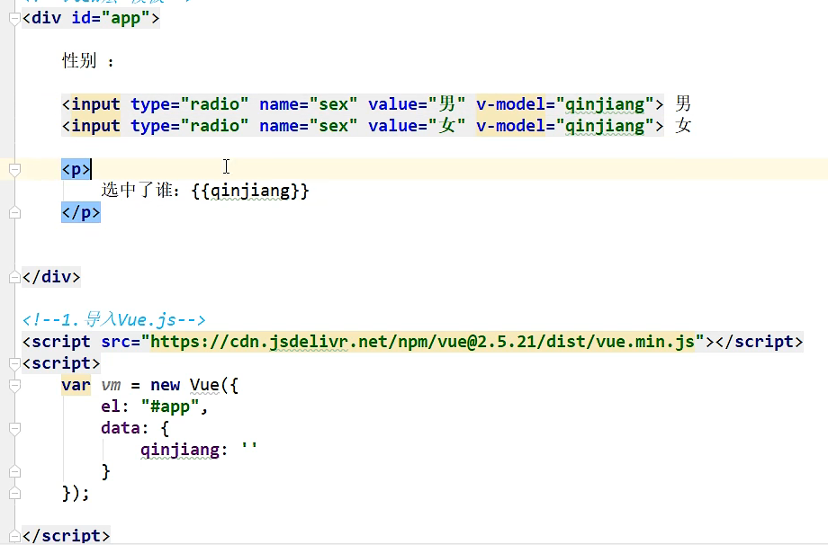

# 1、Vue基础

> ## 中文文档[Class 与 Style 绑定 — Vue.js 中文文档 (bootcss.com)](https://vuejs.bootcss.com/guide/class-and-style.html)


## 1.1、Vue只关心视图层

- **视图：**HTML（结构层）+CSS（表现层）+JS（行为层）		**给用户看，刷新后台给的数据**
  - 各种UI组件：例如ElementUI
  - 

> ### 其他：
>
> - **网络通信：** axios
>
> - **页面跳转：** vue-router
>
> - **状态管理： **vuex


## 1.2、Vue实现了模块化开发、路由、状态管理等（MVVM+DOM）

> ### 前端三大框架：
>
> - **Angular：**Google收购的前端框架，由一群java程序员开发，其特点是将后台的**MVC模式**搬运到前端并增加了**模块化开发**的理念
> - **React： **Facebook出品的一款高性能的JS前端框架，特点是提出了新概念：**虚拟DMO**，在内存中模拟DOM操作，有效的提升了前端渲染效率，需要学习**JSX语言**
>
> 
>
> - **Vue：**特点是综合了**Angular（模块化） **和 **React（虚拟DOM）**的优点
>
> ### 前端通信框架：
>
> - **Axios：**因为Vue边界明确，就是为了处理DOM，并不具备通信的功能，此时需要额外使用一个通信框架与服务器交互；当然也可以直接选择使用**JQuery提供的Ajax**通信功能


## 1.3、Vue的MVVM：


## 1.4、第一个Vue程序

- 1、导入Vue的cdn

```html
<script src="https://cdn.jsdelivr.net/npm/vue@2.5.16/dist/vue.js"></script>
```

- 2、创建一个view的元素**（view层）**

【前端再也不用去写数据了，直接标签加模板】

```html
<!--view层  模板-->
<div id="app">
    {{message}}
</div>
```

- 3、new一个Vue对象**（model层）**

```html
<script>
    var vm=new Vue({
        el:"#app",
        //Model  数据
        data:{
            message:"hello,vue!"
        }
    });

</script>

```

- 4、VM层**（ViewModel层）**


> ### 至此，View层展现的不是Model层的数据，而是ViewModel的数据，由ViewModel负责与Model层交互，这就完全解耦了View层和Model层，这个解耦是至关重要的，它是前后端分离方案实施的重要一环


# 2、Vue常用的7个属性

> - ## el属性
>
>   - #### 用来指示vue编译器（MV层）从什么地方开始进行数据绑定
>
> - ## data属性
>
>   - #### 将视图的数据抽象出来放在data中，MV层进行双向绑定的数据
>
> - ## methods属性
>
>   - #### js方法一般都放置在其中


# 3、Vue基本语法：

**指令带有v-，以表示它们是Vue提供的特殊属性，它们会在渲染的DOM上应用特殊的响应式行为**


## 3.1、绑定html属性  v-bind

- **比如动态绑定a元素的href属性**
- **比如动态绑定img元素的src属性**

```html
<!--view层  模板-->
<div id="app">
    <span v-bind:title="message">
        鼠标悬停查看此处动态绑定的信息！
    </span>
</div>

<!--1、导入Vue.js的cdn-->
<script src="https://cdn.jsdelivr.net/npm/vue@2.5.16/dist/vue.js"></script>

<script>
    var vm=new Vue({
        el:"#app",
        //Model  数据
        data:{
            message: "hello,vue1!"
        }
    });

</script>
```


## 3.2 、判断 v-if , v-else

```html
<!--view层  模板-->
<div id="app">

    <h1 v-if="ok">Yes</h1>
    <h1 v-else>No</h1>
    
</div>

<!--1、导入Vue.js的cdn-->
<script src="https://cdn.jsdelivr.net/npm/vue@2.5.16/dist/vue.js"></script>

<script>
  var vm=new Vue({
    el:"#app",
    //Model  数据
    data:{
      ok: true
    }
  });

</script>
```


## 3.3、循环 v-for

```html
<!--view层  模板-->
<div id="app">

    <li v-for="item in items">
        {{item.message}}
    </li>
</div>

<!--1、导入Vue.js的cdn-->
<script src="https://cdn.jsdelivr.net/npm/vue@2.5.16/dist/vue.js"></script>

<script>
    var vm=new Vue({
        el:"#app",
        //Model  数据
        data:{
            items:[
                {message:"eddic"},
                {message: "liziang"},
                {message: "liyixi"}
            ]
        }
    });

</script>
```


## 3.4、绑定事件 v-on

**方法必须定义在 Vue 的 Methods 对象中，格式为:**

> ### v-on：事件


```html
<!--view层  模板-->
<div id="app">
    <button v-on:click="sayHi">点击我</button>
</div>

<!--1、导入Vue.js的cdn-->
<script src="https://cdn.jsdelivr.net/npm/vue@2.5.16/dist/vue.js"></script>

<script>
    var vm=new Vue({
        el:"#app",
        //Model  数据
        data:{
            message: "hello,eddic!"
        },
        methods:{
            sayHi:function (){
                alert(this.message)
            }
        }
    });

</script>
```


## 3.5、双向绑定 v-model

使用 **v-model** 指令在表单 <input> 、<textarea>、<select>元素上创建双向数据绑定。它会根据**控件类型**自动选取正确的方法来更新元素。尽管有些神奇，但v-model本质上不过是**语法糖**。它**负责监听用户的输入事件**以更新数据。


> 实现一个功能：文本框里输入数据在后面相同的显示出来
>
> 

```html
<!--view层  模板-->
<div id="app">
    输入的文本：<input type="text" v-model="message"> {{message}}
</div>

<!--1、导入Vue.js的cdn-->
<script src="https://cdn.jsdelivr.net/npm/vue@2.5.16/dist/vue.js"></script>
<script>
    var vm=new Vue({
        el:"#app",
        data:{
            message:""
        }

    });

</script>
```


**单选框：**




**下拉框：**


# 4、Vue组件：自定义标签，就是一组重复的模板

> - ### 1、定义一个Vue组件component

> ```javascript
> //定义一个Vue组件component
> Vue.component("qinjiang",{
>   template:'<li>Hello</li>'
> });
> ```

> - ### 2、直接调用

> ```html
> <!--view层  模板-->
> <div id="app">
>   <qinjiang></qinjiang>
> </div>
> ```


## 复杂调用：

```html
<!--view层  模板-->
<div id="app">
  <abc v-for="item in items" v-bind:qin="item"></abc>
</div>


<!--1、导入Vue.js的cdn-->
<script src="https://cdn.jsdelivr.net/npm/vue@2.5.16/dist/vue.js"></script>

<script>

  //定义一个Vue组件component
  Vue.component("abc",{
    //接收传递到组件的参数
    props:["qin"],
    //模板
    template:'<li>{{qin}}</li>'
  });

  //new一个Vue对象
  var vm=new Vue({
    el:"#app",
    data:{
      items:["java","linux","qianduan"]
    }
  });

</script>
```


# 5、Axios异步通信


# 6、第一个vue-cli程序

## 6.1、准备

> ## 安装好nodejs后   cmd中

```
node -v				查看node版本
npm -v 				查看npm版本
```


> ## cmd中进行cnpm的安装  淘宝镜像加速  -g为全局安装

```
npm install cnpm -g
```


> ## 安装目录在c盘/用户/AppData/Roaming/npm


> ## 安装vue-cli
>
> [vue-cli](https://www.zhihu.com/search?q=vue-cli&search_source=Entity&hybrid_search_source=Entity&hybrid_search_extra={"sourceType"%3A"answer"%2C"sourceId"%3A348120772})是脚手架工具，其作用就是**用配置好的模板迅速搭建起一个项目工程来**，省去自己配置**webpack**配置文件的基本内容。
>
> 具体来说就是你安装好node环境以及vue-cli后，通过 '**vue init 模板名 项目名**'，然后简单回答部分基本问题后就能快速建立起[工程项目](https://www.zhihu.com/search?q=工程项目&search_source=Entity&hybrid_search_source=Entity&hybrid_search_extra={"sourceType"%3A"answer"%2C"sourceId"%3A348120772})：
>
> 
>
> [webpack](https://www.zhihu.com/search?q=webpack&search_source=Entity&hybrid_search_source=Entity&hybrid_search_extra={"sourceType"%3A"answer"%2C"sourceId"%3A348120772})就是前端资源模块化管理和打包工具，它可以将很多松散的模块按照依赖和规则打包成符合生产环境部署的前端资源，还可以将按需加载的模块进行代码分割，等到实际需要的时候再异步加载（如图），而要它自动实现这些功能，你得提前编辑好[配置文件](https://www.zhihu.com/search?q=配置文件&search_source=Entity&hybrid_search_source=Entity&hybrid_search_extra={"sourceType"%3A"answer"%2C"sourceId"%3A348120772})。
>
> 

```
cnpm install vue-cli -g
```


## 6.2、创建项目

> ## 1、创建一个基于webpack模板的vue应用程序【myvue】
>
> ### 移动到指定文件夹，运行以下命令

```
vue init webpack myvue
```


> ## 2、初始化并运行
>
> - ### 进入到myvue中
>
>   - ```
>     cd myvue
>     ```
>
> - ### 使用npm安装所有依赖环境
>
>   - ```
>     npm install
>     或
>     cnpm install
>     ```
>
> - ### 运行
>
>   - ```
>     npm run dev
>     或
>     cnpm run dev
>     ```
>
>   - 


# 7、vue-router

> - ## 嵌套的路由/视图表
>
> - ## 模块化的、基于组件的路由配置
>
> - ## 路由参数、查询、通配符
>
> - ## 基于Vue.js过渡系统的视图过渡效果
>
> - ## 细粒度的导航控制
>
> - ## 带有自动激活的css class的链接
>
> - ## html5历史模式或hash模式
>
> - ## 自定义的滚动条行为


## 7.1、安装 

```
npm install vue-router --save-dev
```


## 7.2、流程

> ### main.js将App.vue和router绑定起来
>
> 
>
> ### App.vue配置的路由会跳转至路由router
>
> ### router中会根据访问的url匹配相应的组件名字


