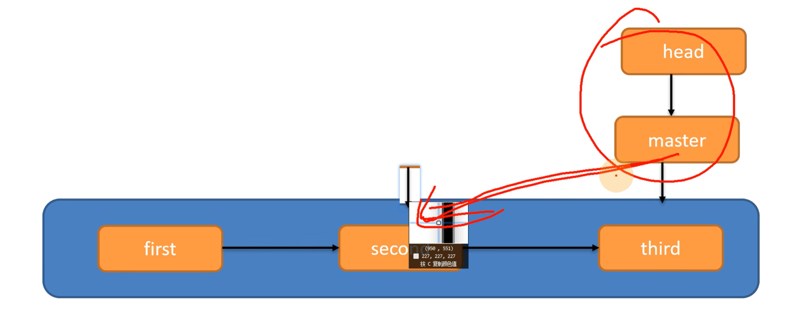
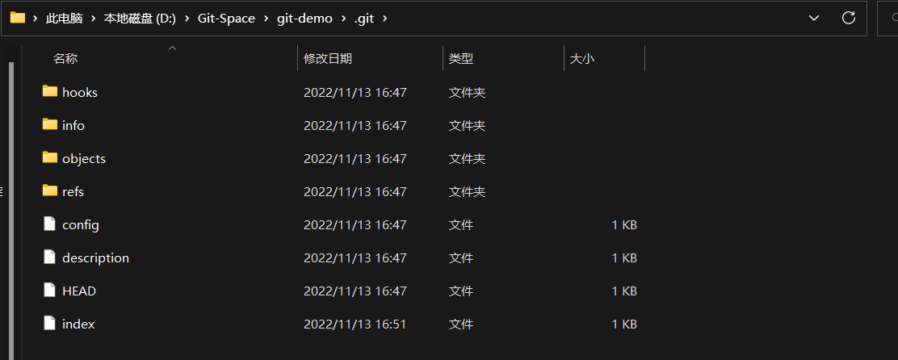
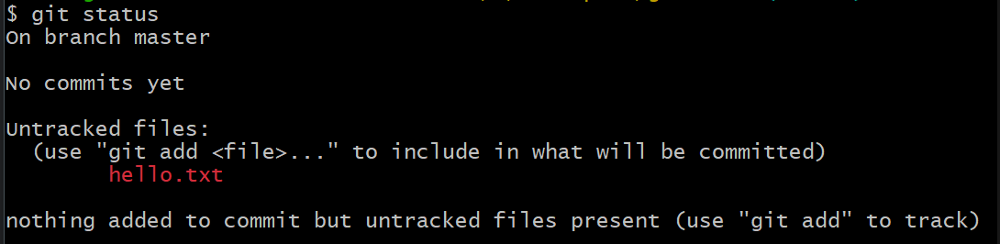
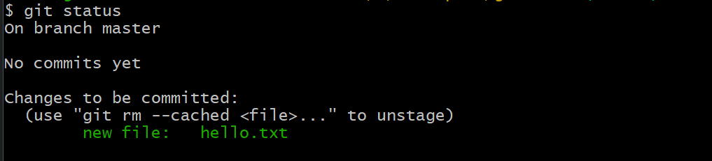
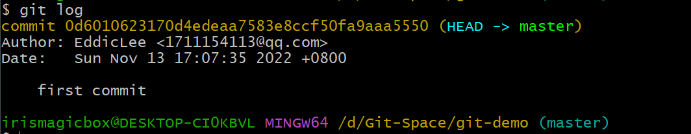
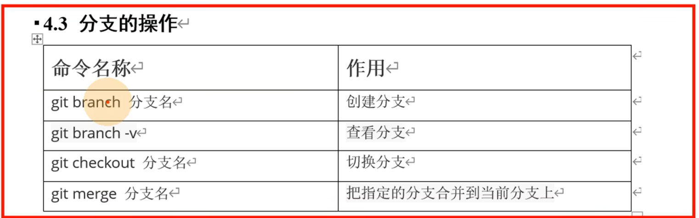
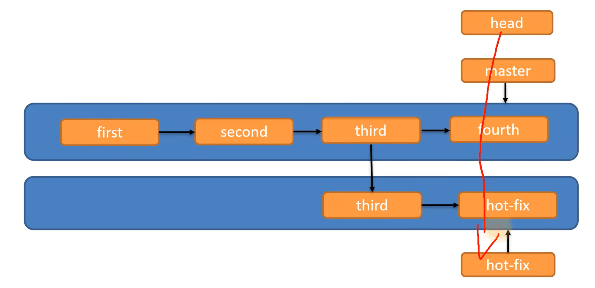
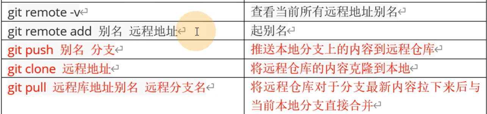
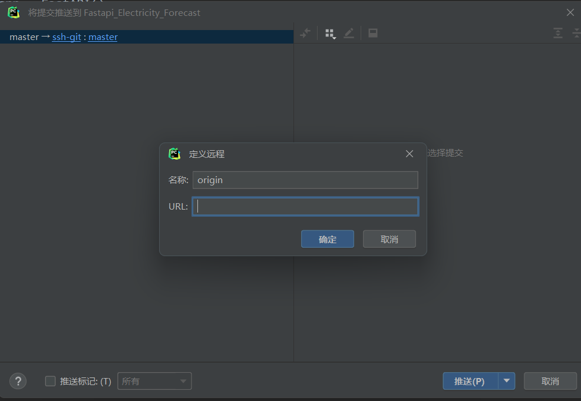

# git：

## git控制版本使用的是 指针指向 来控制的，不是保存副本的形式




# 1、基本命令

- git --version		查看git版本

- #### git init                 初始化本地库【获取本地的管理权】

  - 
  - 

- git status            查看git的状态

  - 

- #### git add                 将文件添加至暂存区

  - 

- git rm --cached hello.txt      从暂存区删除add进的文件

- #### git commit -m "备注版本信息" hello.txt      提交本地库文件

- git log / git reflog                      查看详细的提交日志

  - 

- git reset --hard 版本号             滚动到指定版本号的文件

# 2、分支






# 3、github———使用ssh免密登录进行推送，使用http连接会失败

远程仓库操作：




## 3.1、ssh免密登录

### 1、在用户irismagicbox目录下打开git bush

```
ssh-keygen -t -rsa -C github邮箱
```

在irismagicbox下的.ssh目录下可以看到生成的公钥和私钥，将公钥复制到github settings SSH and GPG keys下添加公钥

### 2、在idea中定义ssh

点击推送后出现



将github上ssh的链接添加进去

# 4、在IDEA中集成Git

## 4.1、配置Git忽略文件

