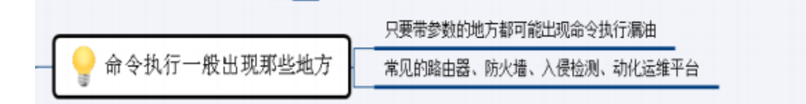

# 1、基础漏洞

## 1.1、SQL注入漏洞

> ### 把用户输入的数据当作代码执行
>
> ### 根本原因在于代码中没有对用户输入项进行验证和处理便直接拼接 到查询语句中。

> ### 分类：
>
> - 显注：Web服务器有错误回显，所以对于攻击者来说有非常重要的“调试信息”。
> - 盲注：没有错误回显，对于攻击者来说缺少了非常重要的“调试信息”。
>   - 布尔盲注：
>   - 时间盲注：
>
> 
>
> ### 危害： 
>
> 1.数据库信息泄露 
>
> 2.网页篡改 
>
> 3.网站被挂马，传播恶意软件 
>
> 4.数据库被恶意操作 
>
> 5.服务器被植入后门 
>
> 6.破坏硬盘或者服务器等硬件设备
>
> ### 如何进行防御：
>
> 1.关闭应用的错误提示 
>
> 2.加waf **【Web应用防护系统，Web应用[防火墙](https://baike.baidu.com/item/防火墙)是通过执行一系列针对HTTP/HTTPS的[安全策略](https://baike.baidu.com/item/安全策略/2890163)来专门为[Web](https://baike.baidu.com/item/Web/150564)应用提供保护的一款产品。】**
>
> 3.对输入进行过滤 
>
> 4.限制输入长度 
>
> 5.限制好数据库权限，drop/create/truncate等权限谨慎grant **【授权】**
>
> 6.预编译好sql语句，python和Php中一般使用?作为占位符。这种方法是从**编程框架**方面解决利用占位符参数的sql注入，只能说一定程度上防止注入。还有缓存溢出、终止字符等。 
>
> 7.数据库信息加密安全（引导到密码学方面）。不采用md5因为有彩虹表【**为破解密码的散列值（或称哈希值、微缩图、摘要、指纹、哈希密文）而准备。一般主流的彩虹表都在100G以上**】，一般是一次md5后 再md5 
>
> 8.清晰的编程规范，结对/自动化代码review**【代码审查，进行规范化编程，避免代码错误】**，加大量现成的解决方案 
>
> （PreparedStatement，ActiveRecord，歧义字符过滤， **只可访问存储过程** 
>
> balabala）已经让SQL注入的风险变得非常低了。 
>
> ### 如何绕过防御：
>
> 1，关键字可以用%（只限 IIS 系列）。比如 select，可以 sel%e%ct 
>
> 2，通杀的内联注释【**用编译器忽略并且不执行任何文本中的注释**】，如 /*!select*/ 过waf
>
> 3，双URL编码绕过WAF
>
> 4，multipart 请求绕过，在 POST 请求中添加一个上传文件，绕过了 绝大多数 WAF 
>
> **【1.multipart/form-data的基础方式是post，也就是说通过post组合方式来实现的。**
> **2.multipart/form-data于post方法的不同之处在于请求头和请求体。**
>
> **如果传送的内容是一个文件的话，那么还会包含文件名信息以及文件内容类型。上面第二部分是一个文件体的结构，最后以--分隔符--结尾，表示请求体结束。】**
>
> 5，参数绕过，复制参数，id=1&id=1 
>
> 6，组合法 如 and 可以用&&再 URL 编码 
>
> 7、替换法，如 and 改成&&;=可以用 like 或 in 等 


## 1.2、CSRF漏洞

> ### CSRF跨站点请求伪造。攻击者盗用了受害者的身份，以受害者的名义发送恶意请求
>
> 
>
> ### 与XSS不同：
>
> ```
> XSS：    XSS漏洞——构造payload——发送给受害人——受害人点击打开——攻击者获取受害人的cookie——攻击者使用受害人cookie完成攻击
> 
> CSRF：  CSRF漏洞——构造payload——发送给受害人——受害人点击打开——受害人执行代码——受害人完成攻击（不知情）
> ```
>
> 
>
> ### 危害：
>
> 危害： 
>
> 1、对网站管理员进行攻击 
>
> 2、修改受害网站上的用户账户和数据 
>
> 3、账户劫持 
>
> 4、传播CSRF蠕虫进行大规模攻击 
>
> 5、利用csrf进行拖库 **【指从数据库中导出数据】**
>
> 6、利用其他漏洞进行组合拳攻击 
>
> 7、针对路由器的csrf攻击 

> ### 如何防御：
>
> 尽量使用POST，限制GET**【GET接口太容易被拿来做CSRF攻击，只需要一个HTTP请求】**； 
>
> 浏览器Cookie策略； 
>
> 加验证码；
>
> Referer Check； 【**防止图片盗链**】
>
> Anti CSRF Token 【**当第一次登录后，服务器生成一个Token便将此Token返回给客户端，以后客户端只需带上这个Token前来请求数据即可，无需再次带上用户名和密码。**】


## 1.3、文件包含漏洞

> ### 程序开发人员通常会把可重复使用的函数写到单个文件中，在使用某些函数时，直接调用此文件，无须再次编写，这种调用文件的过程称为包含。

> ### PHP文件包含漏洞是一种***注入型漏洞***
>
> #### 注入型漏洞还有[XSS](https://so.csdn.net/so/search?q=XSS&spm=1001.2101.3001.7020)漏洞和SQL注入漏洞
>
> 
>
> ### 类型：
>
> 1.本地文件包含 【**包含本地服务器的文件】**
>
> 2.远程文件包含 ：即加载远程文件，在`php.ini`中开allow_url_include 、 allow_url_fopen选项。开启后可以直接执行任意代码。 
>
> 
>
> ### PHP文件包含函数 ：
>
> 1.include()：使用此函数，只有代码执行到此函数时才将文件包含进来，发生错误时只警告 
>
> 并继续执行。 
>
> 2.inclue_once()：功能和前者一样，区别在于当重复调用同一文件时，程序只调用一次。 
>
> 3.require()：使用此函数，只要程序执行，立即调用此函数包含文件，发生错误时，会输出 
>
> 错误信息并立即终止程序。 
>
> 4.require_once()：功能和前者一样，区别在于当重复调用同一文件时，程序只调用一 次
>
> 
>
> ### 利用：
>
> 1.读取敏感文件 
>
> 2.远程包含shell 
>
> 3.图片上传并包含图片shenll [Shell 教程 | 菜鸟教程 (runoob.com)](https://www.runoob.com/linux/linux-shell.html#:~:text=Shell 教程. Shell 是一个用 C 语言编写的程序，它是用户使用 Linux 的桥梁。.,的 sh 是第一种 Unix Shell，Windows Explorer 是一个典型的图形界面 Shell。.)
>
> 4.使用伪协议（伪协议是为关联应用程序而使用的，例如在URL中使用伪协议写入JavaScript代码，浏览器运行URL时会运行这段JavaScript代码） 
>
> 5.包含日志文件GetShell 
>
> 6.截断包含
>
>  
>
> ### 如何防御 ：
>
> 1.禁止远程文件包含allow_url_include=off 
>
> 2.配置open_basedir=指定目录，限制访问区域。 
>
> 3.过滤../等特殊符号 
>
> 4.修改Apache日志文件的存放地址 
>
> 5.开启魔术引号magic_quotes_qpc=on 
>
> 6.尽量不要使用动态变量调用文件，直接写要包含的文件。


## 1.4、文件上传漏洞

> ### 用户文件上传功能代码没有对上传文件的格式进行严格过滤，而导致用户可以越过本身权限向服务器上传木马去控制服务器. 
>
> ### 用户文件上传功能代码处理缺陷
>
> 
>
> ### 危害：
>
> 操作木马文件提权 获取网站权限 
>
> 
>
> ### 如何防御：
>
> 1.后端验证：采用服务端验证模式 
>
> 2.**后缀**验证：基于白名单，黑名单过滤 
>
> 3.MIME验证：基于上传自带类型检测 
>
> 4.内容检测：文件头，完整性检测 
>
> 5.自带函数过滤
>
> 6.WAF防护软件：宝塔、云盾等 
>
> 
>
> ### 绕过方法： 
>
> #### 黑名单是定义不允许上传的扩展名, 白名单则是定义允许上传的扩展名
>
> 1.绕过黑名单验证
>
> ​	a.后缀名不完整 .php5 .phtml等 
>
> ​	b.上传.htacess **【触发getshell将。jpg解析成。php】**
>
> ​	c.大小写 
>
> ​	d.在数据包中文件后缀名前加空格 
>
> ​	e.后缀名前加. 
>
> ​	f.加上::$DATA **【windows下ADS流特性，导致上传文件xxx.php::$DATA = xxx.php】**
>
> ​	g.未循环验证，可以使用x.php..类似的方法 
>
> 
>
> 2.绕过白名单验证（一般需要配合其他漏洞一起利用） 
>
> ​	a.%00截断 **【操作系统在识别字符串时，当读取到\0字符时，就认为读取到了一个字符串的结束符号。因此，我们可以通过修改数据包，插入\0字符的方式，达到字符串截断的目的。】**
>
> ​	b.图片马 
>
> ​	c.条件竞争 （条件竞争是指一个系统的运行结果依赖于不受控制的事件的先后顺序。当这些不受控制的事件并没有按照开发者想要的方式运行时，就可能会出现 bug。这个术语最初来自于两个电信号互相竞争来影响输出结果。）


## 1.5、**SSRF**漏洞 （服务端请求伪造）

> ### 利用一个可以发起网络请求的服务当作跳板来攻击内部其他服务。
>
> ### SSRF攻击的目标是从外网无法访问的内部系统。（正是因为它是由服务端发起的，所以它能够请求到与它相连而与外网隔离的内部系统）。
>
> 
>
> ### 危害： 
>
> 1. 探测内网信息,用协议探`ftp%26ip={ip}%26port={port}` 
>
> 2. 攻击内网或本地其他服务 
>
> 3. 穿透防火墙 
>
> 
>
> ### 具体利用的方式：
>
> - file协议：读取本地文件
> - dict协议：探测端口
> - gopher协议 ：
>   - 截获get请求包和post请求包
>   - 攻击内网应用，在攻击内网ftp【**应用层上进行文件传输的一套标准协议**】、redis【**日志型Key-Value[数据库](https://baike.baidu.com/item/数据库/103728)**】、telnet【**是Internet远程登录服务的标准协议和主要方式**】、Memcache**【[分布式](https://baike.baidu.com/item/分布式/19276232)的高速缓存系统，被许多网站使用以提升网站的访问速度】**上有极大作用
>   - 利用 gopher协议访问redis反弹shell 
>
> 【Gopher是Internet上一个非常有名的信息查找系统，它将Internet上的文件组织成某种索引，很方便地将用户从Internet的一处带到另一处，gopher协议支持发出GET、POST请求：可以先截获get请求包和post请求包，再构成符合gopher协议的请求。gopher协议是ssrf利用中最强大的协议】
>
> 
>
> ### 如何防御： 
>
> 1.地址做白名单处理 
>
> 2.域名识别IP 过滤内部IP 
>
> 3.校验返回的内容对比是否与假定的一致
>
> 
>
> ### 如何绕过防御 
>
> 1.http://example.com@127.0.0.1` 
>
> 2.利用IP地址的省略写法绕过,[::]绕过localhost 
>
> 3.DNS解析 http://127.0.0.1.xip.io/可以指向任意ip的域名：xip.io 
>
> 4.利用八进制IP地址绕过,利用十六进制IP地址绕过，利用十进制的IP地址绕过 
>
> 
>
> ### 漏洞存在的地方： 
>
> 1.能够对外发起网络请求的地方 
>
> 2.请求远程服务器资源的地方 
>
> 3.数据库内置功能 
>
> 4.邮件系统 
>
> 5.文件处理 
>
> 6.在线处理工具 
>
> - 在线识图，在线文档翻译，分享，订阅等，这些有的都会发起网络请求。 
> - 根据远程URL上传，静态资源图片等，这些会请求远程服务器的资源。 
> - 邮件系统就是接收邮件服务器地址这些地方。 
> - 文件就找ImageMagick，xml这些。 
> - 从URL关键字中寻找，比如：source,share,link,src,imageurl,target等。 


## 1.6、逻辑漏洞 

> 

> ### 1.挖过的逻辑漏洞： 
>
> - 订单任意金额修改 
>
> - 订单价格设定为负数。 
>
> 预防思路： 
>
> - 订单需要多重效验 
>
> - 订单数值较大的时候需要人工审核 
>
> 
>
> ### 2.验证码回传 
>
> 漏洞一般发生在账号密码找回、账号注册、支付订单等。验证码发送途径一般为手机短信、邮 
>
> 箱邮件 
>
> 预防思路： 
>
> - 验证方式主要采取后端验证，但是缺点是服务器的运算压力也会随之增加 
>
> - 前端验证需要进行加密 
>
> ### 3.未进行登陆凭证验证 
>
> 有些业务的接口，因为缺少了对用户的登陆凭证的效验或者是验证存在缺陷，导致黑客可以未 
>
> 经授权访问这些敏感信息甚至是越权操作。比如后台页面、订单ID枚举、敏感信息可下载、没 
>
> 验证ID或cookie验证导致越权。 
>
> 预防思路： 
>
> - 对敏感数据存在的接口和页面做cookie，ssid，token或者其它验证 
>
> ### 4.接口无限制枚举 
>
> - 某电商登陆接口无验证导致撞库 
>
> - 某招聘网验证码无限制枚举**07-XSS**漏洞 
>
> - 某快递公司优惠券枚举 
>
> - 某电商会员卡卡号枚举 
>
> 预防思路： 
>
> - 在输入接口设置验证，如token，验证码等。如果设定验证码，最好不要单纯的采取一个前 端验证，最好选择后端验证。如果设定token，请确保每个token只能采用一次，并且对 token设定时间参数。 
>
> - 注册界面的接口不要返回太多敏感信息，以防遭到黑客制作枚举字典。 
>
> - 验证码不要用短数字，尽量6位以上，最好是以字母加数字进行组合，并且验证码需要设定 时间期限。 
>
> - 优惠券，VIP卡号请尽量不要存在规律性和简短性，并且优惠券最好是以数字加字母进行组 合
>
> ### 5.cookie设置存在缺陷 
>
> - Cookie的效验值过于简单。有些web对于cookie的生成过于单一或者简单，导致黑客可以 对cookie的效验值进行一个枚举. 
>
> - cookie存在被盗风险，即用户重置密码后使用老cookie依然可以通过验证 
>
> - 用户的cookie数据加密应严格使用标准加密算法，并注意密钥管理。不能采取简单的 base64等算法 
>
> - 越权：平行越权：权限类型不变，权限ID改变；垂直越权：权限ID不变，权限类型改变；交 叉越权：即改变ID，也改变权限 
>
> ## 预防思路 ：
>
> 1.cookie中设定多个验证，比如自如APP的cookie中，需要sign和ssid两个参数配对，才 能返回数据。 
>
> 2.用户的cookie数据加密应严格使用标准加密算法，并注意密钥管理。 
>
> 3.用户的cookie的生成过程中最好带入用户的密码，一旦密码改变，cookie的值也会改变。 
>
> 4.cookie中设定session参数，以防cookie可以长时间生效。 
>
> 5.根据业务不同还有很多方法 


## 1.7、**XSS**漏洞 

> ### 通过插入恶意脚本劫持cookie，实现对用户浏览器的攻击 
>
> ### 类型: 
>
> - 存储**XSS**漏洞 
> - 反射**XSS**漏洞 
> - dom **XSS**漏洞 
>
> ### 反射和dom的区别: DOM-XSS是javascript处理输出， 而反射性xss是后台程序处理 
>
> 
>
> ### 如何防御： 
>
> 1.对输入内容的特定字符进行编码，例如表示html标记的 < > 等符号。 
>
> **2**.**对重要的cookie设置httpOnly, 防止客户端通过document.cookie读取 cookie，此 HTTP头由服务端设置。** 
>
> 3.将不可信的值输出URL参数之前，进行URLEncode操作，而对于从URL参数中获取值一定要 进行格式检测（比如你需要的时URL，就判读是否满足URL格式）。 
>
> **4.不要使用Eval来解析并运行不确定的数据或代码，对于JSON解析请使用 JSON.parse() 方法**
>
> 
>
> ### 如何绕过防御： 
>
> **1.大小写** 
>
> **2.js伪协议** 
>
> 3.没有分号 
>
> 4.Flash 
>
> 5.Html5新标签
>
> 6.Fuzz进行测试 
>
> 7.双层标签绕过 


## 1.8、**XXE**漏洞

> ### 解析用户传入的xml 
>
> ### 具体利用方式：
>
> - 内网端口扫描
> - 利用file协议等读取文件
> - 攻击内网web应用使用 
>
> - get(struts2等) 
>
> ### 危害： 
>
> 1.导致可以加载恶意外部文件 
>
> 2.造成文件读取 
>
> 3.内网端口扫描 
>
> 4.攻击内网网站 
>
> 5.发起dos攻击等危害 
>
> ### 防御: 
>
> - 过滤用户提交的XML数据、
> - 如果你当前使用的程序为PHP，则可以将 libxml_disable_entity_loader设置为TRUE来禁用外部实体，从而起到防御的目的 


## 1.9、代码执行漏洞 

> ### 没有对接口输入的内容进行严格的判断 造成攻击者精心构造的代码非法执行 
>
> ### 当应用在调用一些能将字符转化为代码的函数(如PHP中的eval)时，没有考虑用户是否能控制这个字符串，这就会造成代码执行漏洞。 
>
> 
>
> ### 相关函数： 
>
> - PHP：eval 、assert 
>
> - Python：exec 
>
> - asp：<%=CreateObject(“wscript.shell”).exec(“cmd.exe /cipconfig”).StdOut.ReadAll()%> 
>
> 
>
> ### 漏洞利用： 
>
> 执行代码的函数：eval、assert 
>
> callback函数：preg_replace + /e模式 
>
> 反序列化：unserialize()(反序列化函数) 
>
> 
>
> ### 危害：
>
> - 执行代码 
>
> - 让网站写shell 
>
> - 甚至控制服务器
>
> 
>
> ### 如何防御： 
>
> **1**.**使用json保存数组，当读取时就不需要使用eval了** 
>
> 2.对于必须使用eval的地方，一定严格处理用户数据 
>
> 3.字符串使用单引号包括可控代码，插入前使用addslashes转义 
>
> 4.放弃使用preg_replace的e修饰符，使用preg_replace_callback()替换 
>
> 5.若必须使用preg_replace的e修饰符，则必用单引号包裹正则匹配出的对象 


## 1.10、路径覆盖漏洞（RPO）

> ### RPO的全称为Relative Path Overwrite,也就是相对路径覆盖
>
> ### 利用客户端和服务端的差异，通过相对路径来引入js或css文件，从而实现某种攻击
>
> 
>
> ### 此攻击方法依赖于浏览器和网络服务器的反应，基于服务器的Web缓存技术和配置 差异，以及服务器和客户端浏览器的解析差异
>
> 
>
> ### 利用前端代码中加载的css/js的相对路径来加载其他文件，最终浏览器把 服务器返回的非css/js文件 **当做css/js来解析**，从而导致 XSS，信息泄露等漏洞产生。 


## 1.11、邮件系统漏洞攻击 

> ### 一、IMAP 和 POP 漏洞： 
>
> 这些协议常见弱点是密码脆弱，同时，各种IMAP和POP服务还容易受到如缓冲区溢出等类型的攻击
>
> ### 二、拒绝服务（DoS）攻击： 
>
> 1.死亡之Ping——发送一个无效数据片段，该片段始于包结尾之前，但止于包结尾之后； 
>
> 2.同步攻击——极快地发送TCP SYN包（它会启动连接），使受攻击的机器耗尽系统资源，进而中断合法连接； 
>（**当两台计算机在TCP连接上进行会话时，连接一定会首先被初始化。完成这项任务的包叫作SYN。一个SYN包简单的表明另一台计算机已经做好了会话的准 备。只有发出服务请求的计算机才发送SYN包。**）
> 3.循环——发送一个带有完全相同的源／目的地址／端口的伪造SYN包，使系统陷入一个试图完成TCP连接的无限循环中。 
>
> ### 三、系统配置漏洞： 
>
> 1.默认配置——大多数系统在交付给客户时都设置了易于使用的默认配置，被黑客盗用变得轻 松；
>
> 2.空的／默认根密码——许多机器都配置了空的或默认的根／管理员密码，并且其数量多得 惊人； 
>
> 3.漏洞创建——几乎所有程序都可以配置为在不安全模式下运行，这会在系统上留下不必要的漏洞。、
>
> ### 四、利用软件问题：在服务器守护程序、客户端应用程序、操作系统和网络堆栈中，存在很多的软件错误，分为以下几类： 
>
> 1.**缓冲区溢出**——程序员会留出一定数目的字符空间来容纳登录用户名，黑客则会通过发送比指定字符串长的字符串，其中包括服务器要执行的代码，使之发生数据溢出，造成系统入侵。 
>
> 2.**意外组合**——程序通常是用很多层代码构造而成的，入侵者可能会经常发送一些对于某一层毫 无意义，但经过适当构造后对其他层有意义的输入。 
>
> 3.**未处理的输入**——大多数程序员都不考虑输入不符合规范的信息时会发生什么。


## 1.12、**DNS**欺骗是什么？

> ### DNS欺骗就是攻击者冒充域名服务器的一种欺骗行为。 
>
> 
>
> ### 原理：
>
> 如果可以冒充域名服务器，然后把查询的IP地址设为攻击者的IP地址，这样的话，用户上网就只能看到攻击者的主页，而不是用户想要取得的网站的主页了
>
> 
>
> ### DNS欺骗其实并不是真的“黑掉”了对方的网站，而是冒名顶替、招摇撞骗罢了。  


## 1.13、**DDOS**攻击 

> ### 分布式拒绝服务攻击（DDoS）是目前黑客经常采用而难以防范的攻击手段。DoS的攻击方式有很多种，最基本的DoS攻击就是利用合理的服务请求来占用过多的服务资源，从而使合法用户无法得到服务的响应。
>
> 
>
> ### 抗D思想和方案 ：
>
> 负载均衡 
>
> 花钱买流量清洗服务 
>
> CDN：web网站加速，比如应对cc攻击 【DDOS攻击的一种】
>
> - 
>
> 分布式集群防御 
>
> 高防服务器：防大部分攻击，udp、大型的cc攻击 
>
> 
>
> ### 预防为主 ：
>
> 系统漏洞 
>
> 系统资源优化： 
>
> 过滤不必要的服务和端口 
>
> 限制特定流量：检查访问来源做适当限制 


## 1.14、什么是**CC**攻击？ 

> ### CC攻击是DDOS（分布式拒绝服务）的一种，相比其它的DDOS攻击CC似乎更有技术含量一些。这种攻击你见不到真实源IP，见不到特别大的异常流量，但造成服务器无法进行正常连接。
>
> 
>
> ### 原理：
>
> - 攻击者控制某些主机不停地发大量数据包给对方服务器造成服务器资源耗尽， 一直到宕机溃。
>
> - CC主要是用来攻击页面的
>
> - CC就是模 拟多个用户（多少线程就是多少用户）不停地进行访问那些需要大量数据操作（就是需要大量 CPU时间）的页面，造成服务器资源的浪费，CPU长时间处100%
>
> - 直至就网络拥塞，正常的访问被中止


## 1.15、常见的端口和对应的服务

> ### 1、web类 
>
> - 这部分常有的漏洞有：（web漏洞/敏感目录）第三方通用组件漏洞struts、thinkphp、 jboss、ganglia、zabbix 
>
> - 80 web 
>
> - 80-89 web 
>
> - 8000-9090 web 
>
> ### 2、数据库类（扫描弱口令） 
>
> - 1433 MSSQL （SQLServer）
>
> - 1521 Oracle 
>
> - 3306 MySQL 
>
> - 5432 PostgreSQL 
>
> ### 3、特殊服务类（未授权/命令执行/漏洞） 
>
> 8443  						SSL心脏滴血 
>
> 873 						 Rsync未授权 
>
> 5984 						CouchDB
>
> 6379 						redis未授权 
>
> 7001、7002 			weblogic默认弱口令、反序列化 
>
> 9200、9300 			elasticsearch 参考乌云：多玩某服务器ElasticSearch命令执行漏洞 
>
> 11211 					memcache未授权访问 
>
> 50000					 SAP命令执行 
>
> 50070、50030		hadoop默认端口未授权访问 
>
> ### 4、常用端口类（扫描弱口令/端口爆破） 
>
> 21 						ftp 
>
> 22 						ssh 
>
> 23						 telnet 
>
> 2601、2604 		zebra路由，默认密码zebra 
>
> 3389					 远程桌面
>
> ### 常见的端口漏洞 
>
> 21		 ftp FTP服务端有很多 anonymous 匿名未授权访问 爆破 
>
> 22		 ssh root密码爆破 后门用户 可以google查一些关于ssh后门的文章 里面的默认密码可能会登入进去 
>
> 23		 telnet 一般会发生在 路由器 或者交换机 嵌入式设备 管理端口 攻击方法 弱口令 
>
> 25 		smtp【**一种提供可靠且有效的[电子邮件传输](https://baike.baidu.com/item/电子邮件传输/22035911)的协议**】 默认用户 默认密码 邮件账号爆破 
>
> 80 		http web 常见的Owasp top 10 中间件反序列化 中间件溢出 fastcgi配置不 当造成fastcgi端口泄露 
>
> 110		 pop3 默认用户 默认密码 邮件账号爆破 
>
> 443 		https openssl 心脏滴血（影响范围较小） SSL/TLS低版本存在的漏洞 
>
> 135、139、 445		 netbios smb MS17010 **（永恒之蓝）**
>
> 3389 					RDP CVE-2019-0708 
>
> ### 3389和443、445有什么漏洞？ 
>
> 445：ms06_040（**魔波**），蠕虫，勒索病毒、MS17-010 （**永恒之蓝）**
>
> 443：ssl心脏滴血 
>
> 3389：rdp漏洞、弱口令、ms06_040（**魔波**）、ms12-20 


## 1.16、身份认证漏洞最常见是？ 

> ### 1.会话固定攻击 
>
> ### 2.cookie仿冒 
>
> ### 只要得到session和cookie即可伪造用户身份


## 1.17、验证码漏洞 

> ### 1.验证码漏洞存在暴力破解 
>
> ### 2.可以通过js或改包方法进行绕过


## 1.18、**DOM** 型**XSS**人工测试 

> 人工测试思路：找到类似 document.write、innerHTML赋值、outterHTML 赋值、 
>
> window.location 操作、写javascript:后内容、eval、setTimeout 、 
>
> setInterval 等直接执行之类的函数点。找到其变量，回溯变量来源观察是否可控，是否经 
>
> 过安全函数。 


## 1.19、为什么参数化查询可以防止**SQL**注入？ 

> ### 语句是语句，参数是参数，参数的值并不是语句的一 部分
>
> ### 原理:
>
> - 使用参数化查询数据库服务器不会把参数的内容当作sql指令的一部分来执行
>
> - 是在数据库完成sql指令的编译**后**才套用参数运行 


## 1.20、各种常见的状态码

> 200 OK 									  //客户端请求成功 
>
> 403 Forbidden 					 	//服务器收到请求，但是拒绝提供服务 
>
> 404 Not Found 						//请求资源不存在，eg：输入了错误的 URL 
>
> 500 Internal Server Error 	  //服务器发生不可预期的错误 


## 1.21、**Dll**劫持漏洞 

> 由于输入表中只包含DLL名而没有它的路径名，因此加载程序必须在磁盘上搜索 DLL 文件。首先会尝试从当前程序所在的目录加载DLL，如果没找到，则在Windows系统目录中查找，最后是在环境变量中列出的各个目录下查找。
>
> 
>
> 利用 这个特点，先伪造一个系统同名的DLL，提供同样的输出表，每个输出函数转向 真正的系统DLL。程序调用系统DLL时会先调用当前目录下伪造的 DLL，完成相关功能后，再 跳到系统DLL同名函数里执行。这个过程用个形象的词来描述，就是系统DLL被劫持 （hijack）了
>
> 
>
> 伪造的dll制作好后，放到程序当前目录下，这样当原程序调用原函数时就调 用了伪造的dll的同名函数
>
> ### 如何防御：
>
> DLL劫持利用系统未知DLL的搜索路径方式，使得程序加载当前目录下的系统同名DLL。
>
> 所以可以告诉系统DLL的位置，改变加载系统DLL的顺序不是当前目录，而是直接到系统目录下查找。


## 1.22、一句话木马 

> ### asp一句话木马：
>
>  <%execute(request("value"))%> 
>
> ### php一句话木马：
>
> <?php@eval($_POST[value]);?> 
>
> 变形：<?php$x=$_GET[‘z’];@eval(“$x;”);?> 
>
> ### aspx一句话木马： 
>
> <%@ PageLanguage="Jscript"%> 
>
> <%eval(Request.Item["value"])%> 


## 1.23、命令执行漏洞 

> 

> 

> ### 绕过技巧： 
>
>  # 管道符号绕过 
>
> \# 空格绕过 ${IFS} 
>
> \# %0a、%09 # 重定向绕过 < <> 
>
> \# 变量拼接绕过 @kali:$ a=c;b=at;c=fl;d=ag;$a$b $c$d 
>
> \# 单引号、双引号绕过 ca''t flag cat"" flag 
>
> \# 编码绕过 
>
> ​		$(printf "\x63\x61\x74\x20\x2f\x66\x6c\x61\x67") ==>cat /flag
>
> ​		\#{printf,"\x63\x61\x74\x20\x2f\x66\x6c\x61\x67"}|\$0 ==>cat /flag 
>
> ​		#$(printf "\154\163") ==>ls 
>
> ​		$(printf "\154\163") 
>
> \# 查看等价替换 
>
> ​		(1)more:一页一页的显示档案内容 
>
> ​		(2)less:与more类似，但是比more更好的是，他可以[pg dn][pg up]翻页 
>
> ​		(3)head:查看头几行 
>
> ​		(4)tac:从最后一行开始显示，可以看出tac是cat的反向显示 
>
> ​		(5)tail:查看尾几行 
>
> ​		(6)nl：显示的时候，顺便输出行号 
>
> ​		(7)od:以二进制的方式读取档案内容 
>
> ​		(8)vi:一种编辑器 
>
> ​		(9)vim:一种编辑器 
>
> ​		(10)sort:可以查看 
>
> ​		(11)uniq:可以查看 
>
> ​		(12)file -f:报错出具体内容
>
> \# 反斜线绕过 c\at fl\ag 
>
> \# 内敛注释绕过\#`命令`和$(命令)都是执行命令的方式 echo "m0re#`cat flag`" 	echo "m0re $(cat flag)" 
>
> \# base64编码绕过 `echo "Y2F0IGZsYWc="|base64 -d` 
>
> \# 绕过长度限制 
>
> \# >命令会将原有文件内容覆盖 echo '123'>xxoo.txt # >>符号的作用是将字符串添 加到文件内容末尾，不会覆盖原内容 echo '233'>>xxoo.txt 
>
> \# 命令换行绕过 
>
> ​		ca\ 
>
> ​		a\


