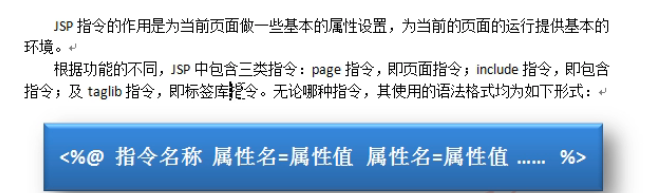

# 1、web基础

## 1.1、基本概念


## 1.2、web应用程序


## 1.3、动态web


# 1、Servlet


# 2、MVC三层架构


什么是MVC：

Model														view							Controller	

模型（实体类和数据库中对应的字段）	视图（JSP页面）	控制器（Servlet：负责跳转页面）


Model(dao，service)

- 业务处理：业务逻辑（Service）
- 数据持久层：CRUD

View（jsp）

- 展示数据
- 提供连接发起Servlet请求

Controller（Servlet）

- 接受用户的请求（req：请求参数、Session信息。。。）
- 交给业务层处理对应的代码
- 控制视图的跳转

```
登录-->接受用户的登录信息-->处理用户请求(获取登录参数,username、password)-->交给业务层处理登录业务(欲判断用户密码是否正确:事务)-->交Dao层查询用户名和密码是否正确-->数据库
```


# 3、JSP

## 3.1、JSP指令



- ### page指令


- ### include指令

  - 静态连编
    - include包含文件时会将被包含的文件的内容拷贝到当前文件
    - 文件中的变量可以共享 


## 3.2、JSP动作——简化java代码块，使用系统定义好的标签完成本应由java代码来完成的功能


# JSP作业：

1、界**面图片和颜色**、新闻内容、评论内容等数据根据个人情况设置，不能与教材雷同。

2、在每个页面合适的地方**显示自己的姓名**。

3、要求：登录判断后的页面跳转采用**请求转发**和**页面重定向**两种方法实现。

4、修改用户登录功能：

- **①区分管理员和普通用户**。  
- **②登录成功后，菜单栏右侧显示正确的功能菜单项。**

5、修改用户登录功能：

- ①增加注册用户的用户修改页面modiUser.jsp和管理员用户的用户管理页面manageUser.jsp。 
- ②注册用户或管理员用户进入相应的页面时需要授权，即根据用户身份确定是否允许进入。

6、要求分别采用Statement和PreparedStatement对象执行查询语句，并验证SQL注入攻击。 （可以在同一个页面中编写代码，将其中一种方法的代码添加为注释。） 

7、完成新闻发布系统的用户管理模块。   

- 注册用户：修改个人信息   
- 管理员：查看所有用户、删除指定用户。   要求至少有一个功能使用PreparedStatement对象实现。

8、使用JSP+JavaBean实现新闻发布、新闻管理、新闻阅读功能。

9、程序7.1、7.2            参考教材7.3节实现新闻修改功能

