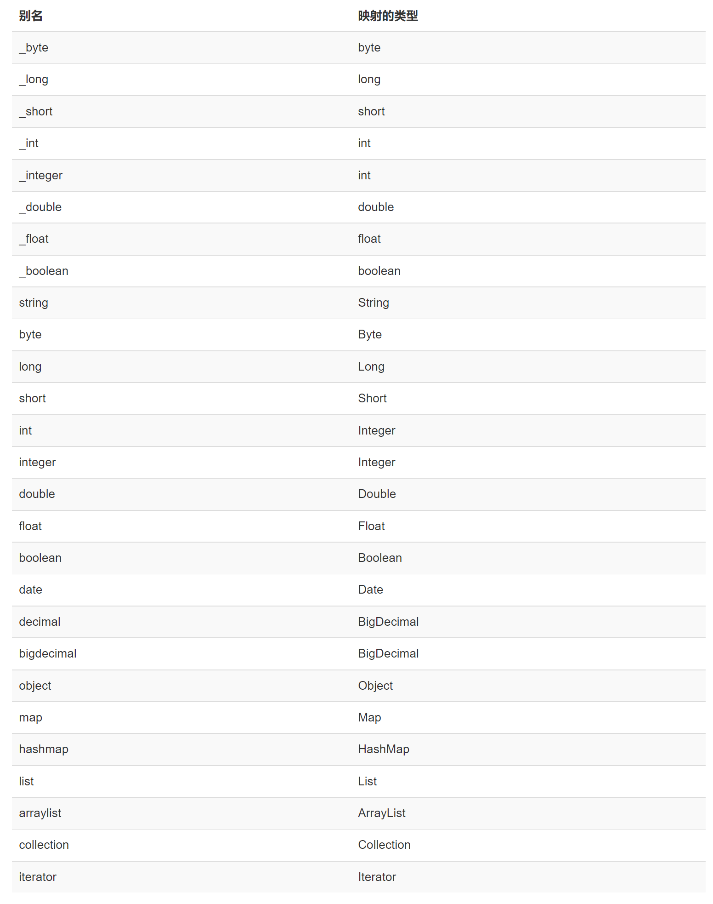
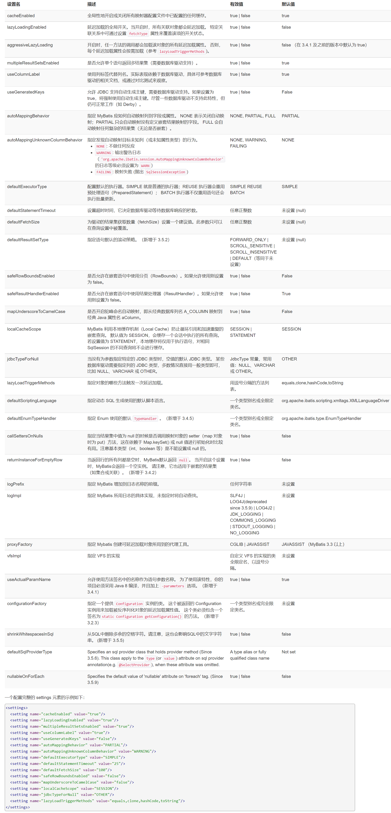
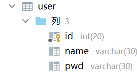
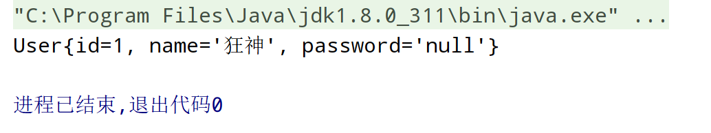
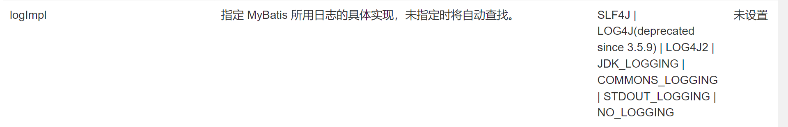

# 1、MyBatis官方中文手册：https://mybatis.org/mybatis-3/zh/getting-started.html

# 2、依赖的配置：
## 2.1、父工程pom.xml需要导入的依赖：

```xml
<!--导入依赖-->
<dependencies>
    <!--mysql驱动-->
    <dependency>
        <groupId>mysql</groupId>
        <artifactId>mysql-connector-java</artifactId>
        <version>5.1.47</version>
    </dependency>
    <!--mybatis-->
    <dependency>
        <groupId>org.mybatis</groupId>
        <artifactId>mybatis</artifactId>
        <version>3.5.2</version>
    </dependency>
    <!--junit-->
    <dependency>
        <groupId>junit</groupId>
        <artifactId>junit</artifactId>
        <version>4.12</version>
    </dependency>
</dependencies>
```
## 2.2、以下为父pom.xml的总体配置：

```xml
<?xml version="1.0" encoding="UTF-8"?>
<project xmlns="http://maven.apache.org/POM/4.0.0"
         xmlns:xsi="http://www.w3.org/2001/XMLSchema-instance"
         xsi:schemaLocation="http://maven.apache.org/POM/4.0.0 http://maven.apache.org/xsd/maven-4.0.0.xsd">
    <modelVersion>4.0.0</modelVersion>

    <!--父工程-->
    <groupId>org.example</groupId>
    <artifactId>TeseMybatis</artifactId>
    <packaging>pom</packaging>
    <version>1.0-SNAPSHOT</version>
    <modules>
        <module>mybatis_01</module>
    </modules>

<!--    <properties>-->
<!--        <maven.compiler.source>8</maven.compiler.source>-->
<!--        <maven.compiler.target>8</maven.compiler.target>-->
<!--    </properties>-->

    <!--导入依赖-->
    <dependencies>
        <!--mysql驱动-->
        <dependency>
            <groupId>mysql</groupId>
            <artifactId>mysql-connector-java</artifactId>
            <version>5.1.47</version>
        </dependency>
        <!--mybatis-->
        <dependency>
            <groupId>org.mybatis</groupId>
            <artifactId>mybatis</artifactId>
            <version>3.5.2</version>
        </dependency>
        <!--junit-->
        <dependency>
            <groupId>junit</groupId>
            <artifactId>junit</artifactId>
            <version>4.12</version>
        </dependency>
    </dependencies>

    <!--手动配置 开启过滤，使得在target目录下运行的文件能够正常调用 maven默认资源文件配置目录resources中的文件-->
    <build>
        <resources>
            
         
            <resource>
            <directory>src/main/resources</directory>
            <includes>
                <include>**/*.properties</include>
                <include>**/*.xml</include>
            </includes>
            <filtering>true</filtering>
            </resource>
           
            
        </resources>
    </build>

</project>
```
# 3、编写一个MyBatis程序：

- **整体思路：搭建一个数据库-->将数据库导入进MyBatis-->编写代码-->测试**

## 3.1、搭建数据库：

```sql
CREATE DATABASE 'mybatis';

USE 'mybatis';

CREATE TABLE 'user'(
    'id' INT(20) NOT PRIMARY KEY,
    'name' VARCHAR (30) DEFAULT NULL ,
    'pwd' VARCHAR (30) DEFAULT NULL ,
)ENGINE=INNODB DEFAULT CHARSET=utf8;

INSERT INTO 'user'('id','name','pwd') VALUES
(1,'狂神','123434')
(2,'张三','123456')
(3,'李四','133434')
```

## 3.2、从XML中构建 SqlSessionFactory，并使用SqlSessionFactory获得SqlSession（SqlSession提供了在数据库执行SQL命令所需的所有方法，你可以通过SqlSession实例来直接执行已映射的SQL语句）
**SqlSessionFactory的实例可以通过SqlSessionFactoryBuilder从XML配置文件中来构建出SqlSessionFactory实例。然后使用构建出的SqlSessionFactory获得SqlSession的实例。**

- 1、建立XML文件,其中driver、url、username、password需要连接数据库之后才能填写
```xml
<?xml version="1.0" encoding="utf8" ?>
<!DOCTYPE configuration
        PUBLIC "-//mybatis.org//DTD Config 3.0//EN"
        "http://mybatis.org/dtd/mybatis-3-config.dtd">

<!--configuration核心配置文件-->
<configuration>

    <!--引入外部配置文件properties-->
    <properties resource="db.properties"></properties>

    <!--可以给实体类pojo.User起别名User-->
    <typeAliases>
        <typeAlias type="pojo.User" alias="User"></typeAlias>
    </typeAliases>


    <environments default="development">
        <environment id="development">
            <transactionManager type="JDBC"/>
            <dataSource type="POOLED">
                <property name="driver" value="${driver}"/>
                <property name="url" value="${url}"/> <!--URL在连接数据库之后可以查看-->
                <property name="username" value="${username}"/>
                <property name="password" value="${password}"/>
            </dataSource>
        </environment>
    </environments>

    <!--每一个Mapper.XML都需要在Mybatis核心配置文件中注册！-->
    <mappers>
        <mapper resource="dao/UserMapper.xml"/>
    </mappers>
</configuration>
```
- 2、建立一个工具类（MybatisUtils.class）来从XML文件中获取SqlSessionFactory，并返回使用SqlSessionFactory生成的SqlSession
```java
package utils;
import org.apache.ibatis.io.Resources;
import org.apache.ibatis.session.SqlSession;
import org.apache.ibatis.session.SqlSessionFactory;
import org.apache.ibatis.session.SqlSessionFactoryBuilder;
import java.io.IOException;
import java.io.InputStream;

//工厂模式 SqlSessionFactory 构建 SqlSession
public class MybatisUtils {

    private static SqlSessionFactory sqlSessionFactory;

    static {      //使用静态 初始时就加载
        try {
            //使用mybatis第一步 获取SqlSessionFactory对象
            String resource = "mybatis-config.xml";
            InputStream inputStream = Resources.getResourceAsStream(resource);
            sqlSessionFactory = new SqlSessionFactoryBuilder().build(inputStream);
        } catch (IOException e) {
            e.printStackTrace();
        }
    }

    //既然有了 SqlSessionFactory，顾名思义，我们可以从中获得 SqlSession 的实例。
    // SqlSession 提供了在数据库执行 SQL 命令所需的所有方法。
    public static SqlSession getSqlSession() {
        return sqlSessionFactory.openSession();
    }
}
```
## 3.3、编写代码

- 1、编写实体类（pojo.User）
```java
package pojo;
//实体类
public class User {
    private int id;
    private String name;
    private String pwd;

    public User() {
    }

    public User(int id, String name, String pwd) {
        this.id = id;
        this.name = name;
        this.pwd = pwd;
    }

    public int getId() {
        return id;
    }

    public void setId(int id) {
        this.id = id;
    }

    public String getName() {
        return name;
    }

    public void setName(String name) {
        this.name = name;
    }

    public String getPwd() {
        return pwd;
    }

    public void setPwd(String pwd) {
        this.pwd = pwd;
    }

    @Override
    public String toString() {
        return "User{" +
                "id=" + id +
                ", name='" + name + '\'' +
                ", pwd='" + pwd + '\'' +
                '}';
    }
}
```

- 2、Dao/Mapper接口
```java
package dao;

import pojo.User;

import java.util.List;

//此类用来操纵数据库的对象的实体
public interface UserMapper {

    //查询全部用户
    List<User> getUserList();

    //根据ID查询用户
    User getUserById(int id);

    //insert一个用户
    int addUser(User user);

    //修改用户
    int updateUser(User user);

    //删除用户
    int deleteUser(int id);
}
```

- 3、实现接口的配置文件（UserMapper.xml）
```xml
<?xml version="1.0" encoding="utf8" ?>
<!--接口实现类-->
    <!DOCTYPE mapper
        PUBLIC "-//mybatis.org//DTD Mapper 3.0//EN"
        "http://mybatis.org/dtd/mybatis-3-mapper.dtd">


<!--命名空间namespace=绑定一个对应的Dao/Mapper接口-->
<mapper namespace="dao.UserMapper">

    <!--select查询语句-->
    <select id="getUserList" resultType="pojo.User">
        select * from mybatis.user
    </select>

    <!--查询ID语句-->
    <select id="getUserById" parameterType="int" resultType="pojo.User">
        select * from mybatis.user where id=#{id}
    </select>

    <!--insert一个用户-->
    <insert id="addUser" parameterType="pojo.User">
        insert into mybatis.user(id,name,pwd) values(#{id},#{name},#{pwd})
    </insert>

    <!--修改用户-->
    <update id="updateUser" parameterType="pojo.User">
        update mybatis.User
        set name = #{name},pwd=#{pwd}
        where id=#{id};
    </update>

    <!--删除用户-->
    <delete id="deleteUser" parameterType="int">
        delete from mybatis.user where id=#{id};
    </delete>
</mapper>
```
## 3.4、测试类（UserDaoTest）

```java
package dao;

import org.apache.ibatis.session.SqlSession;
import org.junit.Test;
import pojo.User;
import utils.MybatisUtils;

import java.util.List;

public class UserDaoTest {
    
    //第一个Test是规范，使用异常来进行规范的编程，但是平常开发时可以简略
    @Test
    public void test(){
        //第一步：获得SqlSession对象
        SqlSession sqlSession=MybatisUtils.getSqlSession();

        try{
            //第二步：执行SQL     方式一：getMapper()
            UserMapper userDao = sqlSession.getMapper(UserMapper.class);
            List<User> userList = userDao.getUserList();

            //下面开始遍历
            for (User user : userList){
                System.out.println(user);
            }

        } catch (Exception e){
            e.printStackTrace();
        } finally {
            //最后关闭SqlSession
            sqlSession.close();
        }
    }

    @Test
    public void getUserById(){
        SqlSession sqlSession=MybatisUtils.getSqlSession();//获取执行SQL对象的sqlSession

        //为什么要用 getMapper(target.class) 方法 获取 目标代理对象 ？
        //因为 Java 中 对于 接口类 是不能直接实例化的。但是如果可以实例化的话 我们就得搞出一大堆 实现类了… 这怎么能行？
        //所以我们使用反射来动态 生成目标代理对象~
        //getMapper(target.class) 方法通过目标的字节码文件 动态生成 目标对象，我们才可以使用此 目标对象（执行目标对象的方法）
        UserMapper mapper = sqlSession.getMapper(UserMapper.class);//使用sqlSession中的getMapper方法获得UserMapper接口的class对象
//此时mapper就是UserMapper接口的对象
        User user=mapper.getUserById(1);
        System.out.println(user);

        sqlSession.close();
    }

    @Test
    public void addUser(){
        SqlSession sqlSession=MybatisUtils.getSqlSession();
        UserMapper mapper = sqlSession.getMapper(UserMapper.class);

        int res= mapper.addUser(new User(4,"哈哈","32423"));
        //增删改必须要提交事务
        sqlSession.commit();

        sqlSession.close();
    }

    @Test
    public void updateUser(){
        SqlSession sqlSession=MybatisUtils.getSqlSession();
        UserMapper mapper = sqlSession.getMapper(UserMapper.class);
        mapper.updateUser(new User(4,"hehe","124343"));
        sqlSession.commit();
        sqlSession.close();
    }

    @Test
    public void deleteUser(){
        SqlSession sqlSession=MybatisUtils.getSqlSession();

        UserMapper mapper=sqlSession.getMapper(UserMapper.class);

        mapper.deleteUser(4);

        sqlSession.commit();
        sqlSession.close();

    }

}
```

# 4、Map和模糊查询
## 4.1、万能的Map
**假设我们的实体类，或者数据库中的表，字段或者参数过多时，我们应当考虑使用Map！**
**Map传递参数和对象传递参数的区别**

- 1、Map传递参数，直接在sql中取出即可【parameterType=“map”】
- 2、对象传递参数，直接在sql中取对象的属性即可【parameterType=“Object”】
- 3、多参使用Map

### 4.1.1、演示 使用Map来传递参数，并测试

- 1、在UserMapper接口中增加一个参数类型为Map的方法
```java
//万能的Map
int addUser2(Map<String,Object> map);
```

- 2、在实现接口类的XML文件 UserMapper.xml 中增加对应的语句
```xml
    <!--insert一个用户,使用map的键值对特性来传值-->
<insert id="addUser2" parameterType="map">
    insert into mybatis.user(id,name,pwd) values (#{userid},#{username},#{password})
</insert>
```
- 3、最后UserDaoTest.class进行测试
```java
@Test
public void addUser2(){
    SqlSession sqlSession=MybatisUtils.getSqlSession();
    UserMapper mapper = sqlSession.getMapper(UserMapper.class);

    HashMap<String,Object> map=new HashMap<String, Object>();

    map.put("userid",6);
    map.put("username","Hello");
    map.put("password",233333);

    mapper.addUser2(map);

    sqlSession.commit();
    sqlSession.close();
}
```

## 4.2、模糊查询怎么写：

- 1、java代码执行的时候，传递通配符% %
```java
List<User> userList = mapper.getUserLike("%李%");
```

- 2、在sql拼接中使用通配符！
```sql
select * from mybatis.user where name like "%"#{value}"%"
```

# 5、配置

**MyBatis的配置文件mybatis-config.xml包含了会深深影响MyBatis行为的设置和属性信息**

- configuration（配置）
- properties（属性）
- settings（设置）
- typeAliases（类型别名）
- typeHandlers（类型处理器）
- objectFactory（对象工厂）
- plugins（插件）
- environments（环境配置）
- environment（环境变量）
- transactionManager（事务管理器）
- dataSource（数据源）
- databaseIdProvider（数据库厂商标识）
- mappers（映射器）

## 5.1、环境配置（environments）

  - MyBatis 可以配置成适应多种环境
  - ***不过要记住：尽管可以配置多个环境，但每个 SqlSessionFactory 实例只能选择一种环境。***
    - 默认使用的环境 ID（比如：environments default="development"）。
    - 每个 environment 元素定义的环境 ID（比如：environment id="development"）。
    - 事务管理器的配置（比如：transactionManager type="JDBC|MANAGED"）。【Mybatis默认的事务管理器就是JDBC】
    - 数据源的配置（比如：dataSource type="POOLED"）。【默认连接池是POOLED】

## 5.2、属性（properties）

  - 我们可以通过properties属性来实现引用配置文件
  - **这些属性都是可外部配置且可动态替换的，既可以在典型的Java属性文件中配置，也可以通过properties元素的子元素来传递。【db.properties】** 
  - 下面来编写properties文件并将其引入到mybatis-config.xml中

1、编写一个db.properties配置文件

```properties
driver=com.mysql.jdbc.Driver
url=jdbc:mysql://localhost:3306/mybatis?useSSL=false&useUnicode=true&characterEncoding=utf8
username=root
password=root
```
2、在核心配置文件 mybatis-config.xml中引入

```xml
<!--引入外部配置文件properties-->
<properties resource="db.properties"></properties>
```

***注意：***

- ***可以直接引入外部文件***
- ***可以在其中增加一些属性配置***
- ***如果两个文件有同一个字段，优先使用外部配置文件的！***


## 5.3、类型别名（typeAliases）

- 类型别名可为 Java 类型设置一个缩写名字。 
- 它仅用于 XML 配置，意在降低冗余的全限定类名书写。

1、给实体类起别名

```xml
<typeAliases>
  <typeAlias alias="Author" type="domain.blog.Author"/>
  <typeAlias alias="Blog" type="domain.blog.Blog"/>
  <typeAlias alias="Comment" type="domain.blog.Comment"/>
  <typeAlias alias="Post" type="domain.blog.Post"/>
  <typeAlias alias="Section" type="domain.blog.Section"/>
  <typeAlias alias="Tag" type="domain.blog.Tag"/>
</typeAliases>
```

2、也可以指定一个包名，MyBatis 会在包名下面搜索需要的 Java Bean，扫描实体类的包，它的默认别名就为这个类的 类名，首字母小写！

```xml
<typeAliases>
  <package name="com.pojo"/>
</typeAliases>
```

***注意***

- ***在实体类比较少的时候，使用第一种方式***
- ***如果实体类十分多，建议使用第二种***

3、在2的基础上使用注解起别名

```java
import org.apache.ibatis.type.Alias;

@Alias("hello")
public class User{
    
}
```

4、常见的 Java 类型内建的类型别名，它们都是不区分大小写的，注意，为了应对原始类型的命名重复，采取了特殊的命名风格。



## 5.4、设置（settings）

**这是 MyBatis 中极为重要的调整设置，它们会改变 MyBatis 的运行时行为。 下表描述了设置中各项设置的含义、默认值等。**



## 5.5、映射器（mappers）
**注册绑定我们的Mapper文件**

- **方式一：【推荐使用】**
```xml
<mappers>
    <mapper resource="com/kuang/dao/UserMapper.xml"/>
</mappers>
```

- **方式二：使用class文件注入绑定**
```xml
<mappers>
    <mapper class="com.kuang.dao.UserMapper"/>
</mappers>
```
*注意：接口和他的Mapper配置文件必须同名！接口和他的Mapper配置文件必须在同一个包下！*

- **方式三：使用扫描包进行注入绑定**
```xml
<mappers>
    <package name="com.kuang.dao"/>
</mappers>
```
*注意：接口和他的Mapper配置文件必须同名！接口和他的Mapper配置文件必须在同一个包下！*

# 6、ResultMap结果集映射

## 6.1、了解ResultMap结果集映射（解决属性名和数据库中的字段名不一致的问题）

>- id ： 一个 ID 结果；标记出作为 ID 的结果可以帮助提高整体性能
>- result ： 注入到字段或 JavaBean 属性的普通结果

数据库中的字段



属性名
```java
private int id;
private String name;
private String password;
```

运行结果出现问题，其中password为空




**解决方法：**
- 方法一：起别名

```sql
select id,name,pwd as password from mybatis.user where id = #{id}
```

- **方法二：使用ResultMap结果集映射**

| 映射前 | 映射后   |
| ------ | -------- |
| id     | id       |
| name   | name     |
| pwd    | password |


在接口实现类UserMapper.xml中表示：
```xml
<!--结果集映射-->
<resultMap id="arbitraryName" type="User">
    <!--column：数据库中的字段，property：实体类中的属性-->
    <result column="id" property="id"/>
    <result column="name" property="name"/>
    <result column="pwd" property="password"/>
</resultMap>

<!--查询ID语句-->
<select id="getUserById" resultMap="arbitraryName">
    select * from mybatis.user where id=#{id}
</select>
```

## 6.2、resultMap 元素有很多子元素，下面是resultMap元素的概念视图。

结果映射（resultMap）
- constructor ： 用于在实例化类时，注入结果到构造方法中
  - idArg ： ID 参数；标记出作为 ID 的结果可以帮助提高整体性能 
  - arg - 将被注入到构造方法的一个普通结果
- id ： 一个 ID 结果；标记出作为 ID 的结果可以帮助提高整体性能
- result ： 注入到字段或 JavaBean 属性的普通结果
- association ： 一个复杂类型的关联；许多结果将包装成这种类型
 - 嵌套结果映射 ： 关联可以是 resultMap 元素，或是对其它结果映射的引用
- collection ： 一个复杂类型的集合 
 - 嵌套结果映射 ： 集合可以是 resultMap 元素，或是对其它结果映射的引用

- discriminator ： 使用结果值来决定使用哪个 resultMap
  - case ： 基于某些值的结果映射
    - 嵌套结果映射 ： case 也是一个结果映射，因此具有相同的结构和元素；或者引用其它的结果映射

  

## 6.3、复杂查询环境搭建【使用lombok进行开发】

>- 多个学生，对应一个老师
>- 对于学生这边而言，关联 多个学生关联一个老师【多对一】
>- 对于老师而言，集合 一个老师，有很多学生【一对多】

- 1、建立数据库
```sql
create table `teacher`(
    `id` int(10) not null ,
    `name` varchar(30) default null,
    primary key (`id`)
)engine =innodb default charset =utf8;

insert into teacher(`id`,`name`) values (1,'秦老师');

create table `student`(
    `id` int(10) not null ,
    `name` varchar(30) default null,
    `tid` int(10) default null,
    primary key (`id`),
    constraint `fktid` foreign key (`tid`) references `teacher` (`id`)
)engine =innodb default charset =utf8;

insert into `student` (`id`,`name`,`tid`) values ('1','小明','1');
insert into `student` (`id`,`name`,`tid`) values ('2','小红','1');
insert into `student` (`id`,`name`,`tid`) values ('3','小张','1');
insert into `student` (`id`,`name`,`tid`) values ('4','小李','1');
insert into `student` (`id`,`name`,`tid`) values ('5','小王','1');
```

- 2、建立学生和老师的实体类
```java
package pojo;
import lombok.Data;

@Data
public class Student {

    private int id;
    private String name;

    //学生需要关联一个老师！这样才能做到多对一和一对多
    private Teacher teacher;
}
```

```java
package pojo;
import lombok.Data;

@Data
public class Teacher {
    private int id;
    private String name;
}
```

***别忘了在mybatis-config.xml核心配置文件里注册***

```xml
<!--应用注解开发必须在此处注册-->
<mappers>
    <mapper class="dao.TeacherMapper"/>
    <mapper class="dao.StudentMapper"/>
</mappers>
```

- 3、测试
```java
import dao.TeacherMapper;
import org.apache.ibatis.session.SqlSession;
import pojo.Teacher;
import utils.MybatisUtils;

public class MyTest {
    public static void main(String[] args) {
        SqlSession sqlSession = MybatisUtils.getSqlSession();
        TeacherMapper mapper = sqlSession.getMapper(TeacherMapper.class);
        Teacher teacher = mapper.getTeacher(1);
        System.out.println(teacher);
        sqlSession.close();
    }
}
```

## 6.4、多对一的处理

>- association ： 一个复杂类型的**关联的对象**；许多结果将包装成这种类型
   >  - 嵌套结果映射 ： 关联可以是 resultMap 元素，或是对其它结果映射的引用

- ### 按照查询嵌套处理(类似于子查询)
```xml
    <!--查询所有的学生的信息，以及对应的老师的信息！对应的sql语句是：
    select s.id,s.name,t.name from student s,teacher t where s.tid=t.id,
    使用以下xml语句来实现上面的sql语句
    思路：
        1、查询所有的学生信息
        2、根据查询出来的学生的tid，寻找对应的老师！-->
    <select id="getStudent" resultMap="StudentTeacher">
        select * from student;
    </select>

    <resultMap id="StudentTeacher" type="pojo.Student">
        <result column="id" property="id"/>
        <result column="name" property="name"/>
    <!--复杂的属性，我们需要单独处理，这里将字段的tid转成属性的Teacher类型的对象teacher-->
        <association column="tid" property="teacher" javaType="pojo.Teacher" select="getTeacher"/>
    </resultMap>

    <select id="getTeacher" resultType="pojo.Teacher">
    <!--这里#{}中的tid就是
    <association column="tid" property="teacher" javaType="pojo.Teacher" select="getTeacher"/>
    中的tid
    此时是子查询-->
        select * from teacher where id=#{tid}
    </select>
```

- ### 按照结果嵌套处理
```xml
<!--按照结果嵌套处理-->
<select id="getStudent2" resultMap="StudentTeacher2">
<!--给s.id、s.name、t.name取别名sid、sname、tname-->
    select s.id sid,s.name sname,t.name tname
    from student s,teacher t
    where s.tid=t.id;
</select>

<resultMap id="StudentTeacher2" type="Student">
    <result column="sid" property="id"/>
    <result column="sname" property="name"/>
    <association property="teacher" javaType="Teacher">
        <result column="tname" property="name"/>
    </association>
</resultMap>
```

## 6.5、一对多的处理


# 7、日志

## 7.1、日志工厂
如果一个数据库操作，出现了异常，我们需要排错。日志就是最好的助手！

- **曾经：System.out、debug**
- **现在：日志工厂**

在5.4、设置（settings）中



- SLF4J
- LOG4J【掌握】
- LOG4J2
- JDK_LOGGING
- COMMONS_LOGGING
- STDOUT_LOGGING【标准日志输出 掌握】
- NO_LOGGING

**在Mybatis中具体使用哪个日志实现，在设置中设定！设置在mybatis-config.xml文件中配置**
```xml
<settings>
    <!--标准的日志工厂实现-->
    <setting name="logImpl" value="STDOUT_LOGGING"/>
</settings>
```
## 7.2、LOG4J

什么是LOG4J：
- LOG4J是Apache的一个开源项目，通过使用Log4J，我们可以控制日志信息输送的目的地是控制台、文件、GUI组件
- 我们也可以控制每一条日志的输出格式
- 通过定义每一条日志信息的级别，我们能够更加细致地控制日志的生成过程
- 通过一个配置文件来灵活地进行配置，而不需要修改应用的代码


1、先在pom.xml中导入LOG4J的包
```xml
<dependency>
    <groupId>log4j</groupId>
    <artifactId>log4j</artifactId>
    <version>1.2.17</version>
</dependency>
```

2、log4j.properties
```properties
#将等级为DEBUG的日志信息输出到console和file这两个目的地，console和file的定义在下面的代码
log4j.rootLogger=DEBUG,console,file

#控制台输出的相关设置
log4j.appender.console=org.apache.log4j.ConsoleAppender
log4j.appender.console.Target=System.out
log4j.appender.console.Threshold=DEBUG
log4j.appender.console.layout=org.apache.log4j.PatternLayout
log4j.appender.console.layout.ConversionPattern=[%c]-%m%n

#文件输出的相关设置
log4j.appender.file=org.apache.log4j.RollingFileAppender
log4j.appender.file.File=./log/kuang.log
log4j.appender.file.MaxFileSize=10mb
log4j.appender.file.Threshold=DEBUG
log4j.appender.file.layout=org.apache.log4j.PatternLayout
log4j.appender.file.layout.ConversionPattern=[%p][%d{yy-MM-dd}][%c]%m%n

#日志输出级别
log4j.logger.org.mybatis=DEBUG
log4j.logger.java.sql=DEBUG
log4j.logger.java.sql.Statement=DEBUG
log4j.logger.java.sql.ResultSet=DEBUG
log4j.logger.java.sql.PreparedStatement=DEBUG
```

3、在mybatis-config.xml中配置log4j为日志的实现
```xml
<settings>
    <setting name="logImpl" value="LOG4J"/>
</settings>
```

4、简单使用
- 1、在UserDaoTest.class测试类中导入包import org.apache.log4j.Logger;
- 2、下面为测试代码

```java
package dao;
import org.apache.ibatis.session.SqlSession;

import org.apache.log4j.Logger;

import org.junit.Test;
import pojo.User;
import utils.MybatisUtils;

public class UserDaoTest {

    static Logger logger=Logger.getLogger(UserDaoTest.class);

    @Test
    public void getUserById(){
        SqlSession sqlSession=MybatisUtils.getSqlSession();//获取执行SQL对象的sqlSession

        logger.info("测试，进入getUserLike方法成功！");

        UserMapper mapper = sqlSession.getMapper(UserMapper.class);//使用sqlSession中的getMapper方法获得UserMapper接口的class对象
        //此时mapper就是UserMapper接口的对象
        User user=mapper.getUserById(1);
        System.out.println(user);

        sqlSession.close();
    }

    @Test
    public void testLog4j(){
        logger.info("进入了testLog4j");
        logger.debug("进入了testLog4j");
        logger.error("进入了testLog4j");
    }
}
```

# 8、Limit实现分页

1、在接口中
```java
//Limit分页
List<User> getUserByLimit(Map<String,Integer> map);
```
2、在UserMapper.xml实现接口类的配置文件中

```xml
<!--Limit实现分页-->
<select id="getUserByLimit" parameterType="map" resultMap="User">
    select * from mybatis.user limit #{startIndex},#{pageSize}
</select>
```
3、测试类中

```java
@Test
public void getUserByLimit(){
    SqlSession sqlSession=MybatisUtils.getSqlSession();
    UserMapper mapper=sqlSession.getMapper(UserMapper.class);

    HashMap<String,Integer> map=new HashMap<String,Integer>();

    map.put("startIndex",1);
    map.put("pageSize",2);

    List<User> userList=mapper.getUserByLimit(map);

    for(User user:userList){
        System.out.println(user);
    }
    sqlSession.close();
}
```

# 9、使用注解进行开发

- **本质：反射机制实现**
- **底层：动态代理**

## 9.1、演示

- 1、注解在接口上实现
```java
@Select("select * from user")
List<User> getUsers();
```

- 2、在核心配置文件mybatis-config.xml中绑定接口【**重要步骤**】
```xml
<!--绑定接口-->
<!--应用注解开发必须在此处注册-->
<mappers>
    <mapper class="dao.UserMapper"/>
</mappers>
```

- 3、在测试类中测试

## 9.2、使用注解进行增删改查（CRUD）

**我们可以在MybatisUtils（可以生成SqlSession的工具类）创建的时候实现自动提交事务**

```java
//openSession的自动提交设置为true
public static SqlSession getSqlSession() {
    return sqlSessionFactory.openSession(true);
}
```

**在接口中编写注解以及方法**

- 1、增
```java
@Insert("insert into user(id,name,pwd) values (#{id},#{name},#{password})")
int addUser(User user);
```

- 2、删
```java
@Delete("delete from user where id=#{id}")
int deleteUser(@Param("id") int id);
```

- 3、改
```java
@Update("update user set name=#{name},pwd=#{password} where id=#{id}")
int updateUser(User user);
```

- 4、查
```java
//方法存在多个参数，所有的参数前面必须加上@Param注解(其中引用对象不需要写@Param)，下面代码中@Param中的_id对应的就是#{}中的_id
@Select("select * from user where id=#{_id}")
User getUserByID(@Param("_id") int id);
```

## 9.3、lombok

**介绍：Lombok是一个可以通过简单的注解形式来帮助我们简化消除一些必须有但显得很臃肿的Java代码的工具，通过使用对应的注解，可以在编译源码的时候生成对应的方法**

使用步骤：
- 1、在pom.xml中导入lombok的jar包
```xml
<dependency>
    <groupId>org.projectlombok</groupId>
    <artifactId>lombok</artifactId>
    <version>1.18.10</version>
</dependency>
```

- 2、在实体类上加注解即可


- ***@Getter and @Setter***
  
    >注解在类或字段，注解在类时为所有字段生成getter/setter方法，注解在字段上时只为该字段生成getter/setter方法。
    
- ***@ToString***
  
    >注解在类，添加toString方法。默认情况下，它会按顺序（以逗号分隔）打印你的类名称以及每个字段。可以这样设置不包含哪些字段 **@ToString(exclude = "id") / @ToString(exclude = {"id","name"})**
    
- ***@EqualsAndHashCode***
  
    >注解在类，生成hashCode和equals方法。
    
- ***@Data***
  
    >注解在类，生成setter/getter、equals、canEqual、hashCode、toString方法，如为final属性，则不会为该属性生成setter方法。
    
- ***@NoArgsConstructor***
  
    >注解在类，生成无参的构造方法。
    
- ***@AllArgsConstructor***
  
    >注解在类，生成包含类中所有字段的构造方法。


# 10、动态SQL


# 11、一些必须要知道的：

## parameterType

- ### 可以有一个参数：

  - #### 假如参数是简单类型，#{随意写}

  - #### 假如参数是POJO，#{pojo的属性名}

  - #### 假如参数是Map，#{map的key}

  - #### 假如参数是List，#{list[索引]} #{collection[索引]}

  - #### 假如参数是数组，#{array[索引]}

- ### 可以有多个参数

  - #### 没有使用@Param配置参数名称

    - ##### #{arg0}, #{arg1}, ...

    - ##### #{param1}, #{param2},....

  - #### 假如使用了@Param配置了参数名称

    - ##### #{配置的参数名称}

    - ##### #{param1}, #{param2},....

