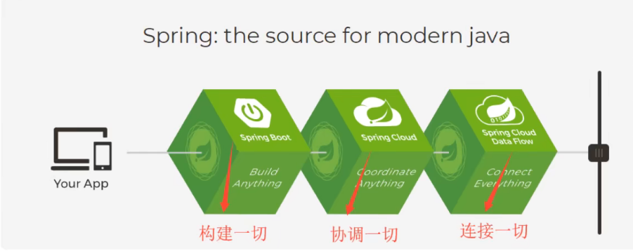
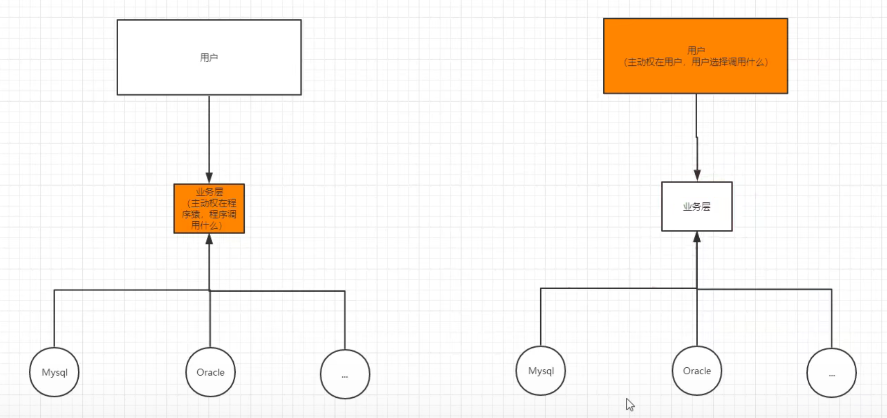
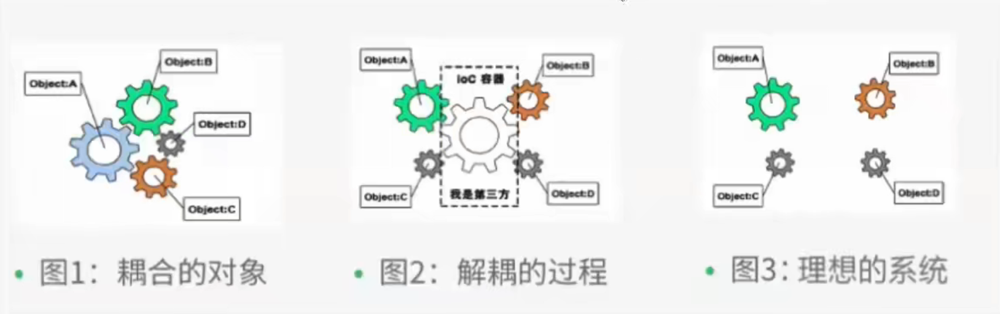

# 1、Spring基本：



## 1.1、spring官网地址：https://spring.io/projects/spring-framework#overview

## 1.2、spring历史版本下载地址（官方）：https://repo.spring.io/ui/native/release/org/springframework/spring

## 1.3、spring4.3.9框架介绍参考文档（参考文档经典版本）：https://docs.spring.io/spring-framework/docs/4.3.9.RELEASE/spring-framework-reference/html/overview.html#overview-distribution-zip

# 2、依赖的配置：

## 2.1、往pom.xml中导入spring web mvc依赖（spring web mvc依赖包含的其他依赖比较多）:

```xml
<!-- https://mvnrepository.com/artifact/org.springframework/spring-webmvc -->
<dependency>
    <groupId>org.springframework</groupId>
    <artifactId>spring-webmvc</artifactId>
    <version>5.2.0.RELEASE</version>
</dependency>
```

## 2.2、往pom.xml中导入jdbc依赖

```xml
<!--(最终要和mybatis整合，下方为jdbc依赖)：-->
<!-- https://mvnrepository.com/artifact/org.springframework/spring-webmvc-->
<dependency>
    <groupId>org.springframework</groupId>
    <artifactId>spring-jdbc</artifactId>
    <version>***</version>
</dependency>
```

## 2.3、以下为父pom.xml总体配置：

```xml
<?xml version="1.0" encoding="UTF-8"?>
<project xmlns="http://maven.apache.org/POM/4.0.0"
         xmlns:xsi="http://www.w3.org/2001/XMLSchema-instance"
         xsi:schemaLocation="http://maven.apache.org/POM/4.0.0 http://maven.apache.org/xsd/maven-4.0.0.xsd">
    <modelVersion>4.0.0</modelVersion>

    <groupId>com.kuang</groupId>
    <artifactId>spring-study</artifactId>
    <packaging>pom</packaging>
    <version>1.0-SNAPSHOT</version>
    <modules>
        <module>spring-01-ioc1</module>
        <module>spring-02-hellospring</module>
        <module>spring-03-ioc2</module>
        <module>spring-04-di</module>
        <module>spring-05-Autowired</module>
        <module>spring-06-anno</module>
        <module>spring-09-aop</module>
        <module>spring-10-mybatis</module>
    </modules>


    <dependencies>
        <!-- https://mvnrepository.com/artifact/org.springframework/spring-webmvc -->
        <dependency>
            <groupId>org.springframework</groupId>
            <artifactId>spring-webmvc</artifactId>
            <version>5.2.0.RELEASE</version>
        </dependency>

        <dependency>
            <groupId>junit</groupId>
            <artifactId>junit</artifactId>
            <version>4.12</version>
        </dependency>

    </dependencies>
</project>
```

# 3、IOC（控制反转）

## 3.1、IOC理论推导（使用spring-01-ioc1）

- 之前，程序是主动创建对象！控制权在程序员手上！
- 使用了set注入后，程序不再具有主动性，而是变成了被动的接收对象！
- 这种思想，从本质上解决了问题，程序员不再去管理对象的创建了，系统的耦合性大大降低，可以更加专注在业务的实现上！

## 3.2、IOC控制反转再理解

- IOC本质：获得对象的方式反转了
  
  
- 控制反转是一种通过描述（XML或注解）并通过第三方生产获取特定对象的方式，在spring中实现控制反转的是IOC容器，其实现方式是使用依赖来注入

## 3.3、编写一个实现IOC的spring-02-hellospring：

- 以下为resource下的配置文件beans.xml配置：

```xml
<?xml version="1.0" encoding="UTF-8"?>
<beans xmlns="http://www.springframework.org/schema/beans"
       xmlns:xsi="http://www.w3.org/2001/XMLSchema-instance"
       xsi:schemaLocation="http://www.springframework.org/schema/beans
        https://www.springframework.org/schema/beans/spring-beans.xsd">

    <!--beans就是容器-->
    <!--使用spring来创建对象，在spring中这些都称为Bean
    类型  变量名 = new  类型();
    Hello  hello = new  Hello();

    id = 变量名
    class = new的类型

    property 相当于给变量str(对象中的属性)赋值为Spring

    这个过程就叫做控制反转
    -->
    <bean id="hello" class="com.kuang.pojo.Hello">
        <property name="str" value="Spring"></property>
    </bean>

</beans>
```

- 以下为测试类MyTest：

```java
import com.kuang.pojo.Hello;
import org.springframework.context.ApplicationContext;
import org.springframework.context.support.ClassPathXmlApplicationContext;

public class MyTest {
    public static void main(String[] args) {
        //获取spring的上下文对象！
        //获取ApplicationContext,拿到spring的容器beans.xml
        ApplicationContext context = new ClassPathXmlApplicationContext("beans.xml");
        //我们的对象现在都在Spring中去管理了，我们要使用，直接去里面取出来就可以！
        Hello hello = (Hello) context.getBean("hello");
        System.out.println(hello.toString());
    }
}
```

## 3.4、IOC创建对象的方式：

- 1、默认使用无参构造创建对象
- 2、假设要使用有参构造创建对象，以下为三种方法：

1.下标赋值

```xml
    <bean id="user" class="com.kuang.pojo.User">
        <constructor-arg index="0" value="狂神说java"/>
    </bean>
```

2.类型

```xml
<bean id="user" class="com.kuang.pojo.User">
    <constructor-arg type="java.lang.String" value="qinjiang"/>
</bean>
```

**3.参数名**

```xml
<bean id="user" class="com.kuang.pojo.User">
    <constructor-arg name="name" value="秦疆"/>
</bean>
```

## 3.5、Spring配置说明

- 别名
- Bean的配置
- import

### 3.5.1、别名

```xml
<alias name="user" alias="userNew"/>
```

### 3.5.2、Bean的配置

- id：bean的唯一标识符，也就是相当于我们学的对象名
- class：bean对象所对应的全限定名：包名+类型
- name：也是别名，而且name可以同时取多个别名

```xml
<bean id="userT" class="com.kuang.pojo.userT" name="user2 u2,u3;u4">
    <property name="name" value="西部开源"/>
</bean>
```

### 3.5.3、import

这个import，一般用于团队开发使用，他可以将多个配置文件，导入合并为一个,

相同的内容会被合并

```xml
<import resource="beans.xml"/>
<import resource="beans2.xml"/>
<import resource="beans3.xml"/>
```

## 3.6、依赖注入

- 构造器注入（3.4、IOC创建对象的方式）
- **Set方式注入**
- C命名和P命名空间注入

### 3.6.1、*Set方式注入*（spring-04-di）

```java
public class Student {
    private String name;
    private Address address;
    private String[] books;
    private List<String> hobbys;
    private Map<String,String> card;
    private Set<String> games;
    private String wife;
    private Properties info;

    public String getName() {
        return name;
    }

    public void setName(String name) {
        this.name = name;
    }

    public Address getAddress() {
        return address;
    }

    public void setAddress(Address address) {
        this.address = address;
    }

    public String[] getBooks() {
        return books;
    }

    public void setBooks(String[] books) {
        this.books = books;
    }

    public List<String> getHobbys() {
        return hobbys;
    }

    public void setHobbys(List<String> hobbys) {
        this.hobbys = hobbys;
    }

    public Map<String, String> getCard() {
        return card;
    }

    public void setCard(Map<String, String> card) {
        this.card = card;
    }

    public Set<String> getGames() {
        return games;
    }
 
    public void setGames(Set<String> games) {
        this.games = games;
    }

    public String getWife() {
        return wife;
    }

    public void setWife(String wife) {
        this.wife = wife;
    }

    public Properties getInfo() {
        return info;
    }

    public void setInfo(Properties info) {
        this.info = info;
    }

    @Override
    public String toString() {
        return "Student{" +
                "name='" + name + '\'' +
                ", address=" + address +
                ", books=" + Arrays.toString(books) +
                ", hobbys=" + hobbys +
                ", card=" + card +
                ", games=" + games +
                ", wife='" + wife + '\'' +
                ", info=" + info +
                '}';
    }
}
```

```xml
<?xml version="1.0" encoding="UTF-8"?>
<beans xmlns="http://www.springframework.org/schema/beans"
       xmlns:xsi="http://www.w3.org/2001/XMLSchema-instance"
       xsi:schemaLocation="http://www.springframework.org/schema/beans
        https://www.springframework.org/schema/beans/spring-beans.xsd">
    
    <bean id="address" class="com.kuang.pojo.Address"/>
    <bean id="student" class="com.kuang.pojo.Student">
        <!--第一种，普通值注入，value-->
        <property name="name" value="秦疆"/>
        
        <!--第二种，Bean注入，ref-->
        <property name="address" ref="address"/>
        
        <!--数组注入，ref-->
        <property name="books">
            <array>
                <value>红楼梦</value>
                <value>水浒传</value>
                <value>三国演义</value>
                <value>西游记</value>
            </array>
        </property>

        <!--List注入-->
        <property name="hobbys">
            <list>
                <value>听歌</value>
                <value>敲代码</value>
                <value>看电影</value>
            </list>
        </property>

        <!--Map注入-->
        <property name="card">
            <map>
                <entry key="身份证" value="231456456456445611"/>
                <entry key="银行卡" value="545151515454115415"/>
            </map>
        </property>
        
        <!--Set注入-->
        <property name="games">
            <set>
                <value>LOL</value>
                <value>CF</value>
                <value>CSgo</value>
            </set>
        </property>
        
        <!--null注入-->
        <property name="wife">
            <null/>
        </property>
        
        <!--Properties注入-->
        <property name="info">
            <props>
                <prop key="driver">20200702</prop>
                <prop key="url">男</prop>
                <prop key="username">root</prop>
                <prop key="password">root</prop>
            </props>
        </property>
        
    </bean>
</beans>
```

### 3.6.2、C命名和P命名空间注入

- P命名和C命名空间不能直接使用，需要导入xml约束
  xmls:p="http://www.springframework.org/schema/p"
  xmls:c="http://www.springframework.org/schema/c"


- C命名空间是使用构造器注入：construct-args

```xml
<?xml version="1.0" encoding="UTF-8"?>
<beans xmlns="http://www.springframework.org/schema/beans"
       xmlns:xsi="http://www.w3.org/2001/XMLSchema-instance"
       xmls:c="http://www.springframework.org/schema/c"
       xsi:schemaLocation="http://www.springframework.org/schema/beans
        https://www.springframework.org/schema/beans/spring-beans.xsd">

    <bean id="user2" class="com.kuang.pojo.User" c:age="18" c:name="狂神"/>

</beans>
```

- P命名空间是使用Set方式注入：property

```xml
<?xml version="1.0" encoding="UTF-8"?>
<beans xmlns="http://www.springframework.org/schema/beans"
       xmlns:xsi="http://www.w3.org/2001/XMLSchema-instance"
       xmls:p="http://www.springframework.org/schema/p"
       xsi:schemaLocation="http://www.springframework.org/schema/beans
        https://www.springframework.org/schema/beans/spring-beans.xsd">

    <bean id="user" class="com.kuang.pojo.User" p:age="18" p:name="狂神"/>

</beans>
```

## 3.7、Bean

### 3.7.1、Bean的作用域

- 1、单例模式（spring默认，单线程）

```xml
<bean id="user2" class="com.kuang.pojo.User" c:age="18" c:name="狂神" scope="singleton"/>
```

- 2、原型模式（多线程）：每次从容器中get的时候，都会产生一个新对象，所产生的哈希值不一样！

```xml
<bean id="accountService" class="com.something.DefaultAccountService" scope="prototype"/>
```

### 3.7.2、Bean的自动装配

- 自动装配是Spring满足bean依赖一种方式！
- Spring会在上下文中自动寻找，并自动给bean装配属性！
- **在Spring中有三种装配的方式**
- 1、在xml中显示的配置
- 2、在java中显示的配置
- 3、**隐式的自动装配bean**


***下面来测试隐式的自动装配bean：***

- **1、byName自动装配**：会自动在容器上下文中查找，和自己对象set方法后面的值对应的bean id！必须所有的bean的id值唯一，并且这个bean需要和自动注入的属性的set方法的值一致

```xml
<bean class="com.kuang.pojo.Cat"/>
<bean class="com.kuang.pojo.Dog"/>


<bean id="people" class="com.kuang.pojo.People" autowire="byName">
    <property name="name" value="小狂神"/>
</bean>
```

- **2、byType自动装配**：会自动在容器上下文中查找，和自己对象属性类型相同的bean！必须所有的bean的类型唯一，并且这个bean需要和自动注入的属性的类型一致

```xml
<bean class="com.kuang.pojo.Cat"/>
<bean class="com.kuang.pojo.Dog"/>


<bean id="people" class="com.kuang.pojo.People" autowire="byType">
    <property name="name" value="小狂神"/>
</bean>
```


# 4、使用注解进行开发：

## 4.1、使用注解必须在配置文件beans.xml中导入*context*约束，增加注解的支持！

```xml
http://www.springframework.org/schema/context
https://www.springframework.org/schema/context/spring-context.xsd">
```

### 以下为总体配置：

```xml
<?xml version="1.0" encoding="UTF-8"?>
<beans xmlns="http://www.springframework.org/schema/beans"
        xmlns:xsi="http://www.w3.org/2001/XMLSchema-instance"
        xmlns:context="http://www.springframework.org/schema/context"
        xsi:schemaLocation="http://www.springframework.org/schema/beans
        https://www.springframework.org/schema/beans/spring-beans.xsd
        http://www.springframework.org/schema/context
        https://www.springframework.org/schema/context/spring-context.xsd">

    <!--开启注解的支持-->
    <context:annotation-config/>
    
</beans>
```

## 4.2、注解说明列表：

- @Autowired：自动装配通过类型，_名字
  如果Autowired不能唯一自动装配上属性_，则需要通过@Qualifier(value=“***”)
- @Nullable 字段标记了这个注解，说明这个字段可以为null
- @Resource：自动装配通过名字，类型
- @Component 组件，放在类上，说明这个类被Spring管理了，就是bean！
- @Value 组件，放在属性上给属性赋值，等价于在配置文件中 <property name="name" value="kuangshen"/>

### 4.2.1、衍生的注解

@Component有几个衍生注解，我们在web开发中，会按照mvc三层架构分层！

- dao   【@Repository】

- service   【@Service】

- controller   【@Controller】

  这四个注解的功能都是一样的，都是代表将某个类注册到Spring容器中，装配Bean

### 4.2.2、自动装配注解

- @Autowired：自动装配通过类型，名字
  如果Autowired不能唯一自动装配上属性，则需要通过@Qualifier(value=“***”)
- @Nullable 字段标记了这个注解，说明这个字段可以为null
- @Resource：自动装配通过名字，类型

### 4.2.3、xml与注解

- xml更加万能，适用于任何场合！维护简单方便
- 注解不是自己类使用不了，维护相对复杂！
- xml用来管理bean；注解只负责完成属性的注入
- 想要注解生效，就需要开启注解的支持和自动扫描

```xml
<!--指定要扫描的包，这个包下的注解就会生效-->
<context:component-scan base-package="com.kuang.pojo"/>
<!--开启注解的支持-->
<context:annotation-config/>
```

## 4.3、使用注解实现自动装配（测试类 spring-05-Autowired）

- 1.导入约束

```xml
http://www.springframework.org/schema/context
https://www.springframework.org/schema/context/spring-context.xsd">
```

- 2.在配置文件里配置注解的支持

```xml
<?xml version="1.0" encoding="UTF-8"?>
<beans xmlns="http://www.springframework.org/schema/beans"
        xmlns:xsi="http://www.w3.org/2001/XMLSchema-instance"
        xmlns:context="http://www.springframework.org/schema/context"
        xsi:schemaLocation="http://www.springframework.org/schema/beans
        https://www.springframework.org/schema/beans/spring-beans.xsd
        http://www.springframework.org/schema/context
        https://www.springframework.org/schema/context/spring-context.xsd">

    <!--开启注解的支持-->
    <context:annotation-config/>

    <bean id="cat" class="com.kuang.pojo.Cat"/>
    <bean id="dog" class="com.kuang.pojo.Dog"/>

    <bean id="people" class="com.kuang.pojo.People"/>
</beans>
```

- 3.@Autowired

```java
package com.kuang.pojo;

import org.springframework.beans.factory.annotation.Autowired;

public class People {
    @Autowired
    private Cat cat;
    @Autowired
    private Dog dog;
    private String name;

    public Cat getCat() {
        return cat;
    }

    public void setCat(Cat cat) {
        this.cat = cat;
    }

    public Dog getDog() {
        return dog;
    }

    public void setDog(Dog dog) {
        this.dog = dog;
    }

    public String getName() {
        return name;
    }

    public void setName(String name) {
        this.name = name;
    }

    @Override
    public String toString() {
        return "People{" +
                "cat=" + cat +
                ", dog=" + dog +
                ", name='" + name + '\'' +
                '}';
    }
}
```

- 4.测试类

```java
public class MyTest {

    @Test
    public void test1() {
        ApplicationContext context = new ClassPathXmlApplicationContext("beans.xml");
        People people = context.getBean("people", People.class);
        people.getDog().shout();
        people.getCat().shout();
    }
}
```


# 5、代理

## 5.1、动态代理的核心，动态生成代理类

```java
package com.kuang;

import java.lang.reflect.InvocationHandler;
import java.lang.reflect.Method;
import java.lang.reflect.Proxy;

//等会我们用这个类，自动生成代理类
public class ProxyInvocationHandler implements InvocationHandler {

    //被代理的接口
    private Object target;

    public void setTarget(Object target) {
        this.target = target;
    }
    
    //生成得到代理类
    public Object getProxy(){
        return Proxy.newProxyInstance(this.getClass().getClassLoader(), target.getClass().getInterfaces(),this);
        
    }
    //处理代理实例，并返回结果
    public Object invoke(Object proxy, Method method,Object[] args) throws Throwable{
        Object result = method.invoke(target,args);
        return result;
    }
}
```

## 5.2、调用动态代理

```java
import org.springframework.aop.ProxyMethodInvocation;

public class Client {
    public static void main(String[] args) {
        //真实角色
        UserServiceImpl userService = new UserServiceImpl();
        //代理角色，不存在
        ProxyInvocationHandler pih = new ProxyInvocationHandler();
        
        pih.setTarget(userService);//设置要代理的对象
        //动态生成代理类
        userService proxy = (userService) pih.getProxy();
        
        proxy.query();
    }
}


```

# 6、AOP（切面编程）

## 6.1、使用Spring实现AOP，需要在pom.xml中导入一个依赖包！

```xml
<dependency>
    <groupId>org.aspectj</groupId>
    <artifactId>aspectjweaver</artifactId>
    <version>1.9.4</version>
</dependency>
```

## 6.2、Spring AOP的applicationContext.xml配置：

```xml
<?xml version="1.0" encoding="UTF-8"?>
<beans xmlns="http://www.springframework.org/schema/beans"
       xmlns:xsi="http://www.w3.org/2001/XMLSchema-instance"
       xmlns:aop="http://www.springframework.org/schema/aop"
       xsi:schemaLocation="http://www.springframework.org/schema/beans
        https://www.springframework.org/schema/beans/spring-beans.xsd
        http://www.springframework.org/schema/aop
        https://www.springframework.org/schema/aop/spring-aop.xsd">

    <!--注册bean-->
    <bean id="userService" class="com.kuang.service.UserServiceImpl"/>
    <bean id="log" class="com.kuang.log.Log"/>
    <bean id="afterLog" class="com.kuang.log.AfterLog"/>

    <!--方式一：使用原生Spring API接口-->
    <!--配置AOP,需要导入AOP的约束-->
    <aop:config>
    <!--切入点：expression：表达式，execution(要执行的位置！   ***public修饰词 返回值 类名 方法名 参数)-->
        <aop:pointcut id="pointcut" expression="execution(* com.kuang.service.UserServiceImpl.*(..))"/>

        <!--执行环绕增加   把log这个类切入到pointcut的方法上面-->
        <aop:advisor advice-ref="log" pointcut-ref="pointcut"/>
        <!--把afterLog这个类切入到pointcut的方法上面-->
        <aop:advisor advice-ref="afterLog" pointcut-ref="pointcut"/>
    </aop:config>

</beans>


```

## 6.3、AOP的实现方式

- 方式一：使用Spring的API接口【主要是SpringAPI接口实现】
- 方式二：自定义来实现AOP【主要是切面定义】   DiyPointCut演示类
- 方式三：使用注解实现   AnnotationPointCut演示类


# 7、整合Mybatis

## 7.1、导入相关jar包

- junit
- mybatis
- mysql数据库
- spring相关的
- aop织入
- mybatis-spring【new】


```xml
<dependencies>
    <dependency>
        <groupId>junit</groupId>
        <artifactId>junit</artifactId>
        <version>4.12</version>
    </dependency>

    <dependency>
        <groupId>mysql</groupId>
        <artifactId>mysql-connector-java</artifactId>
        <version>5.1.47</version>
    </dependency>

    <dependency>
        <groupId>org.mybatis</groupId>
        <artifactId>mybatis</artifactId>
        <version>3.5.2</version>
    </dependency>

    <dependency>
        <groupId>org.springframework</groupId>
        <artifactId>spring-webmvc</artifactId>
        <version>5.2.0.RELEASE</version>
    </dependency>

    <!--Spring操作数据库的话，还需要一个spring-jdbc-->
    <dependency>
        <groupId>org.springframework</groupId>
        <artifactId>spring-jdbc</artifactId>
        <version>5.3.10</version>
    </dependency>

    <!--AOP织入包-->
    <dependency>
        <groupId>org.aspectj</groupId>
        <artifactId>aspectjweaver</artifactId>
        <version>1.8.13</version>
    </dependency>

    <!--Spring和mybatis整合的包-->
    <dependency>
        <groupId>org.mybatis</groupId>
        <artifactId>mybatis-spring</artifactId>
        <version>2.0.1</version>
    </dependency>
</dependencies>
```


## 7.2、接下来编写mybatis

- 1、编写实体类（pojo.User）

```java
package com.kuang.pojo;

import lombok.Data;

@Data
public class User {
    private int id;
    private String name;
    private String pwd;
}

```


- 2、编写核心配置文件

```xml
<?xml version="1.0" encoding="utf8" ?>
<!DOCTYPE configuration
        PUBLIC "-//mybatis.org//DTD Config 3.0//EN"
        "http://mybatis.org/dtd/mybatis-3-config.dtd">

<!--configuration核心配置文件-->
<configuration>

    <!--引入外部配置文件properties-->
    <properties resource="db.properties"></properties>

    <!--给pojo包下的文件起别名-->
    <typeAliases>
       <package name="com.kuang.pojo"/>
    </typeAliases>


    <environments default="development">
        <environment id="development">
            <transactionManager type="JDBC"/>
            <dataSource type="POOLED">
                <property name="driver" value="${driver}"/>
                <property name="url" value="${url}"/> <!--URL在连接数据库之后可以查看-->
                <property name="username" value="${username}"/>
                <property name="password" value="${password}"/>
            </dataSource>
        </environment>
    </environments>

    
    <!--需要注册接口-->
    <mappers>
        <mapper class="com.kuang.mapper.UserMapper"/>
    </mappers>

</configuration>
```

- 3、编写接口(UserMapper.class)

```java
package com.kuang.mapper;

import com.kuang.pojo.User;

import java.util.List;

public interface UserMapper {
    public List<User> selectUser();
}

```

- 4、编写接口对应的Mapper.xml

```xml
<?xml version="1.0" encoding="utf8" ?>
<!DOCTYPE mapper
        PUBLIC "-//mybatis.org//DTD Config 3.0//EN"
        "http://mybatis.org/dtd/mybatis-3-mapper.dtd">
<!--configuration核心配置文件-->
<mapper namespace="com.kuang.mapper.UserMapper">

    <select id="selectUser" resultType="user">
        select * from mybatis.user;
    </select>
    
</mapper>
```

- 5、测试(需要注意的是没有了可以生成SqlSessionFactory并返回sqlSession的工具类了)

```java
import com.kuang.mapper.UserMapper;
import com.kuang.pojo.User;
import org.apache.ibatis.io.Resources;
import org.apache.ibatis.session.SqlSession;
import org.apache.ibatis.session.SqlSessionFactory;
import org.apache.ibatis.session.SqlSessionFactoryBuilder;
import org.junit.Test;

import java.io.IOException;
import java.io.InputStream;
import java.util.List;

public class MyTest {
    @Test
    public void test() throws IOException {
        String resources = "mybatis-config.xml";
        InputStream in = Resources.getResourceAsStream(resources);
        SqlSessionFactory sessionFactory=new SqlSessionFactoryBuilder().build(in);
        SqlSession sqlSession=sessionFactory.openSession(true);

        UserMapper mapper = sqlSession.getMapper(UserMapper.class);
        List<User> userList = mapper.selectUser();

        for (User user : userList) {
            System.out.println(user);
        }
    }
}
```

# 8、高效整合Mybatis【方式一、方式二】（理解点繁琐，还是重复看视频理解）


