# 小迪安全-渗透测试

> 一些未下载将要下载的工具：
>
> - 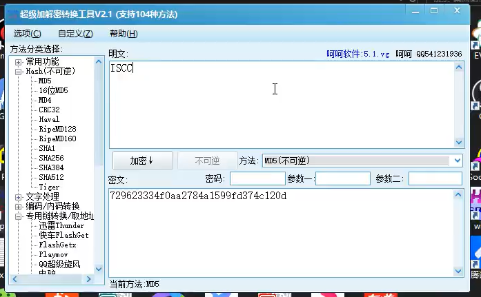
> - 


# 1、基础入门

## 1.1、本地Host

> 配置DNS解析
>
> 可以在本地进行配置 **网址**到**ip地址**的 修改

## 1.2、DNS攻击

> 会导致大量的用户访问网站时进行恶意的解析

## 1.3、漏洞体现在以下四个方面

> 组成web的架构模型
>
> ```
> 中间件是一种软件，它在应用程序和数据存储之间提供了一个中间层，为应用程序提供了访问数据存储的方式。中间件可以帮助应用程序与不同类型的数据存储进行交互，并为应用程序提供其他服务，如通信、事务管理、安全性等。
> ```

> 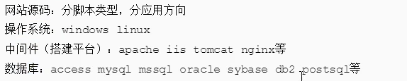
>
> 为什么要从web层面入手？**因为web层面更加常见，相比于其他更加容易**

## 1.4、对应的漏洞

> #### web源码类对应漏洞
>
> SQL注入、上传、XSS、代码执行、变量覆盖、逻辑漏洞、反序列化
>
> #### web中间件对应漏洞
>
> 未授权访问
>
> #### web数据库对应漏洞
>
> 内核类
>
> #### web系统对应漏洞
>
> 提权、远程代码执行
>
> #### 第三方漏洞
>
> 第三方软件
>
> #### APP或PC应用结合
>
> 涉及到 逆向


# 2、数据包基础

### 2.1、http和https

> http明文传输
>
> 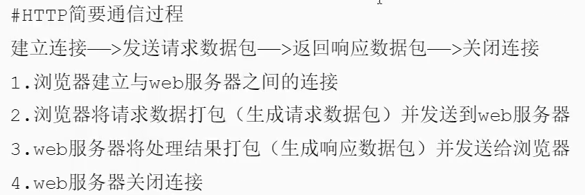
>
> https使用SSL或者TLS进行加密传输
>
> ```
> SSL (Secure Sockets Layer) 是一种安全协议，它为网络连接提供了安全性。它使用加密来保护在网络上传输的数据，防止黑客攻击或数据泄露。
> 
> SSL的后继者是TLS（Transport Layer Security），TLS是一种用于在两个通信应用程序之间提供保密性和数据完整性的安全协议。TLS和SSL是一样的，只是名字不同而已。
> 
> 当我们在浏览器中访问https网站时，就是使用TLS/SSL协议进行的安全传输，保证了用户与网站之间的信息传输安全性。
> 
> 
> SSL原理是使用公钥加密和私钥解密的方式来保护网络连接。
> 
> 在通信双方中，一方拥有公钥和私钥，另一方拥有公钥。当发送方想要发送数据给接收方时，会使用接收方的公钥进行加密，这样只有接收方拥有的私钥才能解密出数据。
> 
> 这样就可以保证，即使黑客截获了网络上传输的数据，也无法解密出数据，从而保护了数据的安全性。
> 
> 另外，在SSL/TLS协议中还有一个重要的概念叫做证书，证书是用来验证通信双方身份的，一般由第三方权威机构颁发，在建立连接之前会进行验证，保证通信双方的身份真实。
> ```
>
> 

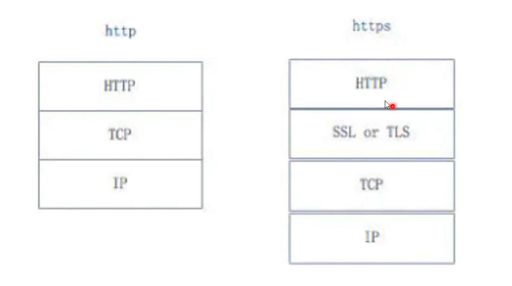


### 2.2、御剑的工作原理【用来扫描网站文件】

> 通过进行**http响应码的监听**来判定文件的存在与否


### 2.3、burp配置一下https抓包方法

> burp抓取并修改数据包


# 3、搭建平台（中间件）的安全入门


## 3.1、中间件基础


> 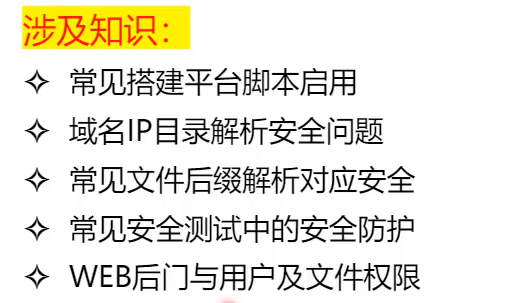

> #### 搭建平台类型：
>
> - iis

> #### 域名ip目录解析问题：
>
> - 御剑 进行扫描目录时，使用**ip域名**扫描的是**首目录（上级目录）**，而使用**网址**进行扫描的是**绝对目录**

> #### 常见文件后缀解析问题：
>
> 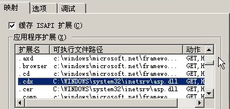
>
> - 将**某一扩展名**以**可执行的文件进行解析**

> #### 安全防护：
>
> - 黑白名单之类

## 3.2、中间件简要识别

> 在返回数据包里包含着中间件的类型
>
> 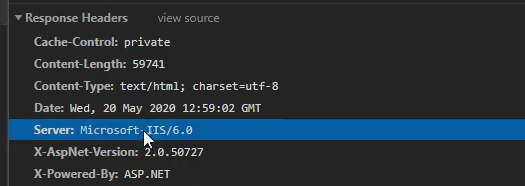

## 3.3、了解中间件的安全漏洞

> 翻阅相关资料查阅某个版本的中间件漏洞


## 3.4、中间件的靶场使用

> https://www.vulhub.org/
>
> 靶场下载


# 4、web源码拓展入门

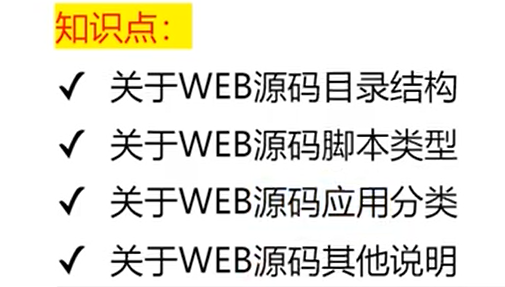

## 4.1、导图：

> ### 目录结构（了解架构便于理解）
>
> - 后台目录
> - 模板目录
> - 数据库目录
> - 数据库配置文件
>
> ### 脚本类型（数据库存储/解释或编译型/语言安全）
>
> - ASP
> - PHP
> - ASPX
> - JSP
> - JAVAWEB
> - Python
>
> ### 应用分类
>
> - 门户（综合类漏洞）
> - 电商（业务逻辑突出）
> - 论坛（xss突出）
> - 博客（漏洞较少）
> - 第三方（根据功能决定）
>
> ### 其他补充
>
> - 框架或非框架（框架漏洞或无框架下一步思路）
> - CMS指纹识别（人工、工具、平台识别）
> - 开源或内部
>   - 开源——直接找漏洞或审计
>   - 内部——常规渗透测试
> - 源码获取（备份获取、CMS识别后获取、特定源码特定渠道）


## 4.2、关于web源码其他说明

> - 数据库配置文件、后台目录、模板目录、数据库目录等
> - ASP、PHP、ASPX、JSP、JAVAWEB等脚本类型源码安全问题
>   - web安全笔记：http://websec.readthedocs.io
> - 社交、论坛、门户、第三方、博客等不同的代码机制对应漏洞
> - 开源、未开源问题、框架和非框架问题、关于CMS识别问题及后续等
> - 关于源码获取的相关途径：搜索，咸鱼淘宝，第三方源码站，各种行业对应
>   - 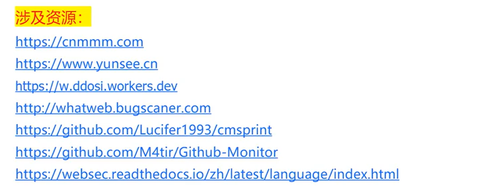


# 5、系统和数据库入门

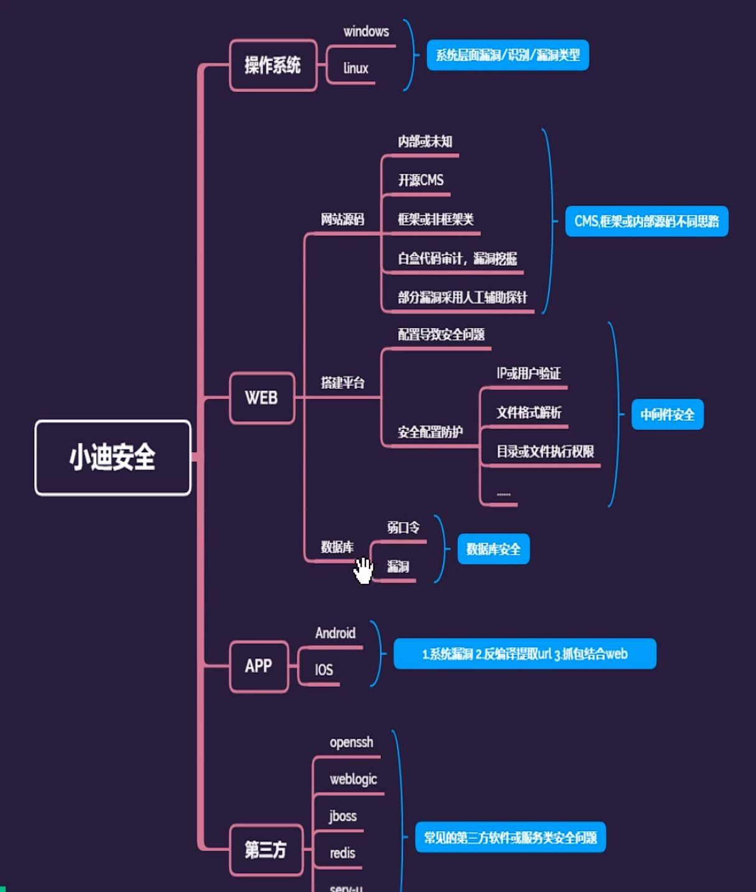

## 5.1、如何进行Linux和Windows的判定

- 使用网站URL的大小写判定，Windows对大小写不敏感，Linux对大小写敏感
- 使用TTL的值进行判定
- 使用nmap进行扫描端口探测操作系统及其版本
  - 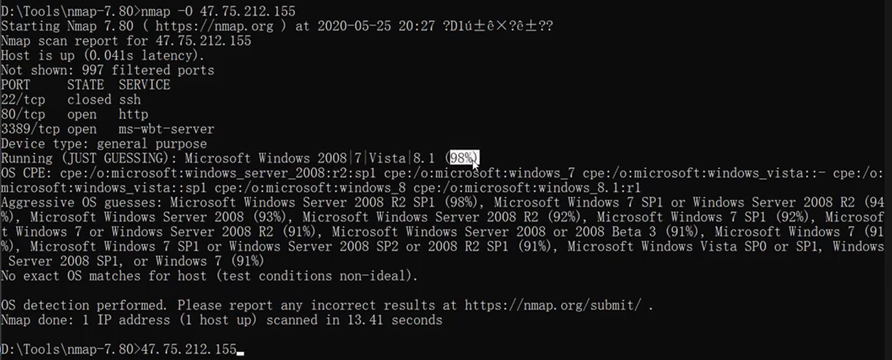


## 5.2、数据库类型的判定

- 通过对某种类型语言常搭配的数据库类型判定
  - 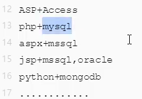
- 使用nmap进行端口以及数据库和第三方架构的扫描判定
  - 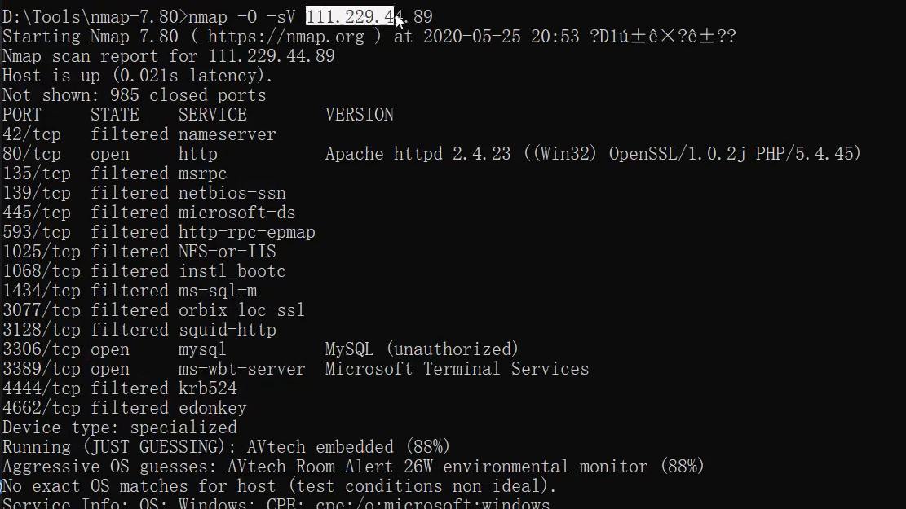


## 5.3、操作系统层面漏洞演示

- 远程代码执行

- msf进行攻击内网时，需要一台服务器进行跳转（端口映射）


## 5.4、数据库弱口令漏洞演示

- 使用msf攻击


# 6、加密算法入门

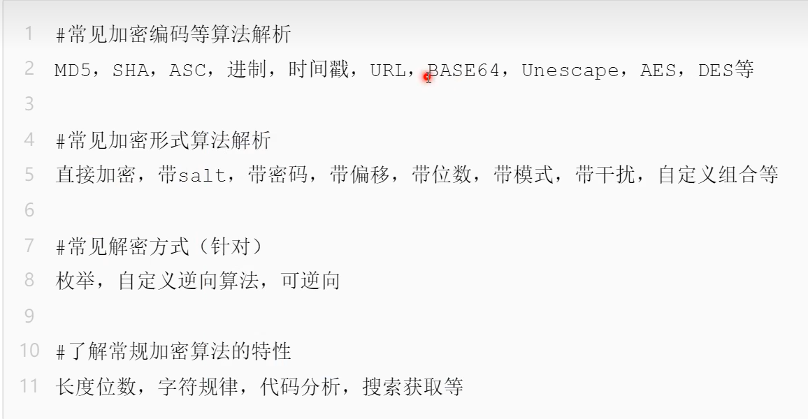

- AES加密之后也许会再进行一次base64编码
  - 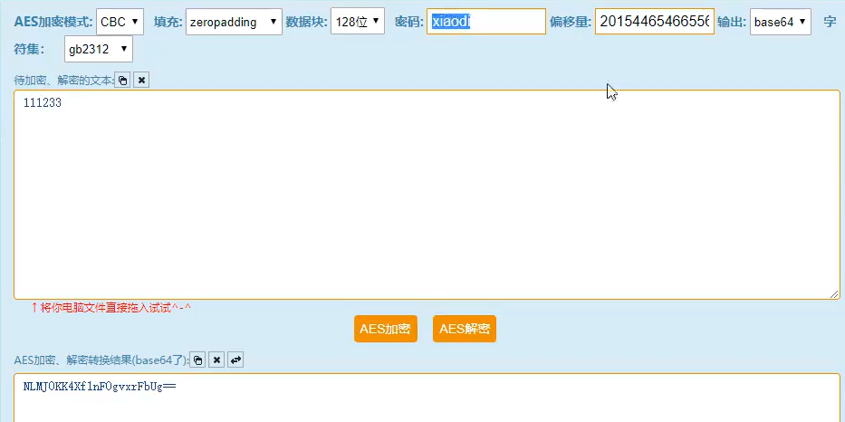
- 使用御剑或者dirsearch扫描敏感目录，进行密钥和偏移量的获取，进行解密，使用sql注入时再加密，放入url中传参


