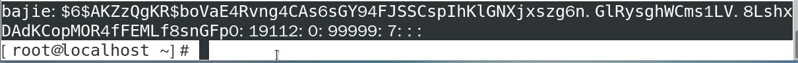
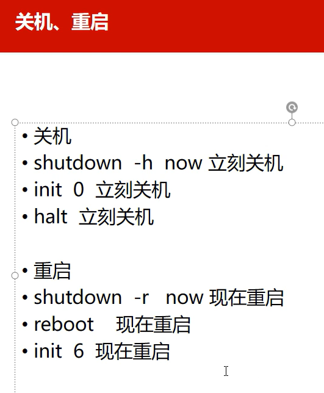

> # 用户名：test
>
> # 密码：1118


# 1、ls 

## 1.1、命令

```
su -
切换超级用户权限
```

```
ls
查看文件目录
```

```
man ls
帮助查看文件目录
```

```
ls - a
显示所有文件 黑色的前边带点是隐藏文件，蓝色的是隐藏目录
.代表本目录
..代表上一级目录
```

```
权限
- rwx r-x r-x.

r用数字4代表
w用数字2代表
x用数字1代表

rwx =7 文件所有者权限，可读可写可执行
r-x =5 同组人权限，可读不可写可执行
r-x =5 其他人权限，可读不可写可执行

所以 
chmod 755
命令查看以上权限的文件
```

```
ll
相当于ls -l
长格式显示目录下的内容列表
```


## 1.2、如何读

>  权限		此文件下文件夹数量，1代表没有	文件所有者	文件所有者所在组	文件所占用空间	创建日期
>
> 前面 - 为文件类型
>
> 
>
> 绿色的为可执行文件
>
> 黑色的为普通文件
>
> 红色的为压缩文件
>
> 深蓝色代表目录
>
> 黑底黄字代表硬件设备 b c
>
> 浅蓝色为链接文件 快捷方式
>
> 


## 1.3、文件目录

> 目录
>
> ## 一级目录：
>
> bin：二进制文件目录
>
> boot：启动文件存放的目录
>
> dev：硬件设备存放目录
>
> etc：所有配置文件目录
>
> home：用户家目录
>
> lib：系统函数存放目录
>
> proc：进程信息存放目录
>
> usr：厂商软件（第三方工具）存放目录
>
> var：可变信息（日志文件）存放目录
>
> 
>
> 


# 2、mkdir、cd、touch、cp、mv、rm

```
mkdir 目录名
新建一个目录

mkdir {1，2，3，4}
新建平级目录1，2，3，4

- p/a/b/c
新建逐层目录
```

```
cd 文件名
在同级目录下进入一个目录
```

```
touch test.txt
新建一个test.txt文件
```

```
cp test.txt a/b/c
将test.txt文件复制到c目录 

cp - r d k
将d目录拷贝到k目录
```

```
mv test.txt 1
将test.txt文件剪切到1目录
 
mv test.txt eddic.txt
将test.txt重命名为eddic.txt
```

```
rm 123
y
删除文件123
```

```
rmdir 目录名
只能删除空目录

rm - r 目录名
删除前每次询问

re - rf 目录名
不询问直接删除

redir - p a/b/c
逐层删除目录
```


# 3、pwd、top、fg、bg、du、file

```
pwd
查看当前所在路径
```

```
top
查看相当于win里面的资源管理器

按下s再按下1
设置1秒更新一次

kill  PID号码
杀死号码为PID号码的进程

kill - 9  PID号码
强制杀死

Q
退出top
```

```
ps
按回车的一瞬间当前哪个进程是活动的
```

```
ctrl+z
将资源管理器放在后台活动

jobs
查看后台进程号

fg 进程号
调回前台

bg 进程号
后台工作
```

```
du
查看当前文件或者文件夹所占用的磁盘空间

du - a
查看所有文件和文件夹所占用的磁盘空间

du - h
磁盘空间大小显示 单位
```

```
file 文件名
查看文件类型
```


# 4、find、which、cat、more、less、head、tail、wc


> 

```
find - name a
按文件名查找a文件存放路径
```

```
which  命令名
查找命令存放路径
```

```
cat 文件名
从前往后查看文件内容

tac 文件名
从后往前查看文件内容
```

```
ll | more
文件太多时分页，只能向下翻页
```

```
ll | less
文件太多时分页，可以上下翻页
```

```
cat /etc/passwd | head - 3
显示passwd文件的前3行数据
【管道符|的意思是，前面的输出作为后面的输入】
```

```
cat /etc/passwd | tail - 3
显示passwd文件的倒数3行数据
```

```
cat /etc/passwd | wc
统计字符数量
```

> 
>
> 43行		87个单词			2259个字符


# 5、gzip、bzip2、tar 、grep

```
gzip - 9 - c a > a.gz
压缩a文件
9是最大压缩率【1是最快】		c代表压缩		>代表保留源文件压缩			gzip压缩后缀名是gz
```

```
gunzip - c a.gz > a
gz格式保留源文件的解压缩
```

```
bzip2 - 9 - c a > a.bz2
压缩a文件
文件压缩bz2格式
```

```
bzip2 - kd  a.bz2
bz2格式保留源文件的解压缩
```

```
tar - zcvf  a.tar.gz  a
tar压缩a目录 gzip压缩
z是调用gzip	c是压缩	v可视化	f是文件系统
```

```
tar - zxvf  a.tar.gz
解压缩
z是调用gzip	x是解压缩	v可视化	f是文件系统
```

```
tar - jcvf  a.tar.bz2  a
tar压缩a目录 bzip压缩
j是调用bzip2	
```

```
tar - jxvf  a.tar.bz2
解压缩
```


```
tar - zxvf a.tar.gz - C b
将a解压缩到b目录
- C代表指定解压缩到哪个目录
```


```
cat /etc/passwd | grep root
筛选关于root关键字并标红
```


# 6、mount、umount

> ### 光驱的挂载和卸载

```
cd /mnt
mnt目录是用来专门挂载光驱和U盘的
mkdir cdrom
建立cdrom目录
```

```
ll /dev/cd*
以长格式列出dev目录（硬件目录）下所有以cd开头的文件
```

> 

```
mount  /dev/sro  /mnt/cdrom
将sr0挂载到/mnt/cdrom
```

```
umount  /dev/sro  /mnt/cdrom
卸载 /dev/sro 和 /mnt/cdrom 中的光驱
```

> ### U盘的挂载和卸载

```
fdisk - l
查看磁盘盘符，其中fdisk是分区命令
```

> 

```
mkdir usb
建立usb目录
mount  /dev/sdb1  /mnt/usb
将sdb1挂载到/mnt/usb
```

```
umount  /dev/sdb1  /mnt/usb
卸载 /dev/sdb1 和 /mnt/usb 中的光驱
```


# 7、文本编译器：vi 和 更改权限：chmod


```
chmod 755 文件名
更改此文件权限为755
```


```
chmod 777 文件名.后缀
先开启w权限

./文件名.后缀
运行文件
```


# 8、应用程序管理


## 8.1、rpm

> ### 查询命令


> ### 安装和卸载


## 8.2、yum（Yellow dog Updater）黄狗

> #### 基于RPM包管理，能够从指定的服务器自动下载RPM包并且安装，可以自动处理依赖性关系，并且一次安装所有依赖的软件包，无须繁琐地一次次下载、安装

> ### 命令
>
> 其中httpd是一个包的名字


```
yum makecache
更新缓存
```

> ### 修改本地源
>
> 不能连接外网的情况下如何下载，可以修改本地源，使yum去指定的本地光盘自动下载RPM包并且安装

- #### 首先进入yum的配置目录

```
cd  /etc/yum.repos.d/
进入yum的配置目录
```

- #### 可以先进行默认的源备份，加后缀名为bk，否则yum下载还是找这个默认源


- #### 使用vim命令建立一个repo文件

```
vim  centos-local.repo
```


- #### 进入repo文件进行内容修改


> ```
> 【】里不能重
> name随笔写
> baseurl：本地安装源的位置
> enabled=1：启用源
> gpgcheck=0：不启用密钥
> ```


# 9、用户和组管理


## 9.1、新建组以及用户 groupadd、useradd

> ### groupadd	组名
>
> ### useradd    - d /home/用户名    - g 组名    - s /bin/bash    用户名
>
> ### passwd	用户名

```
groupadd  abc
新建一个abc组
```

```
useradd   - d /home/bajie   - g abc   - s /bin/bash   bajie
	- d代表指定家目录名字	家目录名字尽量跟用户名相同bajie	 - g属于的组	- s命令解释器shell
```

```
passwd bajie
更改用户bajie的密码
```


> ### id	用户名
>
> ### cat	/etc/passwd

```
id  bajie
查看用户id号
用户id	组id		组名
```


```
cat /etc/passwd
查看存储所有用户的配置文件
```


> 用户名：密码：uid：gid：备注：用户家目录：用户shell
>
> ​			密码为x，因为密码不在这，在etc/shadow，只查看uid大于1000的才是自建用户


> ### cat	ect/shadow

```
su -
切换到root用户，才可以有权限查看shadow文件

cat	ect/shadow
```



> 


## 9.2、删除用户userdel

```
userdel - r a
删除a用户	- r代表删除该用户的时候删除该用户家目录
```


## 9.3、更改用户usermod、groupmod


> ### 更改bajie的组到test组：

```
usermod  - g  test  bajie
```


> ### 更改组名：


> ### 更改文件或目录所属群组：


> ### 更改文件所属用户：


## 9.4、用户和组账号查询id，groups，users，w，who


## 9.5、关机、重启 init

```
init 0
立刻关机

init 3
进入终端工作环境（标准的运行级）

init 5
从终端（标准运行级）切换回图形化界面

init 6
现在重启	
```




## 9.6、uname、df、clear

```
uname - a
显示系统所有信息

uname - r
显示操作系统发行版本
```


```
df - h
查看磁盘空间
```


```
clear
清屏
```

​	


# 10、网络的配置


## 10.1、网卡：ifconfig

```
ifconfig
查看虚拟网桥的网卡
```


```
ifconfig ens33
查看ens33网卡信息

ifconfig ens33 down
禁用ens33网卡

ifconfig ens33 up
启动ens33网卡
systemctl restart network
启动完成网卡后重启网络服务才能重新联网
```


## 10.2、设置ip地址

> #### 找到网卡配置文件

```
cd /etc/sysconfig/network-scripts/
进入网卡配置文件所在目录
```

> #### vim修改配置文件内容

```
vim ifcfg-ens33
```


# 11、磁盘管理


# 12、Linux日志管理和计划任务

## 12.1、日志管理


```
last
查看最近登陆情况
```

```
lastlog
查看本机所有用户是否有登录情况
```


## 12.1、计划任务管理

> ### 一次性任务


> ### 周期性任务


 


# 启明星辰：

## 1、基础

### 1.1、入门


### 1.2、学习架构


