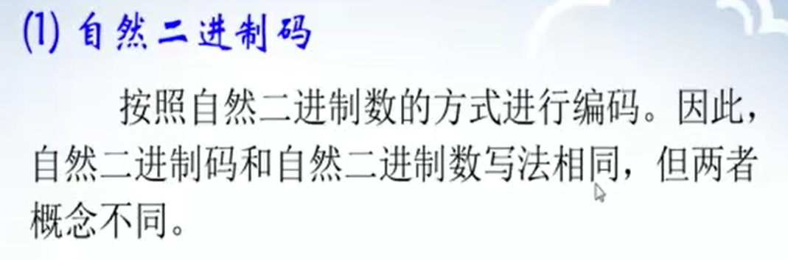
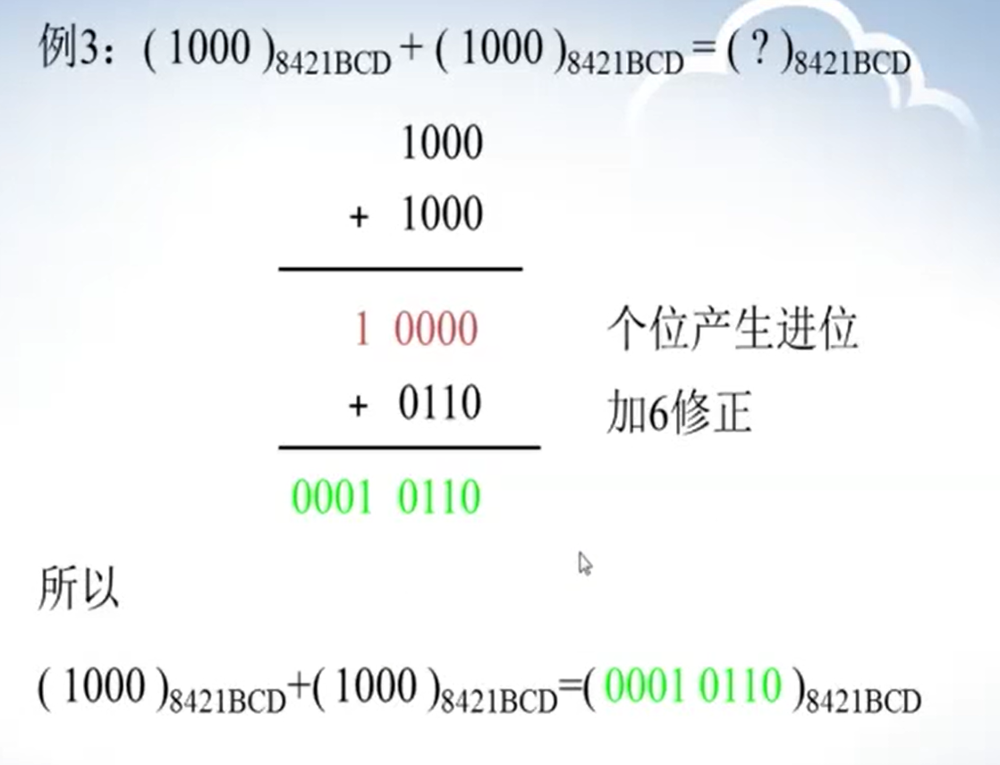

# 1、数制与码制

## 1.1、数制转换

### 1.1.1、十进制和二进制

- **转十进制：**

- **十进制转二进制**

**转换后的精度要比转换前的低**

### 1.1.2、二进制、八进制、十六进制

## 1.2、码制

- **自然二进制码**

- **格雷码**

- **8421BCD码**

有关于大于等于10的时候进位问题：

减位问题：

# 2、逻辑代数

