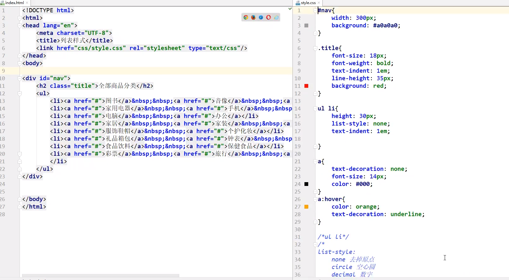
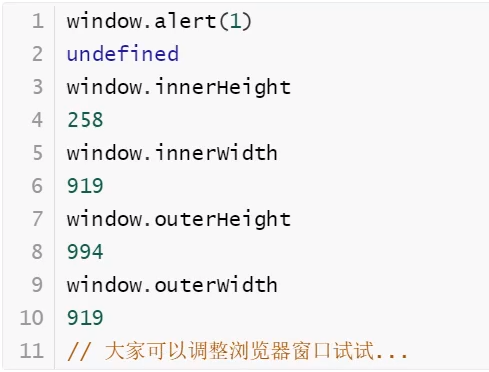

# 1、HTML介绍

> ## 1.1、HTML：网页最基本结构、css：美化网页、JS：让网页动起来产生交互行为
>
> 学习网站：
>
> [w3school 在线教程](https://www.w3school.com.cn/)


## 1.2、网页基本信息

```html

<!--DOCTYPE：告诉浏览器，我们要使用什么规范-->
<!DOCTYPE html>

<html lang="en">

<!--head标签代表网页头部-->
<head>
<!--    meta描述性标签，用来描述网站的一些信息-->
    <meta charset="UTF-8">
    <meta name="keywords" content="学习java">
    <meta name="description" content="来这里学java">

    <!--title网页标题-->
    <title>我的第一个网页</title>
</head>

<!--body标签代表网页主体-->
<body>

Hello,World!

</body>

</html>
```


## 1.3、网页基本标签

```html
<!DOCTYPE html>
<html lang="en">
    
<head>
    <meta charset="UTF-8">
    <title>基本标签学习</title>
</head>
    
<body>

<!--标题标签-->
<h1>一级标题</h1>
<h2>二级标题</h2>
<h3>三级标题</h3>
<h4>四级标题</h4>
<h5>五级标题</h5>
<h6>六级标题</h6>

<!--段落标签-->
<p>两只老虎     跑得快</p>
<p>没有     尾巴</p>
<p>真                  奇怪</p>

<!--换行标签：自闭合标签-->
两只老虎  跑得快<br>
真奇怪  <br>

    
<!--水平线标签:自闭和标签-->
<hr>


<!--粗体 ， 斜体-->
粗体：    <strong>hello</strong>
斜体：    <em>hello</em>

    
<!--特殊符号标签:
    记忆方式：&+字母-->
空&nbsp;&nbsp;&nbsp;&nbsp;&nbsp;&nbsp;&nbsp;格


</body>
    
</html>
```


# 2、图像标签


```html
<!DOCTYPE html>
<html lang="en">
<head>
    <meta charset="UTF-8">
    <title>图像标签学习</title>
</head>
<body>

<!--src:
        相对地址（推荐使用）  ../  表示上一级目录
        绝对地址-->


</body>
</html>
```


# 3、链接标签


```html
<!DOCTYPE html>
<html lang="en">
<head>
    <meta charset="UTF-8">
    <title>链接标签学习</title>
</head>
<body>

    
    
<!--a标签
href：必填，表示要跳转到哪个页面
target:表示窗口再哪里打开
    _blank：在新标签中打开
    _self：在原标签中打开
-->
<a href="1.我的第一个网页.html" target="_blank">点击我跳转到页面</a>
<a href="https://www.baidu.com" target="_self">点击我跳转到百度</a>

<br>

    
    
    
<!--点击图片跳转到超链接-->
<a href="1.我的第一个网页.html">
    
</a>

    

<!--锚链接
1.需要一个锚标记
2.跳转到标记-->

<!--使用id作为跳转标记-->
<a id="top">顶部</a>

<a href="#top">回到顶部</a>


    
    
<!--功能性链接
邮件链接：mailto-->
<a href="mailto:1711154113@qq.com">点击联系eddic</a>

</body>
</html>
```


# 4、列表标签

```html
<!DOCTYPE html>
<html lang="en">
<head>
    <meta charset="UTF-8">
    <title>列表学习</title>
</head>
<body>

<!--有序列表
应用范围：试卷，问答。。。-->
<ol>
    <li>java</li>
    <li>python</li>
    <li>C</li>
    <li>C++</li>
</ol>

<hr>

<!--无序列表
应用范围：导航，侧边栏。。。-->
<ul>
    <li>Java</li>
    <li>Python</li>
    <li>C++</li>
    <li>c</li>
</ul>

<hr>

<!--自定义列表
dl：标签
dt：列表名称
dd：列表内容-->
<dl>
    <dt>学科</dt>

    <dd>java</dd>
    <dd>linux</dd>
    <dd>C</dd>
    <dd>python</dd>
    <dd>php</dd>

    <dt>位置</dt>

    <dd>山东</dd>
    <dd>北京</dd>
    <dd>上海</dd>
</dl>


</body>
</html>
```


# 5、表格标签

```html
<!DOCTYPE html>
<html lang="en">
<head>
    <meta charset="UTF-8">
    <title>表格学习</title>
</head>
<body>

<!--表格：table
行：tr
列：td-->
<!--border:添加框-->
<table border="1px">
    <tr>
<!--        colspan:跨列-->
        <td colspan="4">1-1</td>
    </tr>

    <tr>
<!--        rowspan：跨行-->
        <td rowspan="2">2-1</td>
        <td>2-2</td>
        <td>2-3</td>
        <td>2-4</td>
    </tr>

    <tr>
        <td>3-1</td>
        <td>3-2</td>
        <td>3-3</td>
    </tr>
</table>
</body>
</html>
```

  

# 6、媒体元素

```html
<!--视频和音频
src：资源路径
controls：控制条
autoplay：自动播放-->

<video src="../resources/video/视频.mp4" controls autoplay></video>

<audio src="../resources/video/音频.mp3" controls autoplay></audio>
```

# 7、页面结构分析


# 8、iframe内联框架：在一个网页里嵌套另一个网页

```html
<iframe src="https://www.baidu.com" 
        frameborder="0" width="1000px" height="800px">
</iframe>
```


# 9、表单post和get提交

## 9.1、简单演示

```html
<body>
<h1>注册</h1>

<!--表单form
action：表单提交的位置，可以是网站，也可以是一个请求处理地址
method：post，get 提交方式
-->
<form action="1.我的第一个网页.html" method="get">
    <!--文本输入框 ：input type="text"
        密码输入框 ：input type="password"-->
    <p>名字：<input type="text" name="username"></p>
    <p>密码：<input type="password" name="pwd"></p>
    <!--提交、重置按钮-->
    <p>  
        <input type="submit">
        <input type="reset">
    </p>
</form>
</body>
```

###### input 标签元素格式：


## 9.2、单选框标签、多选框标签、按钮

```html
<!--单选框标签
    input type=“radio”
    value：单选框的值
    name：组名称-->

<p>性别：
    <input type="radio" value="boy" name="sex">男
    <input type="radio" value="girl" name="sex">女
</p>
```


```html
<!--多选框标签
    input type="checkbox"-->

<p>爱好
    <input type="checkbox" value="sleep" name="hobby">睡觉
    <input type="checkbox" value="code" name="hobby">敲代码
    <input type="checkbox" value="chat" name="hobby">聊天
    <input type="checkbox" value="game" name="hobby">打游戏
</p>
```

```html
<!--按钮标签
input type="button"
input type="image"
input type="submit"
input type="reset"-->

<p>按钮
    <input type="button" name="button1" value="点击此处">
    <input type="image" src="../resources/image/QQ图片20220102220148.jpg">
</p>

<!--提交、重置按钮-->
<p>  
    <input type="submit">
    <input type="reset">
</p>
```

## 9.3、下拉框、文本域、文件域

```html
<!--下拉框，列表框-->
<p>国家：
    <select name="列表名称">
        <option value="china">中国</option>
        <option value="us">美国</option>
        <option value="india">印度</option>
    </select>
</p>
```

```html
<!--文本域-->
<p>反馈：
    <textarea name="textarea" cols="30" rows="10"></textarea>
</p>
```

```html
<!--文件域：上传文件-->
<p>
    <input type="file" name="files">

    <input type="button" value="上传" name="upload">
</p>
```

## 9.4、其他

```html
<!--邮件验证-->
<p>邮箱：
    <input type="email" name="emailsss">
</p>

<!--URL验证-->
<p>URL:
    <input type="url" name="urlss">
</p>

<!--数字验证-->
<p>商品数量：
    <input type="number" name="numssss" max="100" min="0" step="10">
</p>

<!--滑块-->
<p>音量：
    <input type="range" name="voice" min="0" max="100" step="2">
</p>

<!--搜索框-->
<p>搜索：
    <input type="search" name="searchssss">
</p>
```


## 9.5、表单的应用

- 只读 readonly

```html
<p>名字：<input type="text" name="username" value="默认" readonly></p>
```

- 隐藏域 hidden

```html
<p>密码：<input type="password" name="pwd" hidden></p>
```

- 禁用 disabled

```html
<p>性别：
    <input type="radio" value="boy" name="sex" checked disabled>男
    <input type="radio" value="girl" name="sex">女
</p>
```

- 提示信息：placeholder
- 非空判断：required
- 正则表达式：pattern


# 1、CSS基础

## 1.1、第一个程序

```html
<!DOCTYPE html>
<html lang="en">
<head>
    <meta charset="UTF-8">
    <title>Title</title>
    
    
        <!--规范，<style>  可以编写css的代码
        语法：
            选择器{
                声明1；
                声明2；
                声明3；
            }-->
    <style>
        h1{
            color: deepskyblue;
        }
    </style>
    
</head>
<body>
    <h1>我是标题</h1>
</body>
</html>
```

## 1.2、为了规范编写，将css代码与html分开来写


- css文件

```css
h1{
    color: deepskyblue;
}
```

- html引入css

```html
<!DOCTYPE html>
<html lang="en">
<head>
    <meta charset="UTF-8">
    <title>Title</title>
    
    <!--将外部css文件引入，指向地址是当前目录下的css路径-->
    <link rel="stylesheet" href="css/style.css">
    
</head>
<body>
    <h1>我是标题</h1>
</body>
</html>
```

## 1.3、css优势

- 内容和表现分离
- 网页结构表现统一，可以实现复用


## 1.4、cs三种导入方式

**优先级：谁最后执行使用谁的css样式**


- **行内样式：**

```html
<h1 style="color:red">我是标题</h1>
```

- **内部样式：**

```html
<style>
    h1{
        color:green;
    }
</style>
```

- **外部导入：**

```html
<link rel="stylesheet href="css/style.css">
```

- @import  是css2.1特有的

```html
<style>
    @import url("css/style.css");
</style>
```


# 2、三种基本选择器

**优先级：id选择器 > 类选择器 > 标签选择器**

> - 标签 选择器：选择一类标签       标签名{}
> - 类 选择器：选择所有class属性一致的标签，跨标签       .类名{}
> - id 选择器：全局唯一 ！     #id名{}

## 2.1、标签选择器


## 2.2、类选择器


## 2.3、id选择器


# 3、高级选择器

## 3.1、层次选择器


**1、后代选择器：在某个元素的后面     祖爷爷  爷爷  爸爸  你   选择一个元素的所有后代**

```css
body p{
	background:red;
}
```

**2、子选择器：只选择一个元素后面的一代**

```css
body>p{
    background:green;
}
```

**3、相邻兄弟选择器  只选择当前元素下面的一个兄弟元素（向下选择，相邻，同辈）**

```css
.active+p{
    background:blue;
}
```

**4、通用选择器  选择当前元素下面的所有兄弟元素（向下选择，同辈）**

```css
.active~p{
    background:blue;
}
```

## 3.2、结构伪类选择器

> **伪类格式：**
>
> ​	**标签名：效果名{**
>
> ​		***声明1；***
>
> ​		***声明2；***
>
> **}**


## 3.3、属性选择器：功能相当于把  id选择器  和  class选择器  结合起来【重要】


写法：

> **标签名 [ 属性名 = 属性值（正则表达式）] {**
>
> **}**

> **=		绝对等于**
>
> ***=		包含这个元素**
>
> **^=		以这个开头**
>
> **$=		以这个结尾**

例如：以下css代码选中 **所有a标签 **中的 **href属性中 **以 **http开头的元素**

```css
a[href^=http]{
    background:yellow;
}
```


# 4、CSS的应用

> **span标签本身并不产生任何视觉效果。**
>
> **它只是提供一种途径，令你可以对文档中的一部分进行引用。**
>
> **是人们对于文字样式编辑约定俗成的一个标签**

## 4.1、字体样式

> font-family:	字体
>
> font-size：	字体大小
>
> font-weight：	字体粗细
>
> color：		字体颜色

```css
<style>
    body{
        font-family:"楷体";
        color:blue;
    }
	
    h1{
        font-size:50px;
    }

    .p1{
        font-weigth:bolder;
    }
</style>
```


## 4.2、文本样式

> 1、颜色	color	rgb	rgba
>
> 2、文本对齐方式	text-align = center
>
> 3、首行缩进	text-indent : 2em
>
> 4、行高	line-height :				单行文字上下居中时使 line-height = height
>
> 5、装饰	text-decoration :
>
> 6、文本和图片对齐:	vertical-align : middle
>
> 7、鼠标悬浮的状态
>
> a : hover{
>
> ​			color : orange;
>
> ​			font-size : 50px;
>
> }
>
> 8、鼠标按住未释放的状态
>
> a : active{
>
> ​			color : green;
>
> }


## 4.3、列表演示





## 4.4、背景图像以及渐变

**众多渐变色获取网站：https://www.grabient.com/**

# 5、盒子模型和边框使用

## 5.1、盒子模型（略）


> margin：外边距
>
> border：边框
>
> padding：内边距


## 5.2、边框（略）

> 1、边框的粗细
>
> 2、边框的样式
>
> 3、边框的颜色


## 5.3、已经听至   [【狂神说Java】CSS3最新教程快速入门通俗易懂_哔哩哔哩_bilibili](https://www.bilibili.com/video/BV1YJ411a7dy?p=16&spm_id_from=pageDriver)


# 1、JavaScript基础


## 1.1、编写HelloWorld

JavaScript代码类似于css可外部引入到html中，也可以在html里直接写

**1、内部直接写**

```html
<!DOCTYPE html>
<html lang="en">
<head>
    <meta charset="UTF-8">
    <title>Title</title>
    
    
    <!--script标签内，写JavaScript代码-->
    <script>
        alert('hello,world');
    </script>
    
</head>
<body>

</body>
</html>
```

**2、外部引入**

qj.js

```javascript
alert('hello,world');
```

```html
<!DOCTYPE html>
<html lang="en">
<head>
    <meta charset="UTF-8">
    <title>Title</title>

    <!--外部引入qj.js-->
    <script src="js/qj.js"></script>

</head>
<body>

</body>
</html>
```


## 1.2、浏览器控制台的使用


**console.log（）在浏览器的控制台打印变量！  类似 System.out.println（）;**


# 2、数据类型概览

数值、文本、图形、音频、视频.......


- number		js不区分小数和整数

```javascript
123			//整数
123.1		//浮点数
1.123e4		//科学计数法
-99			//负数
NaN			//not a number    在JS中，NaN==NaN的结果为false，但可以使用isNaN（NaN）来判断这个数是否是NaN
Infinity	//表示无限大
```


- 字符串

```javascript
'abc'
"abc"
```


- 布尔值

```javascript
true
false
```


- 逻辑运算

```javascript
&&		//与
    
||		//或
    
!		//取反
```


- 比较运算符

```javascript
=			
==		//等于（类型不一样，值一样，也会判断为true）
    
===		//绝对等于（类型一样，值一样，结果为true）一般使用这个
```


- null和undefined

```javascript
null		//空
undefined	//未定义
```


- 数组			Java的数组必须是相同类型的对象，JS中不需要这样！

```javascript
var arr=[1,2,3,4,5,'hello',null,true];
```


- 对象

```javascript
var person={
    name:"eddic",
    age:3
    tags:['js','java','web','mybatis']
}
```


# ３、严格检查模式

**严谨的来编写代码**


# ４、数据类型详解


## ４.１、字符串类型

- 1、正常字符串使用单引号或双引号包裹

- 2、转义字符

```javascript
\'
\n
\t
\u4e2d		\u####  Unicode字符
\x41				AscII字符
```

- 3 、多行字符串编写

```javascript
//tab键上面的``
var msg=
    `hello
    你好
    world
    `
```

- 4、模板字符串

```javascript
let name="eddic";
let age=3;

let msg=`你好啊，${name}`
```

- 5、字符串长度

```javascript
console.log(str.length)
```

- 6、字符串不可变


- 7、大小写转换

```javascript
//注意，这里调用的是方法，不是属性
student.toUpperCase()
student.toLowerCase()
```


- 8、截取字符串

```javascript
//  [)
student.substring(1,3)   //[1,3)
```


## 4.2、数组类型

Array可以包含任意的数据类型

```javascript
var arr=[1,2,3,4,5,6];		//通过下标取值和赋值
arr[0]
arr[0]=10
```

- 1、长度

```javascript
arr.length
//注意，给arr.length赋值，数组大小就会发生变化，如果赋值过小，元素就会丢失
```

- 2、indexOf，通过元素获得在数组中的下标索引

```javascript
arr.indexOf(传入元素)
```

- 3、slice（）截取数组的一部分

```javascript
arr.slice(3)		//从下标3开始截取
arr.slice(1,5)		//从下标1至5
```

- 4、压入，弹出

> arr.push（）	压入尾部
>
> arr.pop（）	弹出尾部
>
> arr.unshift（）	压入头部
>
> arr.shift（）		弹出头部


- 5、排序  arr.sort（）       元素反转  arr.reverse（）


- 6、concat（）连接   		arr.concat（[1,2,3]）   concat（）并没有修改数组，只是会返回一个新的数组


- 7、连接符 join    打印拼接数组，使用特定的字符串连接

```javascript
var arr=["C","B","A"];
arr.join('-')

//输出  “C-B-A”
```


- 8、多维数组

```javascript
arr=[[1,2],[3,4],["5",6]]
arr[1][1]
4
```


## 4.3、对象类型

若干个键值对		Javascript中的所有的键都是字符串，值是任意对象

> var 对象名={
>
> ​		属性名：属性值，
>
> ​		属性名：属性值，
>
> ​		属性名：属性值
>
> }

- 1、对象赋值

> person.name=“eddic”

- 2、动态的删减属性

> delete person.name

- 3、动态的添加属性，直接给新的属性添加值即可

> person.fdsfaafv="dfjdgdfsg"

- 4、判断属性是否在这个对象中	xxx in xxx

> 'age'  in  person			可以判断此对象和继承的父类中的所有属性
>
> person.hasOwnProperty('age')		判断一个属性是否是这个对象自身拥有的


## 4.4、流程控制

```javascript
<script>
    'use strict';

    var age=3;

    //if语句
    if(age>3){
        alert("haha");
    }else if (age<5){
        alert("wawawa");
    }else {
        alert("faskjfa");
    }

    //while语句
    while (age<100){
        age=age+1;
        console.log(age)
    }

    //for循环
    for (let i = 0; i < 100; i++) {
        console.log(i)
    }

</script>
```


## 4.5、Map和Set (ES6的新特性)


- Map：类似于python里的字典

```javascript
<script>
    "use strict";

    var map=new Map([['tom',100],['jack',90],['eddic',99]]);
    var name=map.get('tom');//通过key获得value
    map.set('admin',123456);//set来新增或修改
	map.delete("tom");//删除

</script>
```


- Set：无序不重复集合

```javascript
<script>
    "use strict";

    var set=new Set([3,1,1,1,1]);
	set.add(2);//添加2元素
	set.delete(1);//删除1元素
	console.log(set.has(3));//查看3元素是否在set中

</script>  
```


**遍历迭代Map和Set**

- 使用 for  of 遍历

```javascript
for(let x of map){
    console.log(x)
}

for(let x of set){
    console.log(x)
}
```


# 5、函数


## 5.1、函数定义

- 定义方式一

```javascript
function abs(x){
    if (x>=0){
        return x;
    }else {
        return -x;
    }
}
```

- 定义方式二		function(x){ } 这是一个匿名函数，但是可以把结果赋值给abs，通过abs就可以调用函数！

```javascript
var abs=function(x){
    if (x>=0){
        return x;
    }else {
        return -x;
    }
}
```


## 5.2、传参问题

- **不传入参数**


- **传入多个参数**

**使用arguments获取全部参数：**


**使用rest获取其他参数：**


## 5.3、变量的作用域

### 5.3.1、var定义变量：在函数体中声明，只能在函数体中使用，在函数体外面声明可以当作全局变量


**嵌套时：**


### 5.3.2、全局对象：window	默认的所有的全局变量，都会自动绑定在window对象下

```javascript
var x='xxx';
alert(x);
alert(window.x);	//	默认的所有的全局变量，都会自动绑定在window对象下
```

> **alert（）由于随时随地能调用，所以alert（）这个函数本身也是window对象变量**
>
> JavaScript实际上只有一个全局作用域**window**，任何变量（函数也可以视为变量），假设没有在函数作用范围内找到，就会向外查找，如果在全局作用域**window**都没有找到，报错**RefrenceError**


**但这样会出现冲突问题，使用以下方法解决：**


### 5.3.3、局部作用域：let


### 5.3.4、常量 const


## 5.4、方法

定义方法：**方法就是把函数放在对象的里面**，对象只有两个东西：属性和方法

```javascript
'use strict'

var kuangshen={
    name:'eddic',
    birth:2002,
    //方法
    age:function (){
        var now=new Date().getFullYear();
        //this指向当前对象
        return now-this.birth;
    }
}
//调用属性
kuangshen.name
//调用方法
kaungshen.age()
```

**或**

```javascript
'use strict'

function getAge(){
    var now=new Date().getFullYear();
    return now-this.birth;
}

var kuangshen={
    name:'eddic',
    birth:2002,
    age:getAge
}

//使用每个函数自带的apply调用，控制this指向
getAge.apply(kuangshen,[])	//第一个参数this指向了kuangshen，第二个参数可以为空
```


# 6、对象


## 6.1、Date日期对象


## 6.2、JSON对象

- JSON因为 简洁 和 清晰 的层次结构成为最理想的 **数据交换语言**
- 在JavaScript中一切皆为对象，任何js支持的类型都可以用JSON来表示，格式为：
  - **对象都用 { }**
  - **数组都用 [ ]**
  - **所有的键值对都是用 key : value**

```javascript
//先定义一个对象
var user={
    name:'eddic',
    age:'3',
    sex:'男'
}

//对象转化为json字符串
var jsonUser=JSON.stringify(user)

//json字符串转化为对象,参数为字符串
var obj=JSON.parse('{"name":"eddic","age":"3","sex":"男"}')
```


# 7、面向对象编程


## 7.1、面向对象class

- 1、定义一个类，属性，方法

```javascript
class Student {

    constructor(name) {
        this.name=name;
    }

    hello(){
        alert("hello")
    }
}

var xiaoming=new Student("XiaoMing");
xiaoming.hello()
```

- 2、继承

```javascript
class XiaoStudent extends Student{
    constructor(name,grade) {
        super(name);
        this.grade=grade;
    }

    myGrade(){
        alert('我是一名小学生,名字叫做'+this.name)
    }
}

var xioahong=new XiaoStudent("XiaoHong",1);
xioahong.myGrade()
```


# 8、操作BOM（浏览器对象模型）

> JavaScript和浏览器的关系：
>
> JavaScript诞生就是为了能够在浏览器中运行


> ## window	代表浏览器窗口

**window是一个全局对象，浏览器对象都附属于window**




> ## Navigator

**Navigator封装了浏览器的信息**


> ## screen

**可以用来控制屏幕大小**


> ## location

**location代表当前页面的URL信息**

```javascript
host: "www.bilibili.com"                                             //主机
href: "https://www.bilibili.com/video/BV12J411M7Sj?p=8"              //当前指向的位置
protocol: "https:"                                                   //协议
reload: ƒ reload()                                                   //重新加载
location.assign('https://blog.eddic.com/')				             //重定向到新的网页
```


> ## document

**代表当前的页面的文档信息，操作HTML DOM文档树**

- **获取具体文档树节点**


- **获取cookie**


> 劫持cookie原理
>
> 例如：登录www.taobao.com
>
> <script src="aa.js"> </script>
>
> <!--恶意人员如果在aa.js中写入document.cookie,获取你的cookie上传到他的服务器，就劫持了cookie-->
>
> 在淘宝和天猫之间，同时打开淘宝和天猫，只登录淘宝，不登陆天猫，则天猫也会同样被登录
>
> 服务器端可以设置cookie为httpOnly，来保证安全


> ## history

**代表浏览器的历史记录**

```javascript
history.back()		//后退
history.forward()	//前进
```


# 9、操作DOM（文档对象模型）

> **核心：浏览器网页就是一个Dom树形结构，操作Dom元素，管理Dom节点**
>
> - 更新Dom节点
> - 遍历Dom节点，得到一个新的Dom节点
> - 删除一个Dom节点
> - 添加新的Dom节点
>
> ### document：代表当前的页面的文档信息，用来操作HTML DOM文档树


## 9.1、获得Dom节点

这是原生代码，之后尽量使用 jQuery（）

```html
<body>

<div id="father">
    <h1>标题一</h1>
    <p id="p1">p1</p>
    <p class="p2">p2</p>
</div>

<script>
    var h1=document.getElementsByTagName('h1');
    var p1=document.getElementById('p1');
    var p2=document.getElementsByClassName('p2');
    var father=document.getElementById('father');

    var childrens=father.children;//获取父节点下的所有子节点
    
</script>

</body>
```


## 9.2、更新Dom节点

- **操作HTML**

```html
<div id="id1">

</div>

<script>
    var id1=document.getElementById('id1');

    id1.innerText="123"//修改文本的值
    id1.innerHTML="<strong>123</strong>"//可以解析HTML文本标签

</script>
```


- **操作CSS**

```html
<div id="id1">

</div>

<script>
    var id1=document.getElementById('id1');
    id1.innerText="abc";
    //使用style来操作CSS
    id1.style.color='red';
    id1.style.fontSize='100px'
</script>
```


## 9.3、删除Dom节点

**删除节点的步骤：先获取父节点，再通过父节点删除自己**

```html
<div id="father">
    <h1>标题一</h1>
    <p id="p1">p1</p>
    <p class="p2">p2</p>
</div>

<script>
    var self =document.getElementById('p1');//获得p1节点
    var father= self.parentElement;          //获得father节点
    father.removeChild(self);                //通过父节点删除子节点
</script>
```


## 9.4、创建和插入Dom节点

> ### 创建节点

- **创建一个p普通标签节点**

```html
<script>

    var newP=document.createElement('p');//创建一个p标签
    newP.id='newP';
    newP.innerText='Hello,eddic';

</script>
```

相当于

```html
<p id="newP">
    Hello,eddic
</p>
```

- **创建一个<script>标签节点**

```javascript
var myScript = document.createElement('script');//输入标签
myScript.setAttribute('type','text/javascript');//输入键值对
```

相当于

```html
<script type='text/javascript' src=''></script>
```


> ### 插入节点

- **尾部插入**

```html
<p id="js">JavaScript</p>
<div id="list">
    <p id="se">JavaSE</p>
    <p id="ee">JavaEE</p>
    <p id="me">JavaME</p>
</div>

<script>

    var js=document.getElementById('js');
    var list=document.getElementById('list');
    list.appendChild(js); //追加到后面

    var newP=document.createElement('p'); //创建一个p标签
    newP.id='newP';
    newP.innerText='Hello,eddic';
    list.appendChild(newP); //将这个新的标签插入
    
</script>
```


- **在指定元素前面插入**

```html
<p id="js">JavaScript</p>
<div id="list">
    <p id="se">JavaSE</p>
    <p id="ee">JavaEE</p>
    <p id="me">JavaME</p>
</div>

<script>

    var js=document.getElementById('js');
    var ee=document.getElementById('ee');
    var list=document.getElementById('list');
    
    //要包含的节点.insertBefore(要插入的节点，被插入的节点)
    list.insertBefore(js,ee);
    
</script>
```


# 10、操作表单（验证）

**表单的目的：提交信息**


> ## 获得/修改 信息

- **1、**

```html
<form method="post">
    <p>
        <span>用户名：</span>
        <input type="text" id="username">
    </p>

</form>

<script>
    var input_text=document.getElementById('username');
    //得到输入框的值
    input_text.value
    //修改输入框的值
    input_text.value='123'
</script>
```

- **2、**

```html
<form method="post">
    <p>
        <span>用户名：</span> <input type="text" name="username" id="username">
    </p>

    <p>
        <span>密码：</span> <input type="password" name="password" id="password">
    </p>

    <!--绑定事件 onclick 被点击时跳转函数aaa()-->
    <button type="post" onclick="aaa()">提交</button>

</form>

<script>
    function aaa(){
        var uname=document.getElementById('username');
        var pwd=document.getElementById('password');
        console.log(uname.value);
        console.log(pwd.value);
    }
</script>
```


> ## 获得/修改 单选框布尔值

```html
<form method="post">
    <p>
        <span>性别：</span>
        <input type="radio" name="sex" value="man" id="boy"> 男
        <input type="radio" name="sex" value="woman" id="girl"> 女
    </p>
</form>

<script>
    var boy_radio=document.getElementById("boy");
    var girl_radio=document.getElementById("girl");

    //查看返回结果是否为true，如果为true，则被选中
    boy_radio.checked;
    //赋值
    boy_radio.checked=true;
</script>
```


> ## 前端密码MD5加密

**这里重要要点：**

- 使用MD5加密需要引入MD5工具<script src="https://cdn.bootcss.com/blueimp-md5/2.10.0/js/md5.min.js"></script>

- 表单绑定提交事件
  onsubmit=绑定一个提交检测的函数，该函数返回一个ture或false
  将这个结果返回给表单，使用 onsubmit 接收
  onsubmit="return aaa()"
- 使用假的密码框获取密码
- 真的密码框，被隐藏起来，使用隐藏域提交，更加安全
- 将假的密码框获取到的密码通过MD5加密后赋给真正的密码，并返回true

**下面演示程序提交成功后跳转到百度页面：**

```html
<!DOCTYPE html>
<html lang="en">
<head>
    <meta charset="UTF-8">
    <title>Title</title>
    <!--MD5工具类-->
    <script src="https://cdn.bootcss.com/blueimp-md5/2.10.0/js/md5.min.js"></script>
</head>
<body>

<!--表单绑定提交事件
onsubmit=绑定一个提交检测的函数，该函数返回一个ture或false
将这个结果返回给表单，使用 onsubmit 接收
onsubmit="return aaa()"
-->
<form action="https://www.baidu.com/" method="get" onsubmit="return aaa()">
    <p>
        <span>用户名：</span> <input type="text" name="username" id="username">
    </p>


    <!--使用假的密码框获取密码-->
    <p>
        <span>密码：</span> <input type="password" id="input-password">
    </p>

    <!--这个是真的密码框，被隐藏起来
        使用隐藏域提交，更加安全-->
    <input type="hidden" name="password" id="md5-password">

    <button type="submit">提交</button>
</form>

<script>
    function aaa(){
        var uname=document.getElementById('username');
        var pwd=document.getElementById('input-password');
        var md5pwd=document.getElementById('md5-password');

        md5pwd.value=md5(pwd.value);
        //验证通过返回true
        return true;
    }
</script>

</body>
</html>
```


# 11、jQuery


## 11.1、初识jQuery

**jQuery库：里面存在着大量的JavaScript函数**


> ### 获取jQuery

```html
<!DOCTYPE html>
<html lang="en">
<head>
    <meta charset="UTF-8">
    <title>Title</title>
    
      <!--引入jQuery CDN
      CDN：镜像
      -->
	<script src="http://libs.baidu.com/jquery/2.0.0/jquery.min.js"></script>
    
</head>
<body>

</body>
</html>
```


> ### 使用公式:
>
> ​	**$ ( 选择器 ) . 事件 ( )**

演示：

```html
<!DOCTYPE html>
<html lang="en">
<head>
    <meta charset="UTF-8">
    <title>Title</title>
      <!--引入jQueryCDN
      CDN：镜像
      -->
    <script src="http://libs.baidu.com/jquery/2.0.0/jquery.min.js"></script>
</head>
<body>

<a href="" id="test-jQuery">点击我</a>

<script>
    //选择器就是css的选择器
    $('#test-jQuery').click(function () {
        alert('hello,jQuery');
    })
</script>

</body>
</html>
```


## 11.2、jQuery选择器


> 文档工具站：https://jquery.cuishifeng.cn/


## 11.3、jQuery事件

其中当网页加载完毕之后，响应事件源代码是：

> $(document).ready(function( ){
>
> })
>
> 但是可以简写成：
>
> $(function( ){
>
> })


## 11.4、操作Dom元素

> ### jQuery中封装了众多的方法


> ### 接下来是利用方法进行相关的操作


# 12、前端开发小技巧

> ## 1、扒取
>
> 
>
> ## 2、现成的小组件：
>
> - Layer弹窗组件：[layer弹层组件开发文档 - Layui (pearadmin.com)](http://layui-doc.pearadmin.com/doc/modules/layer.html)
> - 阿里巴巴的Element-ui组件：[组件 | Element](https://element.eleme.cn/#/zh-CN/component/layout)


