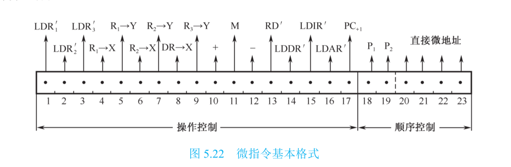

# 计组

# 1、算数移位

# 2、加减法运算和溢出检测

## 2.1、补码范围：

> ## -128--+127

## 2.2、溢出检测

- 第一种方法
  - 

## 2.3、符号扩展

# 3、乘法运算

## 3.1、来自王道计组

### 原码——一位乘法

### 补码

## 3.2、来自课本

### 1、不带符号的阵列乘法器

### 2、带符号的阵列乘法器

#### 例题：

# 4、除法运算

## 加减交替阵列除法器

### 例题：

# 5、存储器

## 5.1、存储器的三种扩展方式

###  5.1.1、位扩展

### 5.1.2、字扩展

### 5.1.3、字位扩展

## 5.2、DRAM：存储密度高，用作计算机主存储器

**动态随机存取存储器**

### 5.2.1、逻辑结构

### 5.2.2、刷新

**刷新方式为集中式刷新和分散式刷新**

## 5.3、cache

### 5.3.1、主存与cache的地址映射：计组书籍第 94 页

# 6、CPU

## 6.1、六类寄存器的功能与连接关系

## 6.2、数据通路

> ### **把许多寄存器之间传送信息的通路，称作数据通路**

## 6.3、指令周期流程图

## 6.4、微程序控制器：163页

### 微指令的格式：171页

### 微地址的形成：170页

### 微命令编码：169页

## 6.5、流水CPU时空图

**取指令(IF)、指令译码(ID)、 计算有效地址或执行(EX)、访存取数(MEM)、结果写寄存器堆(WB)**

### 6.5.1、资源相关

### 6.5.2、数据相关

# 7、输入输出系统

## 7.1、中断处理流程图

## 7.2、多级中断

