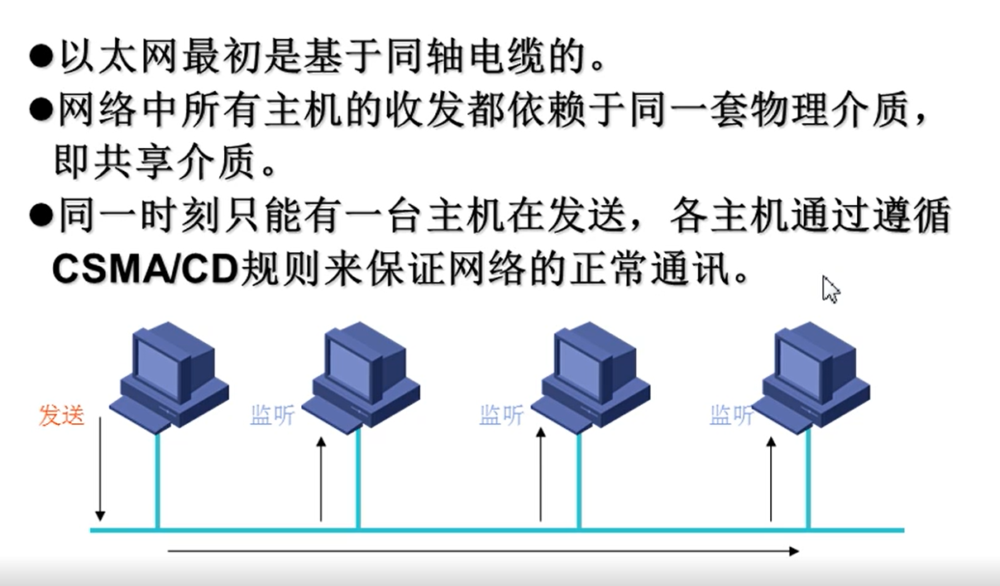

# 路由与交换技术

> - ## 交换机技术
>
>   - ### 虚拟局域网
>
>   - ### 生成树协议
>
>     - #### stp，预防环路
>
> - ## 路由器技术
>
>   - ### 路由基础
>
>   - ### Rip
>
>   - ### Ospf
>
>   - ### 广域网
>
>   - ### 访问安全与NAT

# 1、交换机

## 1.1、网络设备

> - ### HUB
>
>   - 转发器，中继器。是数据通信系统中的基础设备，和双绞线一样，不需要或很少软件管理的硬件设备
>
> - ### 网桥
>
>   - 网络之间的互联，对帧进行转发，与路由器的区别在于它工作于数据链路层
>   - 数据接收、地址过滤、数据转发的作用
>   - 某种意义上等同于交换机，交换机是网桥发展来的
>     - 网桥端口少（2到4个），交换机上百个端口
>     - 都可以分隔大的冲突域为数个小冲突域
>     - 不可分割广播域，分割广播域由路由器完成
>
> - ### 交换机
>
>   - 数据链路层或者网络层以上的设备使用交换机
>   - 使用硬件进行转发，交换机有一张转发表，知道目的地址则转发到目的地，不知道就发送到所有端口
>   - 
>
> - ### 三层交换机
>
>   - 网络层
>   - 
>
> - ### 路由器
>
>   - 
>   - 
>
> - ### 网关
>
>   - 网络层以上的互联设备
>
> - ### 四层交换机（会话交换机）
>
>   - 基于数据流的概念进行数据报文的寻径转发的
>
> - ### 服务器
>
>   - 大多数服务器是网络的核心
>
> - ### 网卡
>
>   - 将计算机数据转换为能够通过介质传输的信号
>
> - ### 防火墙
>
>   - 子网与互联网之间设置的安全隔离设施，信息安全
>
> - ### IP交换机
>
>   - ATM交换机和IP交换控制器组成xxxxxxff

 

## 1.2、交换网络

### 1.2.1、传统以太网：

> 
>
> - 个别主机故障，会影响所有主机的通讯
> - 采用CSMA/CD技术，保证了将信道冲突产生的浪费缩减到最小，但不能保证网络高负荷时的传输效率
> - 广播报文较多的情况下网络性能会受到严重影响，产生广播风暴

### 1.2.2、交换式以太网

> - 独享更高的带宽
> - 解决了冲突和广播泛滥
> - 物理和逻辑上均为星型结构

> - vlan
> - 信息流优先级
> - 组播
> - 三层交换
> - 远程检测RMON
> - 生成树协议
> - 千兆以太网
> - 万兆以太网

### 1.2.3、MAC地址

### 1.2.4、单播与组播

### 1.2.5、共享式以太网

#### 早期技术

#### 交换式以太网

